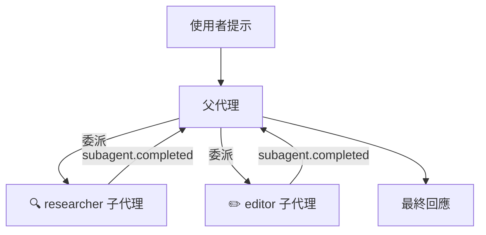

# 自訂代理與子代理協調 (Custom Agents & Sub-Agent Orchestration)

定義具有特定範圍工具和提示詞的專業代理，然後讓 Copilot 在單個工作階段中將其作為子代理進行協調。

## 概覽

自訂代理是您附加到工作階段的輕量級代理定義。每個代理都有自己的系統提示詞、工具限制和選用的 MCP 伺服器。當使用者的請求與代理的專長相匹配時，Copilot 執行階段會自動委派給該代理作為 **子代理 (sub-agent)** — 在隔離的內容中執行它，同時將生命週期事件串流回父工作階段。



| 概念 | 說明 |
|---------|-------------|
| **自訂代理 (Custom agent)** | 具有自己的提示詞和工具集的具名代理設定 |
| **子代理 (Sub-agent)** | 由執行階段叫用以處理部分任務的自訂代理 |
| **推論 (Inference)** | 執行階段根據使用者意圖自動選擇代理的能力 |
| **父工作階段 (Parent session)** | 產生子代理的工作階段；接收所有生命週期事件 |

## 定義自訂代理

在建立工作階段時傳遞 `customAgents`。每個代理至少需要一個 `name` 和 `prompt`。

<details open>
<summary><strong>Node.js / TypeScript</strong></summary>

```typescript
import { CopilotClient } from "@github/copilot-sdk";

const client = new CopilotClient();
await client.start();

const session = await client.createSession({
    model: "gpt-4.1",
    customAgents: [
        {
            name: "researcher",
            displayName: "Research Agent",
            description: "使用唯讀工具探索程式碼庫並回答問題",
            tools: ["grep", "glob", "view"],
            prompt: "您是一位研究助理。請分析程式碼並回答問題。不要修改任何檔案。",
        },
        {
            name: "editor",
            displayName: "Editor Agent",
            description: "進行有針對性的程式碼變更",
            tools: ["view", "edit", "bash"],
            prompt: "您是一位程式碼編輯器。請根據要求對檔案進行最小程度、精確的修改。",
        },
    ],
    onPermissionRequest: async () => ({ kind: "approved" }),
});
```

</details>

<details>
<summary><strong>Python</strong></summary>

```python
from copilot import CopilotClient
from copilot.types import PermissionRequestResult

client = CopilotClient()
await client.start()

session = await client.create_session({
    "model": "gpt-4.1",
    "custom_agents": [
        {
            "name": "researcher",
            "display_name": "Research Agent",
            "description": "使用唯讀工具探索程式碼庫並回答問題",
            "tools": ["grep", "glob", "view"],
            "prompt": "您是一位研究助理。請分析程式碼並回答問題。不要修改任何檔案。",
        },
        {
            "name": "editor",
            "display_name": "Editor Agent",
            "description": "進行有針對性的程式碼變更",
            "tools": ["view", "edit", "bash"],
            "prompt": "您是一位程式碼編輯器。請根據要求對檔案進行最小程度、精確的修改。",
        },
    ],
    "on_permission_request": lambda req, inv: PermissionRequestResult(kind="approved"),
})
```

</details>

<details>
<summary><strong>Go</strong></summary>

<!-- docs-validate: hidden -->
```go
package main

import (
	"context"
	copilot "github.com/github/copilot-sdk/go"
)

func main() {
	ctx := context.Background()
	client := copilot.NewClient(nil)
	client.Start(ctx)

	session, _ := client.CreateSession(ctx, &copilot.SessionConfig{
		Model: "gpt-4.1",
		CustomAgents: []copilot.CustomAgentConfig{
			{
				Name:        "researcher",
				DisplayName: "Research Agent",
				Description: "使用唯讀工具探索程式碼庫並回答問題",
				Tools:       []string{"grep", "glob", "view"},
				Prompt:      "您是一位研究助理。請分析程式碼並回答問題。不要修改任何檔案。",
			},
			{
				Name:        "editor",
				DisplayName: "Editor Agent",
				Description: "進行有針對性的程式碼變更",
				Tools:       []string{"view", "edit", "bash"},
				Prompt:      "您是一位程式碼編輯器。請根據要求對檔案進行最小程度、精確的修改。",
			},
		},
		OnPermissionRequest: func(req copilot.PermissionRequest, inv copilot.PermissionInvocation) (copilot.PermissionRequestResult, error) {
			return copilot.PermissionRequestResult{Kind: copilot.PermissionRequestResultKindApproved}, nil
		},
	})
	_ = session
}
```
<!-- /docs-validate: hidden -->

```go
ctx := context.Background()
client := copilot.NewClient(nil)
client.Start(ctx)

session, _ := client.CreateSession(ctx, &copilot.SessionConfig{
    Model: "gpt-4.1",
    CustomAgents: []copilot.CustomAgentConfig{
        {
            Name:        "researcher",
            DisplayName: "Research Agent",
            Description: "使用唯讀工具探索程式碼庫並回答問題",
            Tools:       []string{"grep", "glob", "view"},
            Prompt:      "您是一位研究助理。請分析程式碼並回答問題。不要修改任何檔案。",
        },
        {
            Name:        "editor",
            DisplayName: "Editor Agent",
            Description: "進行有針對性的程式碼變更",
            Tools:       []string{"view", "edit", "bash"},
            Prompt:      "您是一位程式碼編輯器。請根據要求對檔案進行最小程度、精確的修改。",
        },
    },
    OnPermissionRequest: func(req copilot.PermissionRequest, inv copilot.PermissionInvocation) (copilot.PermissionRequestResult, error) {
        return copilot.PermissionRequestResult{Kind: copilot.PermissionRequestResultKindApproved}, nil
    },
})
```

</details>

<details>
<summary><strong>.NET</strong></summary>

```csharp
using GitHub.Copilot.SDK;

await using var client = new CopilotClient();
await using var session = await client.CreateSessionAsync(new SessionConfig
{
    Model = "gpt-4.1",
    CustomAgents = new List<CustomAgentConfig>
    {
        new()
        {
            Name = "researcher",
            DisplayName = "Research Agent",
            Description = "使用唯讀工具探索程式碼庫並回答問題",
            Tools = new List<string> { "grep", "glob", "view" },
            Prompt = "您是一位研究助理。請分析程式碼並回答問題。不要修改任何檔案。",
        },
        new()
        {
            Name = "editor",
            DisplayName = "Editor Agent",
            Description = "進行有針對性的程式碼變更",
            Tools = new List<string> { "view", "edit", "bash" },
            Prompt = "您是一位程式碼編輯器。請根據要求對檔案進行最小程度、精確的修改。",
        },
    },
    OnPermissionRequest = (req, inv) =>
        Task.FromResult(new PermissionRequestResult { Kind = PermissionRequestResultKind.Approved }),
});
```

</details>

## 設定參考 (Configuration Reference)

| 屬性 | 類型 | 必填 | 說明 |
|----------|------|----------|-------------|
| `name` | `string` | ✅ | 代理的唯一識別碼 |
| `displayName` | `string` | | 事件中顯示的人類可讀名稱 |
| `description` | `string` | | 代理的作用 — 幫助執行階段選擇它 |
| `tools` | `string[]` 或 `null` | | 代理可以使用的工具名稱。`null` 或省略 = 所有工具 |
| `prompt` | `string` | ✅ | 代理的系統提示詞 |
| `mcpServers` | `object` | | 此代理特定的 MCP 伺服器設定 |
| `infer` | `boolean` | | 執行階段是否可以自動選擇此代理（預設值：`true`） |

> **提示：** 良好的 `description` 有助於執行階段將使用者意圖匹配到正確的代理。請具體說明代理的專業知識和能力。

除了上面的各別代理設定外，您還可以在 **工作階段設定 (session config)** 本身設定 `agent`，以在工作階段開始時預先選擇哪個自訂代理處於作用中狀態。請參閱下方的[在建立工作階段時選擇代理](#在建立工作階段時選擇代理)。

| 工作階段設定屬性 | 類型 | 說明 |
|-------------------------|------|-------------|
| `agent` | `string` | 在建立工作階段時預先選擇的自訂代理名稱。必須與 `customAgents` 中的某個 `name` 匹配。 |

## 在建立工作階段時選擇代理

您可以在工作階段設定中傳遞 `agent`，以預先選擇在工作階段開始時哪個自訂代理應該處於作用中狀態。該值必須與 `customAgents` 中定義的其中一個代理的 `name` 匹配。

這相當於在建立後呼叫 `session.rpc.agent.select()`，但可以避免額外的 API 呼叫，並確保代理從第一個提示詞開始就處於作用中狀態。

<details open>
<summary><strong>Node.js / TypeScript</strong></summary>

<!-- docs-validate: skip -->
```typescript
const session = await client.createSession({
    customAgents: [
        {
            name: "researcher",
            prompt: "您是一位研究助理。請分析程式碼並回答問題。",
        },
        {
            name: "editor",
            prompt: "您是一位程式碼編輯器。請進行最小程度、精確的修改。",
        },
    ],
    agent: "researcher", // 預先選擇 researcher 代理
});
```

</details>

<details>
<summary><strong>Python</strong></summary>

<!-- docs-validate: skip -->
```python
session = await client.create_session({
    "custom_agents": [
        {
            "name": "researcher",
            "prompt": "您是一位研究助理。請分析程式碼並回答問題。",
        },
        {
            "name": "editor",
            "prompt": "您是一位程式碼編輯器。請進行最小程度、精確的修改。",
        },
    ],
    "agent": "researcher",  # 預先選擇 researcher 代理
})
```

</details>

<details>
<summary><strong>Go</strong></summary>

<!-- docs-validate: skip -->
```go
session, _ := client.CreateSession(ctx, &copilot.SessionConfig{
    CustomAgents: []copilot.CustomAgentConfig{
        {
            Name:   "researcher",
            Prompt: "您是一位研究助理。請分析程式碼並回答問題。",
        },
        {
            Name:   "editor",
            Prompt: "您是一位程式碼編輯器。請進行最小程度、精確的修改。",
        },
    },
    Agent: "researcher", // 預先選擇 researcher 代理
})
```

</details>

<details>
<summary><strong>.NET</strong></summary>

<!-- docs-validate: skip -->
```csharp
var session = await client.CreateSessionAsync(new SessionConfig
{
    CustomAgents = new List<CustomAgentConfig>
    {
        new() { Name = "researcher", Prompt = "您是一位研究助理。請分析程式碼並回答問題。" },
        new() { Name = "editor", Prompt = "您是一位程式碼編輯器。請進行最小程度、精確的修改。" },
    },
    Agent = "researcher", // 預先選擇 researcher 代理
});
```

</details>

## 子代理委派的工作原理

當您將提示詞傳送到具有自訂代理的工作階段時，執行階段會評估是否委派給子代理：

1. **意圖比對 (Intent matching)** — 執行階段會根據每個代理的 `name` 和 `description` 分析使用者的提示詞
2. **代理選擇 (Agent selection)** — 如果找到匹配項且 `infer` 不為 `false`，則執行階段會選擇該代理
3. **隔離執行 (Isolated execution)** — 子代理會使用自己的提示詞和受限的工具集執行
4. **事件串流 (Event streaming)** — 生命週期事件（`subagent.started`、`subagent.completed` 等）會串流回父工作階段
5. **結果整合 (Result integration)** — 子代理的輸出會合併到父代理的回應中

### 控制推論 (Controlling Inference)

預設情況下，所有自訂代理都可用於自動選擇 (`infer: true`)。將 `infer: false` 設定為防止執行階段自動選擇代理 — 這對於您只想透過明確的使用者請求叫用的代理非常有用：

```typescript
{
    name: "dangerous-cleanup",
    description: "刪除未使用的檔案和無用程式碼",
    tools: ["bash", "edit", "view"],
    prompt: "您透過刪除無用程式碼和未使用的檔案來清理程式碼庫。",
    infer: false, // 僅在使用者明確要求此代理時才叫用
}
```

## 監聽子代理事件

當子代理執行時，父工作階段會發出生命週期事件。訂閱這些事件以建構視覺化代理活動的 UI。

### 事件類型

| 事件 | 發出時機 | 資料 |
|-------|-------------|------|
| `subagent.selected` | 執行階段為任務選擇代理 | `agentName`, `agentDisplayName`, `tools` |
| `subagent.started` | 子代理開始執行 | `toolCallId`, `agentName`, `agentDisplayName`, `agentDescription` |
| `subagent.completed` | 子代理成功完成 | `toolCallId`, `agentName`, `agentDisplayName` |
| `subagent.failed` | 子代理遇到錯誤 | `toolCallId`, `agentName`, `agentDisplayName`, `error` |
| `subagent.deselected` | 執行階段切換離開子代理 | — |

### 訂閱事件

<details open>
<summary><strong>Node.js / TypeScript</strong></summary>

```typescript
session.on((event) => {
    switch (event.type) {
        case "subagent.started":
            console.log(`▶ 子代理已開始：${event.data.agentDisplayName}`);
            console.log(`  說明：${event.data.agentDescription}`);
            console.log(`  工具呼叫識別碼 (Tool call ID)：${event.data.toolCallId}`);
            break;

        case "subagent.completed":
            console.log(`✅ 子代理已完成：${event.data.agentDisplayName}`);
            break;

        case "subagent.failed":
            console.log(`❌ 子代理失敗：${event.data.agentDisplayName}`);
            console.log(`  錯誤：${event.data.error}`);
            break;

        case "subagent.selected":
            console.log(`🎯 已選擇代理：${event.data.agentDisplayName}`);
            console.log(`  工具：${event.data.tools?.join(", ") ?? "全部"}`);
            break;

        case "subagent.deselected":
            console.log("↩ 代理已取消選擇，返回父代理");
            break;
    }
});

const response = await session.sendAndWait({
    prompt: "研究此程式碼庫中的身分驗證運作方式",
});
```

</details>

<details>
<summary><strong>Python</strong></summary>

```python
def handle_event(event):
    if event.type == "subagent.started":
        print(f"▶ 子代理已開始：{event.data.agent_display_name}")
        print(f"  說明：{event.data.agent_description}")
    elif event.type == "subagent.completed":
        print(f"✅ 子代理已完成：{event.data.agent_display_name}")
    elif event.type == "subagent.failed":
        print(f"❌ 子代理失敗：{event.data.agent_display_name}")
        print(f"  錯誤：{event.data.error}")
    elif event.type == "subagent.selected":
        tools = event.data.tools or "全部"
        print(f"🎯 已選擇代理：{event.data.agent_display_name} (工具：{tools})")

unsubscribe = session.on(handle_event)

response = await session.send_and_wait({
    "prompt": "研究此程式碼庫中的身分驗證運作方式"
})
```

</details>

<details>
<summary><strong>Go</strong></summary>

<!-- docs-validate: hidden -->
```go
package main

import (
	"context"
	"fmt"
	copilot "github.com/github/copilot-sdk/go"
)

func main() {
	ctx := context.Background()
	client := copilot.NewClient(nil)
	client.Start(ctx)

	session, _ := client.CreateSession(ctx, &copilot.SessionConfig{
		Model: "gpt-4.1",
		OnPermissionRequest: func(req copilot.PermissionRequest, inv copilot.PermissionInvocation) (copilot.PermissionRequestResult, error) {
			return copilot.PermissionRequestResult{Kind: copilot.PermissionRequestResultKindApproved}, nil
		},
	})

	session.On(func(event copilot.SessionEvent) {
		switch event.Type {
		case "subagent.started":
			fmt.Printf("▶ 子代理已開始：%s\n", *event.Data.AgentDisplayName)
			fmt.Printf("  說明：%s\n", *event.Data.AgentDescription)
			fmt.Printf("  工具呼叫識別碼 (Tool call ID)：%s\n", *event.Data.ToolCallID)
		case "subagent.completed":
			fmt.Printf("✅ 子代理已完成：%s\n", *event.Data.AgentDisplayName)
		case "subagent.failed":
			fmt.Printf("❌ 子代理失敗：%s — %v\n", *event.Data.AgentDisplayName, event.Data.Error)
		case "subagent.selected":
			fmt.Printf("🎯 已選擇代理：%s\n", *event.Data.AgentDisplayName)
		}
	})

	_, err := session.SendAndWait(ctx, copilot.MessageOptions{
		Prompt: "研究此程式碼庫中的身分驗證運作方式",
	})
	_ = err
}
```
<!-- /docs-validate: hidden -->

```go
session.On(func(event copilot.SessionEvent) {
    switch event.Type {
    case "subagent.started":
        fmt.Printf("▶ 子代理已開始：%s\n", *event.Data.AgentDisplayName)
        fmt.Printf("  說明：%s\n", *event.Data.AgentDescription)
        fmt.Printf("  工具呼叫識別碼 (Tool call ID)：%s\n", *event.Data.ToolCallID)
    case "subagent.completed":
        fmt.Printf("✅ 子代理已完成：%s\n", *event.Data.AgentDisplayName)
    case "subagent.failed":
        fmt.Printf("❌ 子代理失敗：%s — %v\n", *event.Data.AgentDisplayName, event.Data.Error)
    case "subagent.selected":
        fmt.Printf("🎯 已選擇代理：%s\n", *event.Data.AgentDisplayName)
    }
})

_, err := session.SendAndWait(ctx, copilot.MessageOptions{
    Prompt: "研究此程式碼庫中的身分驗證運作方式",
})
```

</details>

<details>
<summary><strong>.NET</strong></summary>

<!-- docs-validate: hidden -->
```csharp
using GitHub.Copilot.SDK;

public static class SubAgentEventsExample
{
    public static async Task Example(CopilotSession session)
    {
        using var subscription = session.On(evt =>
        {
            switch (evt)
            {
                case SubagentStartedEvent started:
                    Console.WriteLine($"▶ 子代理已開始：{started.Data.AgentDisplayName}");
                    Console.WriteLine($"  說明：{started.Data.AgentDescription}");
                    Console.WriteLine($"  工具呼叫識別碼 (Tool call ID)：{started.Data.ToolCallId}");
                    break;
                case SubagentCompletedEvent completed:
                    Console.WriteLine($"✅ 子代理已完成：{completed.Data.AgentDisplayName}");
                    break;
                case SubagentFailedEvent failed:
                    Console.WriteLine($"❌ 子代理失敗：{failed.Data.AgentDisplayName} — {failed.Data.Error}");
                    break;
                case SubagentSelectedEvent selected:
                    Console.WriteLine($"🎯 已選擇代理：{selected.Data.AgentDisplayName}");
                    break;
            }
        });

        await session.SendAndWaitAsync(new MessageOptions
        {
            Prompt = "研究此程式碼庫中的身分驗證運作方式"
        });
    }
}
```
<!-- /docs-validate: hidden -->

```csharp
using var subscription = session.On(evt =>
{
    switch (evt)
    {
        case SubagentStartedEvent started:
            Console.WriteLine($"▶ 子代理已開始：{started.Data.AgentDisplayName}");
            Console.WriteLine($"  說明：{started.Data.AgentDescription}");
            Console.WriteLine($"  工具呼叫識別碼 (Tool call ID)：{started.Data.ToolCallId}");
            break;
        case SubagentCompletedEvent completed:
            Console.WriteLine($"✅ 子代理已完成：{completed.Data.AgentDisplayName}");
            break;
        case SubagentFailedEvent failed:
            Console.WriteLine($"❌ 子代理失敗：{failed.Data.AgentDisplayName} — {failed.Data.Error}");
            break;
        case SubagentSelectedEvent selected:
            Console.WriteLine($"🎯 已選擇代理：{selected.Data.AgentDisplayName}");
            break;
    }
});

await session.SendAndWaitAsync(new MessageOptions
{
    Prompt = "研究此程式碼庫中的身分驗證運作方式"
});
```

</details>

## 建構代理樹 (Agent Tree) UI

子代理事件包含 `toolCallId` 欄位，可讓您重建執行樹。以下是追蹤代理活動的模式：

```typescript
interface AgentNode {
    toolCallId: string;
    name: string;
    displayName: string;
    status: "running" | "completed" | "failed";
    error?: string;
    startedAt: Date;
    completedAt?: Date;
}

const agentTree = new Map<string, AgentNode>();

session.on((event) => {
    if (event.type === "subagent.started") {
        agentTree.set(event.data.toolCallId, {
            toolCallId: event.data.toolCallId,
            name: event.data.agentName,
            displayName: event.data.agentDisplayName,
            status: "running",
            startedAt: new Date(event.timestamp),
        });
    }

    if (event.type === "subagent.completed") {
        const node = agentTree.get(event.data.toolCallId);
        if (node) {
            node.status = "completed";
            node.completedAt = new Date(event.timestamp);
        }
    }

    if (event.type === "subagent.failed") {
        const node = agentTree.get(event.data.toolCallId);
        if (node) {
            node.status = "failed";
            node.error = event.data.error;
            node.completedAt = new Date(event.timestamp);
        }
    }

    // 使用更新後的樹狀結構渲染 UI
    renderAgentTree(agentTree);
});
```

## 限制每個代理的工具範圍

使用 `tools` 屬性來限制代理可以存取的工具。這對於安全性和保持代理專注至關重要：

```typescript
const session = await client.createSession({
    customAgents: [
        {
            name: "reader",
            description: "對程式碼庫進行唯讀探索",
            tools: ["grep", "glob", "view"],  // 無寫入權限
            prompt: "您負責探索和分析程式碼。切勿直接建議修改。",
        },
        {
            name: "writer",
            description: "進行程式碼變更",
            tools: ["view", "edit", "bash"],   // 具有寫入權限
            prompt: "您根據指令進行精確的程式碼變更。",
        },
        {
            name: "unrestricted",
            description: "處理複雜任務的全權限代理",
            tools: null,                        // 所有工具皆可用
            prompt: "您使用任何可用的工具處理複雜的多步驟任務。",
        },
    ],
});
```

> **注意：** 當 `tools` 為 `null` 或省略時，代理會繼承對工作階段上設定的所有工具的存取權限。請使用明確的工具列表來執行最小權限原則。

## 為代理附加 MCP 伺服器

每個自訂代理都可以擁有自己的 MCP (Model Context Protocol) 伺服器，從而使其能夠存取專業的資料來源：

```typescript
const session = await client.createSession({
    customAgents: [
        {
            name: "db-analyst",
            description: "分析資料庫結構描述和查詢",
            prompt: "您是資料庫專家。請使用資料庫 MCP 伺服器來分析結構描述。",
            mcpServers: {
                "database": {
                    command: "npx",
                    args: ["-y", "@modelcontextprotocol/server-postgres", "postgresql://localhost/mydb"],
                },
            },
        },
    ],
});
```

## 模式與最佳實作

### 將研究員 (researcher) 與編輯器 (editor) 配對

一個常見的模式是定義一個唯讀的研究員代理和一個具備寫入能力的編輯器代理。執行階段會將探索任務委派給研究員，並將修改任務委派給編輯器：

```typescript
customAgents: [
    {
        name: "researcher",
        description: "分析程式碼結構、尋找模式並回答問題",
        tools: ["grep", "glob", "view"],
        prompt: "您是一位程式碼分析師。請徹底探索程式碼庫以回答問題。",
    },
    {
        name: "implementer",
        description: "根據分析結果實作程式碼變更",
        tools: ["view", "edit", "bash"],
        prompt: "您進行最小程度、有針對性的程式碼變更。始終驗證變更是否編譯成功。",
    },
]
```

### 保持代理說明的具體性

執行階段使用 `description` 來匹配使用者意圖。模糊的說明會導致委派效果不佳：

```typescript
// ❌ 太模糊 — 執行階段無法將其與其他代理區分開來
{ description: "協助處理程式碼" }

// ✅ 具體 — 執行階段知道何時進行委派
{ description: "分析 Python 測試涵蓋範圍並識別未經測試的程式碼路徑" }
```

### 優雅地處理失敗

子代理可能會失敗。請務必監聽 `subagent.failed` 事件並在您的應用程式中處理它們：

```typescript
session.on((event) => {
    if (event.type === "subagent.failed") {
        logger.error(`代理 ${event.data.agentName} 失敗：${event.data.error}`);
        // 在 UI 中顯示錯誤、重試或回退到 parent agent
    }
});
