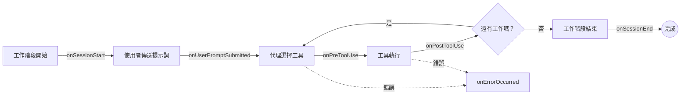

# 使用 Hooks

Hooks 讓您可以將自訂邏輯插入 Copilot 工作階段的每個階段 — 從工作階段開始、每個使用者提示詞和工具呼叫，直到結束。本指南將介紹實際的使用案例，讓您可以在不修改核心代理行為的情況下，實作權限控制、稽核、通知等功能。

## 概覽

Hook 是您在建立工作階段時註冊一次的回呼函式 (callback)。SDK 會在對話生命週期中明確定義的時間點叫用它，傳遞內容輸入，並可選擇性地接受修改工作階段行為的輸出。



| Hook | 觸發時機 | 您可以做什麼 |
|------|---------------|-----------------|
| [`onSessionStart`](../hooks/session-lifecycle_zh_TW.md#session-start) | 工作階段開始（新建或恢復） | 注入內容、載入偏好設定 |
| [`onUserPromptSubmitted`](../hooks/user-prompt-submitted_zh_TW.md) | 使用者傳送訊息 | 重寫提示詞、添加內容、過濾輸入 |
| [`onPreToolUse`](../hooks/pre-tool-use_zh_TW.md) | 工具執行前 | 允許 / 拒絕 / 修改呼叫 |
| [`onPostToolUse`](../hooks/post-tool-use_zh_TW.md) | 工具回傳後 | 轉換結果、遮蓋機密、稽核 |
| [`onSessionEnd`](../hooks/session-lifecycle_zh_TW.md#session-end) | 工作階段結束 | 清理、記錄指標 |
| [`onErrorOccurred`](../hooks/error-handling_zh_TW.md) | 發生錯誤時 | 自訂記錄、重試邏輯、警報 |

所有 Hook 都是 **選用** 的 — 僅註冊您需要的 Hook。從任何 Hook 回傳 `null`（或等效的語言值）會告知 SDK 繼續執行預設行為。

## 註冊 Hooks

在建立（或恢復）工作階段時傳遞 `hooks` 物件。下面的每個範例都遵循此模式。

<details open>
<summary><strong>Node.js / TypeScript</strong></summary>

```typescript
import { CopilotClient } from "@github/copilot-sdk";

const client = new CopilotClient();
await client.start();

const session = await client.createSession({
    hooks: {
        onSessionStart: async (input, invocation) => { /* ... */ },
        onPreToolUse:   async (input, invocation) => { /* ... */ },
        onPostToolUse:  async (input, invocation) => { /* ... */ },
        // ... 僅添加您需要的 hook
    },
    onPermissionRequest: async () => ({ kind: "approved" }),
});
```

</details>

<details>
<summary><strong>Python</strong></summary>

```python
from copilot import CopilotClient

client = CopilotClient()
await client.start()

session = await client.create_session({
    "hooks": {
        "on_session_start": on_session_start,
        "on_pre_tool_use":  on_pre_tool_use,
        "on_post_tool_use": on_post_tool_use,
        # ... 僅添加您需要的 hook
    },
    "on_permission_request": lambda req, inv: {"kind": "approved"},
})
```

</details>

<details>
<summary><strong>Go</strong></summary>

<!-- docs-validate: hidden -->
```go
package main

import (
	"context"
	copilot "github.com/github/copilot-sdk/go"
)

func onSessionStart(input copilot.SessionStartHookInput, inv copilot.HookInvocation) (*copilot.SessionStartHookOutput, error) {
	return nil, nil
}

func onPreToolUse(input copilot.PreToolUseHookInput, inv copilot.HookInvocation) (*copilot.PreToolUseHookOutput, error) {
	return nil, nil
}

func onPostToolUse(input copilot.PostToolUseHookInput, inv copilot.HookInvocation) (*copilot.PostToolUseHookOutput, error) {
	return nil, nil
}

func main() {
	ctx := context.Background()
	client := copilot.NewClient(nil)

	session, err := client.CreateSession(ctx, &copilot.SessionConfig{
		Hooks: &copilot.SessionHooks{
			OnSessionStart: onSessionStart,
			OnPreToolUse:   onPreToolUse,
			OnPostToolUse:  onPostToolUse,
		},
		OnPermissionRequest: func(req copilot.PermissionRequest, inv copilot.PermissionInvocation) (copilot.PermissionRequestResult, error) {
			return copilot.PermissionRequestResult{Kind: "approved"}, nil
		},
	})
	_ = session
	_ = err
}
```
<!-- /docs-validate: hidden -->

```go
client := copilot.NewClient(nil)

session, err := client.CreateSession(ctx, &copilot.SessionConfig{
    Hooks: &copilot.SessionHooks{
        OnSessionStart: onSessionStart,
        OnPreToolUse:   onPreToolUse,
        OnPostToolUse:  onPostToolUse,
        // ... 僅添加您需要的 hook
    },
    OnPermissionRequest: func(req copilot.PermissionRequest, inv copilot.PermissionInvocation) (copilot.PermissionRequestResult, error) {
        return copilot.PermissionRequestResult{Kind: "approved"}, nil
    },
})
```

</details>

<details>
<summary><strong>.NET</strong></summary>

<!-- docs-validate: hidden -->
```csharp
using GitHub.Copilot.SDK;

public static class HooksExample
{
    static Task<SessionStartHookOutput?> onSessionStart(SessionStartHookInput input, HookInvocation invocation) =>
        Task.FromResult<SessionStartHookOutput?>(null);
    static Task<PreToolUseHookOutput?> onPreToolUse(PreToolUseHookInput input, HookInvocation invocation) =>
        Task.FromResult<PreToolUseHookOutput?>(null);
    static Task<PostToolUseHookOutput?> onPostToolUse(PostToolUseHookInput input, HookInvocation invocation) =>
        Task.FromResult<PostToolUseHookOutput?>(null);

    public static async Task Main()
    {
        var client = new CopilotClient();

        var session = await client.CreateSessionAsync(new SessionConfig
        {
            Hooks = new SessionHooks
            {
                OnSessionStart = onSessionStart,
                OnPreToolUse   = onPreToolUse,
                OnPostToolUse  = onPostToolUse,
            },
            OnPermissionRequest = (req, inv) =>
                Task.FromResult(new PermissionRequestResult { Kind = PermissionRequestResultKind.Approved }),
        });
    }
}
```
<!-- /docs-validate: hidden -->

```csharp
var client = new CopilotClient();

var session = await client.CreateSessionAsync(new SessionConfig
{
    Hooks = new SessionHooks
    {
        OnSessionStart = onSessionStart,
        OnPreToolUse   = onPreToolUse,
        OnPostToolUse  = onPostToolUse,
        // ... 僅添加您需要的 hook
    },
    OnPermissionRequest = (req, inv) =>
        Task.FromResult(new PermissionRequestResult { Kind = PermissionRequestResultKind.Approved }),
});
```

</details>

> **提示：** 每個 hook 處理常式都會收到一個包含 `sessionId` 的 `invocation` 參數，這對於關聯日誌和維護每個工作階段的狀態非常有用。

---

## 使用案例：權限控制

使用 `onPreToolUse` 建構權限層，決定代理可以執行哪些工具、允許哪些參數，以及是否在執行前提示使用者。

### 允許安全工具清單

<details open>
<summary><strong>Node.js / TypeScript</strong></summary>

```typescript
const READ_ONLY_TOOLS = ["read_file", "glob", "grep", "view"];

const session = await client.createSession({
    hooks: {
        onPreToolUse: async (input) => {
            if (!READ_ONLY_TOOLS.includes(input.toolName)) {
                return {
                    permissionDecision: "deny",
                    permissionDecisionReason:
                        `僅允許唯讀工具。"${input.toolName}" 已被封鎖。`,
                };
            }
            return { permissionDecision: "allow" };
        },
    },
    onPermissionRequest: async () => ({ kind: "approved" }),
});
```

</details>

<details>
<summary><strong>Python</strong></summary>

```python
READ_ONLY_TOOLS = ["read_file", "glob", "grep", "view"]

async def on_pre_tool_use(input_data, invocation):
    if input_data["toolName"] not in READ_ONLY_TOOLS:
        return {
            "permissionDecision": "deny",
            "permissionDecisionReason":
                f'僅允許唯讀工具。"{input_data["toolName"]}" 已被封鎖。',
        }
    return {"permissionDecision": "allow"}

session = await client.create_session({
    "hooks": {"on_pre_tool_use": on_pre_tool_use},
    "on_permission_request": lambda req, inv: {"kind": "approved"},
})
```

</details>

<details>
<summary><strong>Go</strong></summary>

<!-- docs-validate: hidden -->
```go
package main

import (
	"context"
	"fmt"
	copilot "github.com/github/copilot-sdk/go"
)

func main() {
	ctx := context.Background()
	client := copilot.NewClient(nil)

	readOnlyTools := map[string]bool{"read_file": true, "glob": true, "grep": true, "view": true}

	session, _ := client.CreateSession(ctx, &copilot.SessionConfig{
		Hooks: &copilot.SessionHooks{
			OnPreToolUse: func(input copilot.PreToolUseHookInput, inv copilot.HookInvocation) (*copilot.PreToolUseHookOutput, error) {
				if !readOnlyTools[input.ToolName] {
					return &copilot.PreToolUseHookOutput{
						PermissionDecision:       "deny",
						PermissionDecisionReason: fmt.Sprintf("僅允許唯讀工具。%q 已被封鎖。", input.ToolName),
					}, nil
				}
				return &copilot.PreToolUseHookOutput{PermissionDecision: "allow"}, nil
			},
		},
		OnPermissionRequest: func(req copilot.PermissionRequest, inv copilot.PermissionInvocation) (copilot.PermissionRequestResult, error) {
			return copilot.PermissionRequestResult{Kind: copilot.PermissionRequestResultKindApproved}, nil
		},
	})
	_ = session
}
```
<!-- /docs-validate: hidden -->

```go
readOnlyTools := map[string]bool{"read_file": true, "glob": true, "grep": true, "view": true}

session, _ := client.CreateSession(ctx, &copilot.SessionConfig{
    Hooks: &copilot.SessionHooks{
        OnPreToolUse: func(input copilot.PreToolUseHookInput, inv copilot.HookInvocation) (*copilot.PreToolUseHookOutput, error) {
            if !readOnlyTools[input.ToolName] {
                return &copilot.PreToolUseHookOutput{
                    PermissionDecision:       "deny",
                    PermissionDecisionReason: fmt.Sprintf("僅允許唯讀工具。%q 已被封鎖。", input.ToolName),
                }, nil
            }
            return &copilot.PreToolUseHookOutput{PermissionDecision: "allow"}, nil
        },
    },
})
```

</details>

<details>
<summary><strong>.NET</strong></summary>

<!-- docs-validate: hidden -->
```csharp
using GitHub.Copilot.SDK;

public static class PermissionControlExample
{
    public static async Task Main()
    {
        await using var client = new CopilotClient();

        var readOnlyTools = new HashSet<string> { "read_file", "glob", "grep", "view" };

        var session = await client.CreateSessionAsync(new SessionConfig
        {
            Hooks = new SessionHooks
            {
                OnPreToolUse = (input, invocation) =>
                {
                    if (!readOnlyTools.Contains(input.ToolName))
                    {
                        return Task.FromResult<PreToolUseHookOutput?>(new PreToolUseHookOutput
                        {
                            PermissionDecision = "deny",
                            PermissionDecisionReason = $"僅允許唯讀工具。\"{input.ToolName}\" 已被封鎖。",
                        });
                    }
                    return Task.FromResult<PreToolUseHookOutput?>(
                        new PreToolUseHookOutput { PermissionDecision = "allow" });
                },
            },
            OnPermissionRequest = (req, inv) =>
                Task.FromResult(new PermissionRequestResult { Kind = PermissionRequestResultKind.Approved }),
        });
    }
}
```
<!-- /docs-validate: hidden -->

```csharp
var readOnlyTools = new HashSet<string> { "read_file", "glob", "grep", "view" };

var session = await client.CreateSessionAsync(new SessionConfig
{
    Hooks = new SessionHooks
    {
        OnPreToolUse = (input, invocation) =>
        {
            if (!readOnlyTools.Contains(input.ToolName))
            {
                return Task.FromResult<PreToolUseHookOutput?>(new PreToolUseHookOutput
                {
                    PermissionDecision = "deny",
                    PermissionDecisionReason = $"僅允許唯讀工具。\"{input.ToolName}\" 已被封鎖。",
                });
            }
            return Task.FromResult<PreToolUseHookOutput?>(
                new PreToolUseHookOutput { PermissionDecision = "allow" });
        },
    },
});
```

</details>

### 將檔案存取限制在特定目錄

```typescript
const ALLOWED_DIRS = ["/home/user/projects", "/tmp"];

const session = await client.createSession({
    hooks: {
        onPreToolUse: async (input) => {
            if (["read_file", "write_file", "edit"].includes(input.toolName)) {
                const filePath = (input.toolArgs as { path: string }).path;
                const allowed = ALLOWED_DIRS.some((dir) => filePath.startsWith(dir));

                if (!allowed) {
                    return {
                        permissionDecision: "deny",
                        permissionDecisionReason:
                            `對 "${filePath}" 的存取超出了允許的目錄範圍。`,
                    };
                }
            }
            return { permissionDecision: "allow" };
        },
    },
    onPermissionRequest: async () => ({ kind: "approved" }),
});
```

### 在執行破壞性操作前詢問使用者

```typescript
const DESTRUCTIVE_TOOLS = ["delete_file", "shell", "bash"];

const session = await client.createSession({
    hooks: {
        onPreToolUse: async (input) => {
            if (DESTRUCTIVE_TOOLS.includes(input.toolName)) {
                return { permissionDecision: "ask" };
            }
            return { permissionDecision: "allow" };
        },
    },
    onPermissionRequest: async () => ({ kind: "approved" }),
});
```

回傳 `"ask"` 會在執行階段將決定權委派給使用者 — 對於您希望有人工介入的破壞性操作非常有用。

---

## 使用案例：稽核與合規性

結合 `onPreToolUse`、`onPostToolUse` 和工作階段生命週期 hook，建構完整的稽核軌跡，記錄代理採取的每項行動。

### 結構化稽核日誌

<details open>
<summary><strong>Node.js / TypeScript</strong></summary>

```typescript
interface AuditEntry {
    timestamp: number;
    sessionId: string;
    event: string;
    toolName?: string;
    toolArgs?: unknown;
    toolResult?: unknown;
    prompt?: string;
}

const auditLog: AuditEntry[] = [];

const session = await client.createSession({
    hooks: {
        onSessionStart: async (input, invocation) => {
            auditLog.push({
                timestamp: input.timestamp,
                sessionId: invocation.sessionId,
                event: "session_start",
            });
            return null;
        },
        onUserPromptSubmitted: async (input, invocation) => {
            auditLog.push({
                timestamp: input.timestamp,
                sessionId: invocation.sessionId,
                event: "user_prompt",
                prompt: input.prompt,
            });
            return null;
        },
        onPreToolUse: async (input, invocation) => {
            auditLog.push({
                timestamp: input.timestamp,
                sessionId: invocation.sessionId,
                event: "tool_call",
                toolName: input.toolName,
                toolArgs: input.toolArgs,
            });
            return { permissionDecision: "allow" };
        },
        onPostToolUse: async (input, invocation) => {
            auditLog.push({
                timestamp: input.timestamp,
                sessionId: invocation.sessionId,
                event: "tool_result",
                toolName: input.toolName,
                toolResult: input.toolResult,
            });
            return null;
        },
        onSessionEnd: async (input, invocation) => {
            auditLog.push({
                timestamp: input.timestamp,
                sessionId: invocation.sessionId,
                event: "session_end",
            });

            // 持久化日誌 — 將其換成您自己的存儲後端
            await fs.promises.writeFile(
                `audit-${invocation.sessionId}.json`,
                JSON.stringify(auditLog, null, 2),
            );
            return null;
        },
    },
    onPermissionRequest: async () => ({ kind: "approved" }),
});
```

</details>

<details>
<summary><strong>Python</strong></summary>

<!-- docs-validate: skip -->
```python
import json, aiofiles

audit_log = []

async def on_session_start(input_data, invocation):
    audit_log.append({
        "timestamp": input_data["timestamp"],
        "session_id": invocation["session_id"],
        "event": "session_start",
    })
    return None

async def on_user_prompt_submitted(input_data, invocation):
    audit_log.append({
        "timestamp": input_data["timestamp"],
        "session_id": invocation["session_id"],
        "event": "user_prompt",
        "prompt": input_data["prompt"],
    })
    return None

async def on_pre_tool_use(input_data, invocation):
    audit_log.append({
        "timestamp": input_data["timestamp"],
        "session_id": invocation["session_id"],
        "event": "tool_call",
        "tool_name": input_data["toolName"],
        "tool_args": input_data["toolArgs"],
    })
    return {"permissionDecision": "allow"}

async def on_post_tool_use(input_data, invocation):
    audit_log.append({
        "timestamp": input_data["timestamp"],
        "session_id": invocation["session_id"],
        "event": "tool_result",
        "tool_name": input_data["toolName"],
        "tool_result": input_data["toolResult"],
    })
    return None

async def on_session_end(input_data, invocation):
    audit_log.append({
        "timestamp": input_data["timestamp"],
        "session_id": invocation["session_id"],
        "event": "session_end",
    })
    async with aiofiles.open(f"audit-{invocation['session_id']}.json", "w") as f:
        await f.write(json.dumps(audit_log, indent=2))
    return None

session = await client.create_session({
    "hooks": {
        "on_session_start": on_session_start,
        "on_user_prompt_submitted": on_user_prompt_submitted,
        "on_pre_tool_use": on_pre_tool_use,
        "on_post_tool_use": on_post_tool_use,
        "on_session_end": on_session_end,
    },
    "on_permission_request": lambda req, inv: {"kind": "approved"},
})
```

</details>

### 從工具結果中遮蓋機密資訊

```typescript
const SECRET_PATTERNS = [
    /(?:api[_-]?key|token|secret|password)\s*[:=]\s*["']?[\w\-\.]+["']?/gi,
];

const session = await client.createSession({
    hooks: {
        onPostToolUse: async (input) => {
            if (typeof input.toolResult !== "string") return null;

            let redacted = input.toolResult;
            for (const pattern of SECRET_PATTERNS) {
                redacted = redacted.replace(pattern, "[REDACTED]");
            }

            return redacted !== input.toolResult
                ? { modifiedResult: redacted }
                : null;
        },
    },
    onPermissionRequest: async () => ({ kind: "approved" }),
});
```

---

## 使用案例：通知與音效

Hooks 在您應用程式的處理程序中觸發，因此您可以觸發任何副作用 — 桌面通知、音效、Slack 訊息或 webhook 呼叫。

### 工作階段事件的桌面通知

<details open>
<summary><strong>Node.js / TypeScript</strong></summary>

```typescript
import notifier from "node-notifier"; // npm install node-notifier

const session = await client.createSession({
    hooks: {
        onSessionEnd: async (input, invocation) => {
            notifier.notify({
                title: "Copilot 工作階段已完成",
                message: `工作階段 ${invocation.sessionId.slice(0, 8)} 已結束 (${input.reason})。`,
            });
            return null;
        },
        onErrorOccurred: async (input) => {
            notifier.notify({
                title: "Copilot 錯誤",
                message: input.error.slice(0, 200),
            });
            return null;
        },
    },
    onPermissionRequest: async () => ({ kind: "approved" }),
});
```

</details>

<details>
<summary><strong>Python</strong></summary>

```python
import subprocess

async def on_session_end(input_data, invocation):
    sid = invocation["session_id"][:8]
    reason = input_data["reason"]
    subprocess.Popen([
        "notify-send", "Copilot 工作階段已完成",
        f"工作階段 {sid} 已結束 ({reason})。",
    ])
    return None

async def on_error_occurred(input_data, invocation):
    subprocess.Popen([
        "notify-send", "Copilot 錯誤",
        input_data["error"][:200],
    ])
    return None

session = await client.create_session({
    "hooks": {
        "on_session_end": on_session_start,
        "on_error_occurred": on_error_occurred,
    },
    "on_permission_request": lambda req, inv: {"kind": "approved"},
})
```

</details>

### 工具完成時播放音效

```typescript
import { exec } from "node:child_process";

const session = await client.createSession({
    hooks: {
        onPostToolUse: async (input) => {
            // macOS：每次工具呼叫後播放系統音效
            exec("afplay /System/Library/Sounds/Pop.aiff");
            return null;
        },
        onErrorOccurred: async () => {
            exec("afplay /System/Library/Sounds/Basso.aiff");
            return null;
        },
    },
    onPermissionRequest: async () => ({ kind: "approved" }),
});
```

### 發生錯誤時傳送至 Slack

```typescript
const SLACK_WEBHOOK_URL = process.env.SLACK_WEBHOOK_URL!;

const session = await client.createSession({
    hooks: {
        onErrorOccurred: async (input, invocation) => {
            if (!input.recoverable) {
                await fetch(SLACK_WEBHOOK_URL, {
                    method: "POST",
                    headers: { "Content-Type": "application/json" },
                    body: JSON.stringify({
                        text: `🚨 工作階段 \`${invocation.sessionId.slice(0, 8)}\` 發生無法恢復的錯誤：\n\`\`\`${input.error}\`\`\``,
                    }),
                });
            }
            return null;
        },
    },
    onPermissionRequest: async () => ({ kind: "approved" }),
});
```

---

## 使用案例：提示詞強化

使用 `onSessionStart` 和 `onUserPromptSubmitted` 自動注入內容，讓使用者不必重複輸入。

### 在工作階段開始時注入專案中繼資料

```typescript
const session = await client.createSession({
    hooks: {
        onSessionStart: async (input) => {
            const pkg = JSON.parse(
                await fs.promises.readFile("package.json", "utf-8"),
            );
            return {
                additionalContext: [
                    `專案：${pkg.name} v${pkg.version}`,
                    `Node：${process.version}`,
                    `目前的暫存目錄 (CWD)：${input.cwd}`,
                ].join("\n"),
            };
        },
    },
    onPermissionRequest: async () => ({ kind: "approved" }),
});
```

### 在提示詞中擴展速記指令

```typescript
const SHORTCUTS: Record<string, string> = {
    "/fix":      "找出並修復目前檔案中的所有錯誤",
    "/test":     "為此程式碼編寫完整的單元測試",
    "/explain":  "詳細解釋此程式碼",
    "/refactor": "重構此程式碼以提高可讀性",
};

const session = await client.createSession({
    hooks: {
        onUserPromptSubmitted: async (input) => {
            for (const [shortcut, expansion] of Object.entries(SHORTCUTS)) {
                if (input.prompt.startsWith(shortcut)) {
                    const rest = input.prompt.slice(shortcut.length).trim();
                    return { modifiedPrompt: rest ? `${expansion}：${rest}` : expansion };
                }
            }
            return null;
        },
    },
    onPermissionRequest: async () => ({ kind: "approved" }),
});
```

---

## 使用案例：錯誤處理與復原

`onErrorOccurred` hook 讓您有機會對失敗做出反應 — 無論是重試、通知相關人員，還是優雅地關閉。

### 重試暫時性的模型錯誤

```typescript
const session = await client.createSession({
    hooks: {
        onErrorOccurred: async (input) => {
            if (input.errorContext === "model_call" && input.recoverable) {
                return {
                    errorHandling: "retry",
                    retryCount: 3,
                    userNotification: "暫時性的模型問題 — 正在重試…",
                };
            }
            return null;
        },
    },
    onPermissionRequest: async () => ({ kind: "approved" }),
});
```

### 友好的錯誤訊息

```typescript
const FRIENDLY_MESSAGES: Record<string, string> = {
    model_call:      "AI 模型暫時無法使用。請再試一次。",
    tool_execution:  "工具遇到錯誤。請檢查輸入並再試一次。",
    system:          "發生系統錯誤。請稍後再試。",
};

const session = await client.createSession({
    hooks: {
        onErrorOccurred: async (input) => {
            return {
                userNotification: FRIENDLY_MESSAGES[input.errorContext] ?? input.error,
            };
        },
    },
    onPermissionRequest: async () => ({ kind: "approved" }),
});
```

---

## 使用案例：工作階段指標

追蹤工作階段執行的時間、叫用了多少工具，以及工作階段結束的原因 — 對於儀表板和成本監控非常有用。

<details open>
<summary><strong>Node.js / TypeScript</strong></summary>

```typescript
const metrics = new Map<string, { start: number; toolCalls: number; prompts: number }>();

const session = await client.createSession({
    hooks: {
        onSessionStart: async (input, invocation) => {
            metrics.set(invocation.sessionId, {
                start: input.timestamp,
                toolCalls: 0,
                prompts: 0,
            });
            return null;
        },
        onUserPromptSubmitted: async (_input, invocation) => {
            metrics.get(invocation.sessionId)!.prompts++;
            return null;
        },
        onPreToolUse: async (_input, invocation) => {
            metrics.get(invocation.sessionId)!.toolCalls++;
            return { permissionDecision: "allow" };
        },
        onSessionEnd: async (input, invocation) => {
            const m = metrics.get(invocation.sessionId)!;
            const durationSec = (input.timestamp - m.start) / 1000;

            console.log(
                `工作階段 ${invocation.sessionId.slice(0, 8)}：` +
                `${durationSec.toFixed(1)} 秒，${m.prompts} 個提示詞，` +
                `${m.toolCalls} 次工具呼叫，結束原因：${input.reason}`,
            );

            metrics.delete(invocation.sessionId);
            return null;
        },
    },
    onPermissionRequest: async () => ({ kind: "approved" }),
});
```

</details>

<details>
<summary><strong>Python</strong></summary>

```python
session_metrics = {}

async def on_session_start(input_data, invocation):
    session_metrics[invocation["session_id"]] = {
        "start": input_data["timestamp"],
        "tool_calls": 0,
        "prompts": 0,
    }
    return None

async def on_user_prompt_submitted(input_data, invocation):
    session_metrics[invocation["session_id"]]["prompts"] += 1
    return None

async def on_pre_tool_use(input_data, invocation):
    session_metrics[invocation["session_id"]]["tool_calls"] += 1
    return {"permissionDecision": "allow"}

async def on_session_end(input_data, invocation):
    m = session_metrics.pop(invocation["session_id"])
    duration = (input_data["timestamp"] - m["start"]) / 1000
    sid = invocation["session_id"][:8]
    print(
        f"工作階段 {sid}：{duration:.1f} 秒，{m['prompts']} 個提示詞，"
        f"{m['tool_calls']} 次工具呼叫，結束原因：{input_data['reason']}"
    )
    return None

session = await client.create_session({
    "hooks": {
        "on_session_start": on_session_start,
        "on_user_prompt_submitted": on_user_prompt_submitted,
        "on_pre_tool_use": on_pre_tool_use,
        "on_session_end": on_session_end,
    },
    "on_permission_request": lambda req, inv: {"kind": "approved"},
})
```

</details>

---

## 組合 Hooks

Hooks 可以自然地組合。單個 `hooks` 物件可以處理權限控制 **以及** 稽核 **以及** 通知 — 每個 hook 各司其職。

```typescript
const session = await client.createSession({
    hooks: {
        onSessionStart: async (input) => {
            console.log(`[稽核] 工作階段開始於 ${input.cwd}`);
            return { additionalContext: "專案使用 TypeScript 和 Vitest。" };
        },
        onPreToolUse: async (input) => {
            console.log(`[稽核] 請求工具：${input.toolName}`);
            if (input.toolName === "shell") {
                return { permissionDecision: "ask" };
            }
            return { permissionDecision: "allow" };
        },
        onPostToolUse: async (input) => {
            console.log(`[稽核] 工具已完成：${input.toolName}`);
            return null;
        },
        onErrorOccurred: async (input) => {
            console.error(`[警報] ${input.errorContext}：${input.error}`);
            return null;
        },
        onSessionEnd: async (input, invocation) => {
            console.log(`[稽核] 工作階段 ${invocation.sessionId.slice(0, 8)} 已結束：${input.reason}`);
            return null;
        },
    },
    onPermissionRequest: async () => ({ kind: "approved" }),
});
```

## 最佳實作

1. **保持 hook 執行速度。** 每個 hook 都是內嵌執行的 — 緩慢的 hook 會延遲對話。如果可能，請將繁重的工作（資料庫寫入、HTTP 呼叫）卸載到背景隊列。

2. **沒有什麼要變更時回傳 `null`。** 這會告知 SDK 繼續執行預設行為，並避免不必要的物件配置。

3. **明確權限決定。** 回傳 `{ permissionDecision: "allow" }` 比回傳 `null` 更清晰，儘管兩者都允許工具執行。

4. **不要吞掉關鍵錯誤。** 壓制可恢復的工具錯誤是可以的，但對於無法恢復的錯誤，請務必記錄或發出警報。

5. **盡可能使用 `additionalContext` 而不是 `modifiedPrompt`。** 附加內容可以在引導模型的同時保留使用者的原始意圖。

6. **按工作階段 ID 劃分狀態範圍。** 如果您追蹤每個工作階段的資料，請將其鍵值設為 `invocation.sessionId` 並在 `onSessionEnd` 中進行清理。

## 參考資料

有關每個 hook 的完整類型定義、輸入/輸出欄位表格和更多範例，請參閱 API 參考：

- [Hooks 概覽](../hooks/index_zh_TW.md)
- [工具執行前 (Pre-Tool Use)](../hooks/pre-tool-use_zh_TW.md)
- [工具執行後 (Post-Tool Use)](../hooks/post-tool-use_zh_TW.md)
- [使用者提示詞已提交 (User Prompt Submitted)](../hooks/user-prompt-submitted_zh_TW.md)
- [工作階段生命週期 (Session Lifecycle)](../hooks/session-lifecycle_zh_TW.md)
- [錯誤處理 (Error Handling)](../hooks/error-handling_zh_TW.md)

## 延伸閱讀

- [入門指南](../getting-started_zh_TW.md)
- [自訂代理與子代理協調](./custom-agents_zh_TW.md)
- [串流工作階段事件](./streaming-events_zh_TW.md)
- [偵錯指南](../troubleshooting/debugging_zh_TW.md)
