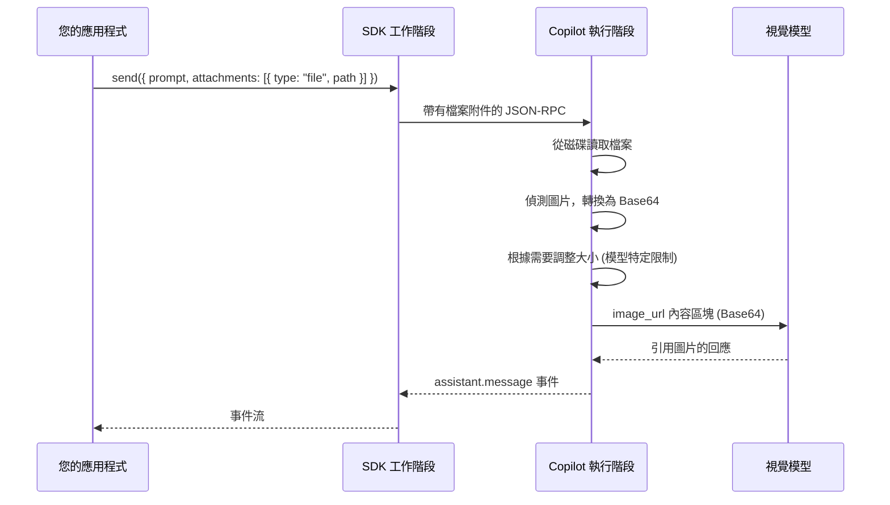

# 圖片輸入 (Image Input)

透過將圖片作為檔案附件，將其發送至 Copilot 工作階段。執行階段會從磁碟讀取檔案，並在內部將其轉換為 Base64，最後將其作為圖片內容區塊發送給大型語言模型 (LLM) —— 無需手動編碼。

## 概述



| 概念 | 描述 |
|---------|-------------|
| **檔案附件 (File attachment)** | 類型為 `type: "file"` 且包含磁碟上圖片絕對 `path` 的附件 |
| **自動編碼** | 執行階段讀取圖片，將其轉換為 Base64，並以 `image_url` 區塊形式發送 |
| **自動調整大小** | 執行階段會自動調整超過模型特定限制的圖片大小或降低其品質 |
| **視覺能力 (Vision capability)** | 模型必須具備 `capabilities.supports.vision = true` 才能處理圖片 |

## 快速入門

使用檔案附件類型將圖片檔案附加到任何訊息中。路徑必須是磁碟上圖片的絕對路徑。

<details open>
<summary><strong>Node.js / TypeScript</strong></summary>

```typescript
import { CopilotClient } from "@github/copilot-sdk";

const client = new CopilotClient();
await client.start();

const session = await client.createSession({
    model: "gpt-4.1",
    onPermissionRequest: async () => ({ kind: "approved" }),
});

await session.send({
    prompt: "描述你在這張圖片中看到了什麼",
    attachments: [
        {
            type: "file",
            path: "/absolute/path/to/screenshot.png",
        },
    ],
});
```

</details>

<details>
<summary><strong>Python</strong></summary>

```python
from copilot import CopilotClient
from copilot.types import PermissionRequestResult

client = CopilotClient()
await client.start()

session = await client.create_session({
    "model": "gpt-4.1",
    "on_permission_request": lambda req, inv: PermissionRequestResult(kind="approved"),
})

await session.send({
    "prompt": "描述你在這張圖片中看到了什麼",
    "attachments": [
        {
            "type": "file",
            "path": "/absolute/path/to/screenshot.png",
        },
    ],
})
```

</details>

<details>
<summary><strong>Go</strong></summary>

<!-- docs-validate: hidden -->
```go
package main

import (
	"context"
	copilot "github.com/github/copilot-sdk/go"
)

func main() {
	ctx := context.Background()
	client := copilot.NewClient(nil)
	client.Start(ctx)

	session, _ := client.CreateSession(ctx, &copilot.SessionConfig{
		Model: "gpt-4.1",
		OnPermissionRequest: func(req copilot.PermissionRequest, inv copilot.PermissionInvocation) (copilot.PermissionRequestResult, error) {
			return copilot.PermissionRequestResult{Kind: copilot.PermissionRequestResultKindApproved}, nil
		},
	})

	path := "/absolute/path/to/screenshot.png"
	session.Send(ctx, copilot.MessageOptions{
		Prompt: "描述你在這張圖片中看到了什麼",
		Attachments: []copilot.Attachment{
			{
				Type: copilot.File,
				Path: &path,
			},
		},
	})
}
```
<!-- /docs-validate: hidden -->

```go
ctx := context.Background()
client := copilot.NewClient(nil)
client.Start(ctx)

session, _ := client.CreateSession(ctx, &copilot.SessionConfig{
    Model: "gpt-4.1",
    OnPermissionRequest: func(req copilot.PermissionRequest, inv copilot.PermissionInvocation) (copilot.PermissionRequestResult, error) {
        return copilot.PermissionRequestResult{Kind: copilot.PermissionRequestResultKindApproved}, nil
    },
})

path := "/absolute/path/to/screenshot.png"
session.Send(ctx, copilot.MessageOptions{
    Prompt: "描述你在這張圖片中看到了什麼",
    Attachments: []copilot.Attachment{
        {
            Type: copilot.File,
            Path: &path,
        },
    },
})
```

</details>

<details>
<summary><strong>.NET</strong></summary>

<!-- docs-validate: hidden -->
```csharp
using GitHub.Copilot.SDK;

public static class ImageInputExample
{
    public static async Task Main()
    {
        await using var client = new CopilotClient();
        await using var session = await client.CreateSessionAsync(new SessionConfig
        {
            Model = "gpt-4.1",
            OnPermissionRequest = (req, inv) =>
                Task.FromResult(new PermissionRequestResult { Kind = PermissionRequestResultKind.Approved }),
        });

        await session.SendAsync(new MessageOptions
        {
            Prompt = "描述你在這張圖片中看到了什麼",
            Attachments = new List<UserMessageDataAttachmentsItem>
            {
                new UserMessageDataAttachmentsItemFile
                {
                    Path = "/absolute/path/to/screenshot.png",
                    DisplayName = "screenshot.png",
                },
            },
        });
    }
}
```
<!-- /docs-validate: hidden -->

```csharp
using GitHub.Copilot.SDK;

await using var client = new CopilotClient();
await using var session = await client.CreateSessionAsync(new SessionConfig
{
    Model = "gpt-4.1",
    OnPermissionRequest = (req, inv) =>
        Task.FromResult(new PermissionRequestResult { Kind = PermissionRequestResultKind.Approved }),
});

await session.SendAsync(new MessageOptions
{
    Prompt = "描述你在這張圖片中看到了什麼",
    Attachments = new List<UserMessageDataAttachmentsItem>
    {
        new UserMessageDataAttachmentsItemFile
        {
            Path = "/absolute/path/to/screenshot.png",
            DisplayName = "screenshot.png",
        },
    },
});
```

</details>

## 支援的格式

支援的圖片格式包括 JPG、PNG、GIF 和其他常見的圖片類型。執行階段會從磁碟讀取圖片，並在發送給 LLM 之前根據需要進行轉換。為了獲得最佳效果，請使用 PNG 或 JPEG，因為這些是支援最廣泛的格式。

模型的 `capabilities.limits.vision.supported_media_types` 欄位列出了它接受的確切 MIME 類型。

## 自動處理

執行階段會自動處理圖片，使其符合模型的約束。無需手動調整大小。

- 超過模型尺寸或大小限制的圖片會被自動調整大小（保持寬高比）或降低品質。
- 如果處理後圖片仍無法符合限制，則會被跳過且不發送給 LLM。
- 模型的 `capabilities.limits.vision.max_prompt_image_size` 欄位指示了以位元組為單位的最大圖片大小。

您可以在執行階段透過模型功能對象 (model capabilities object) 檢查這些限制。為了獲得最佳體驗，請使用大小適中的 PNG 或 JPEG 圖片。

## 視覺模型功能 (Vision Model Capabilities)

並非所有模型都支援視覺。在發送圖片之前，請檢查模型的功能。

### 功能欄位

| 欄位 | 類型 | 描述 |
|-------|------|-------------|
| `capabilities.supports.vision` | `boolean` | 模型是否可以處理圖片輸入 |
| `capabilities.limits.vision.supported_media_types` | `string[]` | 模型接受的 MIME 類型 (例如：`["image/png", "image/jpeg"]`) |
| `capabilities.limits.vision.max_prompt_images` | `number` | 每次提示的最大圖片數量 |
| `capabilities.limits.vision.max_prompt_image_size` | `number` | 最大圖片大小 (以位元組為單位) |

### 視覺限制類型

<!-- docs-validate: hidden -->
```typescript
interface VisionCapabilities {
    vision?: {
        supported_media_types: string[];
        max_prompt_images: number;
        max_prompt_image_size: number; // 位元組
    };
}
```
<!-- /docs-validate: hidden -->
```typescript
vision?: {
    supported_media_types: string[];
    max_prompt_images: number;
    max_prompt_image_size: number; // 位元組
};
```

## 接收圖片結果

當工具返回圖片（例如：螢幕截圖或生成的圖表）時，結果包含帶有 Base64 編碼資料的 `"image"` 內容區塊。

| 欄位 | 類型 | 描述 |
|-------|------|-------------|
| `type` | `"image"` | 內容區塊類型識別元 |
| `data` | `string` | Base64 編碼的圖片資料 |
| `mimeType` | `string` | MIME 類型 (例如：`"image/png"`) |

這些圖片區塊會出現在 `tool.execution_complete` 事件結果中。有關完整的事件生命週期，請參閱 [串流事件 (Streaming Events)](./streaming-events_zh_TW.md) 指南。

## 技巧與限制

| 技巧 | 詳情 |
|-----|---------|
| **直接使用 PNG 或 JPEG** | 避免轉換開銷 —— 這些圖片將原樣發送給 LLM |
| **保持圖片大小適中** | 大型圖片可能會降低品質，這可能會導致丟失重要細節 |
| **使用絕對路徑** | 執行階段從磁碟讀取檔案；相對路徑可能無法正確解析 |
| **先檢查視覺支援** | 將圖片發送給不支援視覺的模型會浪費 Token 在檔案路徑上，且沒有視覺理解能力 |
| **支援多張圖片** | 在一條訊息中附加多個檔案附件，最多可達模型的 `max_prompt_images` 限制 |
| **在您的程式碼中圖片不是 Base64** | 您提供檔案路徑 —— 執行階段負責編碼、調整大小和格式轉換 |
| **不支援 SVG** | SVG 檔案是基於文字的，不包含在圖片處理中 |

## 另請參閱

- [串流事件 (Streaming Events)](./streaming-events_zh_TW.md) — 事件生命週期，包括工具結果內容區塊
- [轉向與隊列 (Steering & Queueing)](./steering-and-queueing_zh_TW.md) — 發送帶有附件的後續訊息
