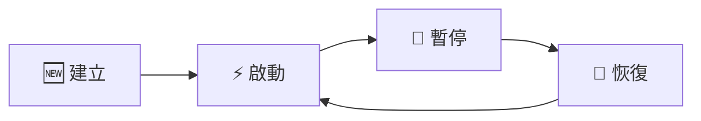
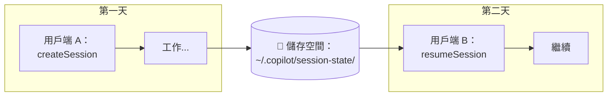
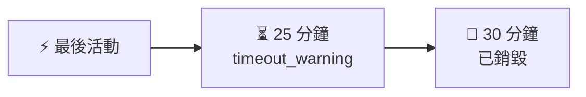
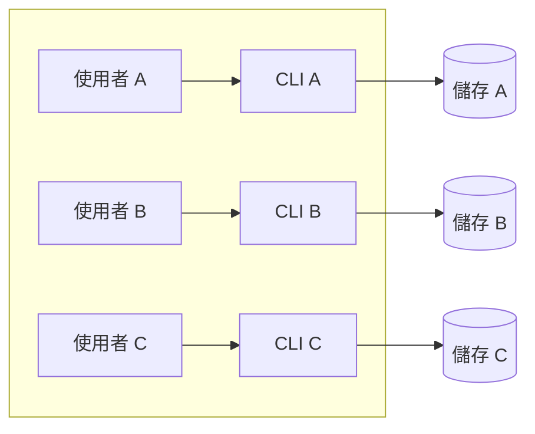
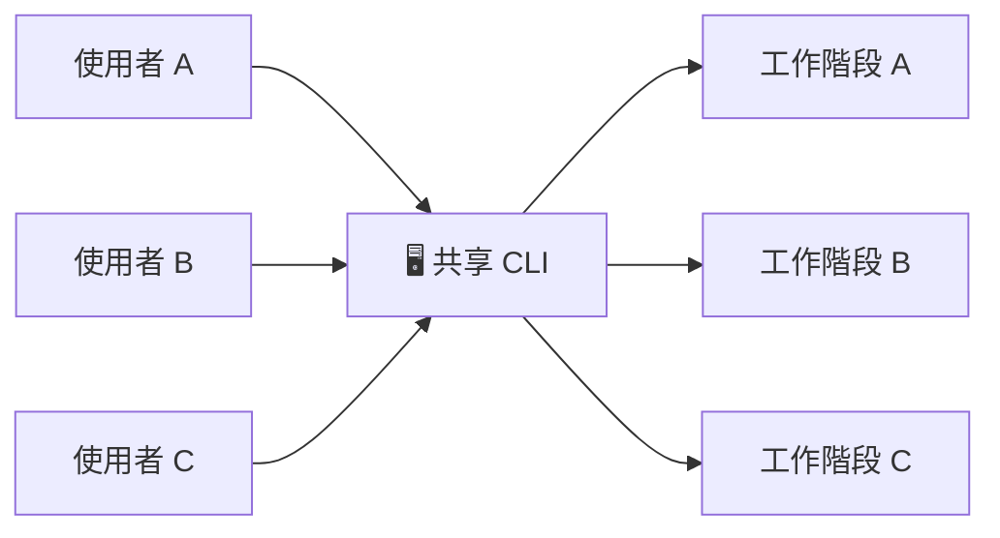
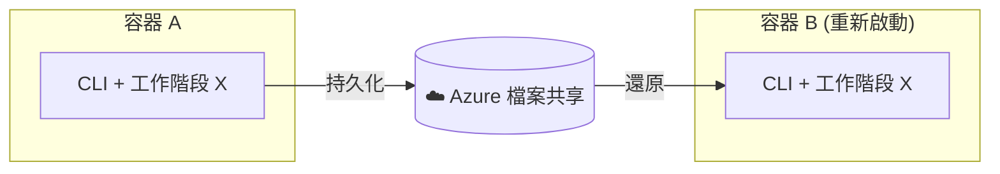

# 工作階段恢復與持久化 (Session Resume & Persistence)

本指南將引導您瞭解 SDK 的工作階段持久化功能——如何暫停工作、稍後恢復，以及在生產環境中管理工作階段。

## 工作階段的工作原理

當您建立工作階段時，Copilot CLI 會維護對話歷史記錄、工具狀態和規劃上下文。預設情況下，此狀態存在於記憶體中，並在工作階段結束時消失。啟用持久化後，您可以跨重新啟動、容器遷移、甚至不同的用戶端執行個體來恢復工作階段。



| 狀態 | 發生了什麼 |
|-------|--------------|
| **建立 (Create)** | 分配 `session_id` |
| **啟動 (Active)** | 發送提示、工具呼叫、回應 |
| **暫停 (Paused)** | 狀態儲存到磁碟 |
| **恢復 (Resume)** | 從磁碟載入狀態 |

## 快速入門：建立可恢復的工作階段

可恢復工作階段的關鍵是提供您自己的 `session_id`。如果不提供，SDK 會生成一個隨機 ID，且該工作階段稍後無法恢復。

### TypeScript

```typescript
import { CopilotClient } from "@github/copilot-sdk";

const client = new CopilotClient();

// 使用具有意義的 ID 建立工作階段
const session = await client.createSession({
  sessionId: "user-123-task-456",
  model: "gpt-5.2-codex",
});

// 執行一些工作...
await session.sendAndWait({ prompt: "分析我的程式碼庫" });

// 工作階段狀態會自動持久化
// 您可以安全地關閉用戶端
```

### Python

```python
from copilot import CopilotClient

client = CopilotClient()
await client.start()

# 使用具有意義的 ID 建立工作階段
session = await client.create_session({
    "session_id": "user-123-task-456",
    "model": "gpt-5.2-codex",
})

# 執行一些工作...
await session.send_and_wait({"prompt": "分析我的程式碼庫"})

# 工作階段狀態會自動持久化
```

### Go

<!-- docs-validate: hidden -->
```go
package main

import (
	"context"
	copilot "github.com/github/copilot-sdk/go"
)

func main() {
	ctx := context.Background()
	client := copilot.NewClient(nil)

	session, _ := client.CreateSession(ctx, &copilot.SessionConfig{
		SessionID: "user-123-task-456",
		Model:     "gpt-5.2-codex",
		OnPermissionRequest: func(req copilot.PermissionRequest, inv copilot.PermissionInvocation) (copilot.PermissionRequestResult, error) {
			return copilot.PermissionRequestResult{Kind: copilot.PermissionRequestResultKindApproved}, nil
		},
	})

	session.SendAndWait(ctx, copilot.MessageOptions{Prompt: "分析我的程式碼庫"})
	_ = session
}
```
<!-- /docs-validate: hidden -->

```go
ctx := context.Background()
client := copilot.NewClient(nil)

// 使用具有意義的 ID 建立工作階段
session, _ := client.CreateSession(ctx, &copilot.SessionConfig{
    SessionID: "user-123-task-456",
    Model:     "gpt-5.2-codex",
})

// 執行一些工作...
session.SendAndWait(ctx, copilot.MessageOptions{Prompt: "分析我的程式碼庫"})

// 工作階段狀態會自動持久化
```

### C# (.NET)

```csharp
using GitHub.Copilot.SDK;

var client = new CopilotClient();

// 使用具有意義的 ID 建立工作階段
var session = await client.CreateSessionAsync(new SessionConfig
{
    SessionId = "user-123-task-456",
    Model = "gpt-5.2-codex",
});

// 執行一些工作...
await session.SendAndWaitAsync(new MessageOptions { Prompt = "分析我的程式碼庫" });

// 工作階段狀態會自動持久化
```

## 恢復工作階段

稍後——幾分鐘、幾小時甚至幾天後——您可以從上次中斷的地方恢復工作階段。



### TypeScript

```typescript
// 從不同的用戶端執行個體（或在重新啟動後）恢復
const session = await client.resumeSession("user-123-task-456");

// 從上次中斷的地方繼續
await session.sendAndWait({ prompt: "我們之前討論了什麼？" });
```

### Python

```python
# 從不同的用戶端執行個體（或在重新啟動後）恢復
session = await client.resume_session("user-123-task-456")

# 從上次中斷的地方繼續
await session.send_and_wait({"prompt": "我們之前討論了什麼？"})
```

### Go

<!-- docs-validate: hidden -->
```go
package main

import (
	"context"
	copilot "github.com/github/copilot-sdk/go"
)

func main() {
	ctx := context.Background()
	client := copilot.NewClient(nil)

	session, _ := client.ResumeSession(ctx, "user-123-task-456", nil)

	session.SendAndWait(ctx, copilot.MessageOptions{Prompt: "我們之前討論了什麼？"})
	_ = session
}
```
<!-- /docs-validate: hidden -->

```go
ctx := context.Background()

// 從不同的用戶端執行個體（或在重新啟動後）恢復
session, _ := client.ResumeSession(ctx, "user-123-task-456", nil)

// 從上次中斷的地方繼續
session.SendAndWait(ctx, copilot.MessageOptions{Prompt: "我們之前討論了什麼？"})
```

### C# (.NET)

<!-- docs-validate: hidden -->
```csharp
using GitHub.Copilot.SDK;

public static class ResumeSessionExample
{
    public static async Task Main()
    {
        await using var client = new CopilotClient();

        var session = await client.ResumeSessionAsync("user-123-task-456", new ResumeSessionConfig
        {
            OnPermissionRequest = (req, inv) =>
                Task.FromResult(new PermissionRequestResult { Kind = PermissionRequestResultKind.Approved }),
        });

        await session.SendAndWaitAsync(new MessageOptions { Prompt = "我們之前討論了什麼？" });
    }
}
```
<!-- /docs-validate: hidden -->

```csharp
// 從不同的用戶端執行個體（或在重新啟動後）恢復
var session = await client.ResumeSessionAsync("user-123-task-456");

// 從上次中斷的地方繼續
await session.SendAndWaitAsync(new MessageOptions { Prompt = "我們之前討論了什麼？" });
```

## 恢復選項

恢復工作階段時，您可以選擇性地重新配置許多設定。這在您需要更改模型、更新工具配置或修改行為時非常有用。

| 選項 | 描述 |
|--------|-------------|
| `model` | 更改恢復後的工作階段模型 |
| `systemMessage` | 覆蓋或擴展系統提示 |
| `availableTools` | 限制可用的工具 |
| `excludedTools` | 停用特定工具 |
| `provider` | 重新提供 BYOK 憑據（BYOK 工作階段必需） |
| `reasoningEffort` | 調整推理強度等級 |
| `streaming` | 啟用/停用串流回應 |
| `workingDirectory` | 更改工作目錄 |
| `configDir` | 覆蓋配置目錄 |
| `mcpServers` | 配置 MCP 伺服器 |
| `customAgents` | 配置自定義代理 (Custom Agents) |
| `agent` | 通過名稱預先選擇自定義代理 |
| `skillDirectories` | 載入技能 (Skills) 的目錄 |
| `disabledSkills` | 要停用的技能 |
| `infiniteSessions` | 配置無限工作階段行為 |

### 範例：恢復時更改模型

```typescript
// 使用不同的模型恢復
const session = await client.resumeSession("user-123-task-456", {
  model: "claude-sonnet-4",  // 切換到不同的模型
  reasoningEffort: "high",   // 增加推理強度
});
```

## 在恢復的工作階段中使用 BYOK (自備金鑰)

使用您自己的 API 金鑰時，恢復時必須重新提供供應商配置。出於安全原因，API 金鑰永遠不會持久化到磁碟。

```typescript
// 使用 BYOK 的初始工作階段
const session = await client.createSession({
  sessionId: "user-123-task-456",
  model: "gpt-5.2-codex",
  provider: {
    type: "azure",
    endpoint: "https://my-resource.openai.azure.com",
    apiKey: process.env.AZURE_OPENAI_KEY,
    deploymentId: "my-gpt-deployment",
  },
});

// 恢復時，您必須重新提供供應商配置
const resumed = await client.resumeSession("user-123-task-456", {
  provider: {
    type: "azure",
    endpoint: "https://my-resource.openai.azure.com",
    apiKey: process.env.AZURE_OPENAI_KEY,  // 需要再次提供
    deploymentId: "my-gpt-deployment",
  },
});
```

## 哪些內容會被持久化？

工作階段狀態儲存在 `~/.copilot/session-state/{sessionId}/`：

```
~/.copilot/session-state/
└── user-123-task-456/
    ├── checkpoints/           # 對話歷史快照
    │   ├── 001.json          # 初始狀態
    │   ├── 002.json          # 第一次互動後
    │   └── ...               # 增量檢查點
    ├── plan.md               # 代理的規劃狀態（如果有）
    └── files/                # 工作階段產出物
        ├── analysis.md       # 代理建立的檔案
        └── notes.txt         # 工作文件
```

| 資料 | 已持久化？ | 備註 |
|------|------------|-------|
| 對話歷史記錄 | ✅ 是 | 完整的訊息執行緒 |
| 工具呼叫結果 | ✅ 是 | 快取以用於上下文 |
| 代理規劃狀態 | ✅ 是 | `plan.md` 檔案 |
| 工作階段產出物 | ✅ 是 | 在 `files/` 目錄中 |
| 供應商/API 金鑰 | ❌ 否 | 安全：必須重新提供 |
| 記憶體中的工具狀態 | ❌ 否 | 工具應該是無狀態的 |

## 工作階段 ID 最佳實踐

選擇能夠編碼所有權和用途的工作階段 ID。這使得稽核和清理變得更加容易。

| 模式 | 範例 | 使用場景 |
|---------|---------|----------|
| ❌ `abc123` | 隨機 ID | 難以稽核，沒有所有權資訊 |
| ✅ `user-{userId}-{taskId}` | `user-alice-pr-review-42` | 多使用者應用程式 |
| ✅ `tenant-{tenantId}-{workflow}` | `tenant-acme-onboarding` | 多租戶 SaaS |
| ✅ `{userId}-{taskId}-{timestamp}` | `alice-deploy-1706932800` | 基於時間的清理 |

**結構化 ID 的好處：**
- 易於稽核：「顯示使用者 alice 的所有工作階段」
- 易於清理：「刪除所有早於 X 的工作階段」
- 自然的存取控制：從工作階段 ID 解析使用者 ID

### 範例：生成工作階段 ID

```typescript
function createSessionId(userId: string, taskType: string): string {
  const timestamp = Date.now();
  return `${userId}-${taskType}-${timestamp}`;
}

const sessionId = createSessionId("alice", "code-review");
// → "alice-code-review-1706932800000"
```

```python
import time

def create_session_id(user_id: str, task_type: str) -> str:
    timestamp = int(time.time())
    return f"{user_id}-{task_type}-{timestamp}"

session_id = create_session_id("alice", "code-review")
# → "alice-code-review-1706932800"
```

## 管理工作階段生命週期

### 列出作用中的工作階段

```typescript
// 列出所有工作階段
const sessions = await client.listSessions();
console.log(`找到 ${sessions.length} 個工作階段`);

for (const session of sessions) {
  console.log(`- ${session.sessionId} (建立時間：${session.createdAt})`);
}

// 按儲存庫篩選工作階段
const repoSessions = await client.listSessions({ repository: "owner/repo" });
```

### 清理舊的工作階段

```typescript
async function cleanupExpiredSessions(maxAgeMs: number) {
  const sessions = await client.listSessions();
  const now = Date.now();
  
  for (const session of sessions) {
    const age = now - new Date(session.createdAt).getTime();
    if (age > maxAgeMs) {
      await client.deleteSession(session.sessionId);
      console.log(`已刪除過期的工作階段：${session.sessionId}`);
    }
  }
}

// 清理超過 24 小時的工作階段
await cleanupExpiredSessions(24 * 60 * 60 * 1000);
```

### 斷開工作階段連接 (`disconnect`)

當任務完成時，明確地斷開與工作階段的連接，而不是等待超時。這會釋放記憶體中的資源，但會**保留磁碟上的工作階段資料**，因此稍後仍可恢復該工作階段：

```typescript
try {
  // 執行工作...
  await session.sendAndWait({ prompt: "完成任務" });
  
  // 任務完成 — 釋放記憶體中的資源（稍後可以恢復工作階段）
  await session.disconnect();
} catch (error) {
  // 即使發生錯誤也要進行清理
  await session.disconnect();
  throw error;
}
```

每個 SDK 還提供了慣用的自動清理模式：

| 語言 | 模式 | 範例 |
|----------|---------|---------|
| **TypeScript** | `Symbol.asyncDispose` | `await using session = await client.createSession(config);` |
| **Python** | `async with` 上下文管理器 | `async with await client.create_session(config) as session:` |
| **C#** | `IAsyncDisposable` | `await using var session = await client.CreateSessionAsync(config);` |
| **Go** | `defer` | `defer session.Disconnect()` |

> **注意：** `destroy()` 已被棄用，建議改用 `disconnect()`。使用 `destroy()` 的現有程式碼將繼續工作，但應進行遷移。

### 永久刪除工作階段 (`deleteSession`)

要從磁碟中永久移除工作階段及其所有資料（對話歷史記錄、規劃狀態、產出物），請使用 `deleteSession`。這是不可逆的——刪除後**無法**恢復該工作階段：

```typescript
// 永久移除工作階段資料
await client.deleteSession("user-123-task-456");
```

> **`disconnect()` vs `deleteSession()`：** `disconnect()` 釋放記憶體中的資源，但將工作階段資料保留在磁碟上以供稍後恢復。`deleteSession()` 永久移除所有內容，包括磁碟上的檔案。

## 自動清理：閒置超時

CLI 內建了 30 分鐘的閒置超時。沒有活動的工作階段將自動清理：



監聽閒置事件以瞭解工作何時完成：

```typescript
session.on("session.idle", (event) => {
  console.log(`工作階段已閒置 ${event.idleDurationMs} 毫秒`);
});
```

## 部署模式

### 模式 1：每個使用者一個 CLI 伺服器（推薦）

最適用於：強隔離、多租戶環境、Azure 動態工作階段 (Azure Dynamic Sessions)。



**優點：** ✅ 完全隔離 | ✅ 簡單的安全機制 | ✅ 易於擴展

### 模式 2：共享 CLI 伺服器（資源效率高）

最適用於：內部工具、受信任的環境、資源受限的設定。



**要求：**
- ⚠️ 每個使用者唯一的工作階段 ID
- ⚠️ 應用程式級別的存取控制
- ⚠️ 操作前驗證工作階段 ID

```typescript
// 共享 CLI 的應用程式級別存取控制
async function resumeSessionWithAuth(
  client: CopilotClient,
  sessionId: string,
  currentUserId: string
): Promise<Session> {
  // 從工作階段 ID 解析使用者
  const [sessionUserId] = sessionId.split("-");
  
  if (sessionUserId !== currentUserId) {
    throw new Error("存取被拒絕：工作階段屬於另一個使用者");
  }
  
  return client.resumeSession(sessionId);
}
```

## Azure 動態工作階段 (Azure Dynamic Sessions)

對於容器可能會重新啟動或遷移的無伺服器/容器部署：

### 掛載持久化儲存

工作階段狀態目錄必須掛載到持久化儲存：

```yaml
# Azure Container Instance 範例
containers:
  - name: copilot-agent
    image: my-agent:latest
    volumeMounts:
      - name: session-storage
        mountPath: /home/app/.copilot/session-state

volumes:
  - name: session-storage
    azureFile:
      shareName: copilot-sessions
      storageAccountName: myaccount
```



**工作階段在容器重新啟動後依然存在！**

## 長時間執行工作流的無限工作階段

對於可能超過上下文限制的工作流，啟用具有自動壓縮功能的無限工作階段 (Infinite Sessions)：

```typescript
const session = await client.createSession({
  sessionId: "long-workflow-123",
  infiniteSessions: {
    enabled: true,
    backgroundCompactionThreshold: 0.80,  // 在 80% 上下文時開始壓縮
    bufferExhaustionThreshold: 0.95,      // 如果需要，在 95% 時封鎖
  },
});
```

> **注意：** 閾值是上下文利用率 (0.0-1.0)，而不是絕對 Token 計數。詳情請參閱 [相容性指南](../troubleshooting/compatibility_zh_TW.md)。

## 限制與注意事項

| 限制 | 描述 | 緩解措施 |
|------------|-------------|------------|
| **BYOK 重新身分驗證** | API 金鑰不會被持久化 | 將金鑰儲存在您的秘密管理器中；恢復時提供 |
| **可寫入儲存** | `~/.copilot/session-state/` 必須可寫入 | 在容器中掛載持久化磁碟區 |
| **無工作階段鎖定** | 同時存取同一工作階段的行為未定義 | 實作應用程式級別的鎖定或隊列 |
| **工具狀態未持久化** | 記憶體中的工具狀態會丟失 | 將工具設計為無狀態，或讓其自行持久化狀態 |

### 處理同時存取

SDK 不提供內建的工作階段鎖定。如果可能有多個用戶端存取同一個工作階段：

```typescript
// 選項 1：使用 Redis 進行應用程式級別鎖定
import Redis from "ioredis";

const redis = new Redis();

async function withSessionLock<T>(
  sessionId: string,
  fn: () => Promise<T>
): Promise<T> {
  const lockKey = `session-lock:${sessionId}`;
  const acquired = await redis.set(lockKey, "locked", "NX", "EX", 300);
  
  if (!acquired) {
    throw new Error("工作階段正被另一個用戶端使用");
  }
  
  try {
    return await fn();
  } finally {
    await redis.del(lockKey);
  }
}

// 用法
await withSessionLock("user-123-task-456", async () => {
  const session = await client.resumeSession("user-123-task-456");
  await session.sendAndWait({ prompt: "繼續任務" });
});
```

## 總結

| 功能 | 如何使用 |
|---------|------------|
| **建立可恢復的工作階段** | 提供您自己的 `sessionId` |
| **恢復工作階段** | `client.resumeSession(sessionId)` |
| **BYOK 恢復** | 重新提供 `provider` 配置 |
| **列出工作階段** | `client.listSessions(filter?)` |
| **斷開與使用中工作階段的連接** | `session.disconnect()` — 釋放記憶體中的資源；保留磁碟上的工作階段資料以供恢復 |
| **永久刪除工作階段** | `client.deleteSession(sessionId)` — 從磁碟永久移除所有工作階段資料；無法恢復 |
| **容器化部署** | 將 `~/.copilot/session-state/` 掛載到持久化儲存 |

## 下一步

- [鉤子 (Hooks) 概述](../hooks/index_zh_TW.md) - 使用鉤子自定義工作階段行為
- [相容性指南](../troubleshooting/compatibility_zh_TW.md) - SDK 與 CLI 功能比較
- [偵錯指南](../troubleshooting/debugging_zh_TW.md) - 疑難排解工作階段問題
