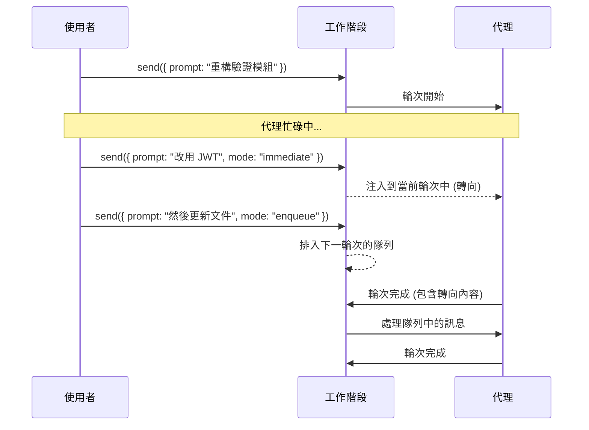

# 轉向與隊列 (Steering & Queueing)

這兩種互動模式讓使用者在代理 (Agent) 正在工作時也能發送訊息：**轉向 (Steering)** 可在輪次中重定向代理，而**隊列 (Queueing)** 則會快取訊息，以便在當前輪次完成後進行順序處理。

## 概述

當工作階段正在積極處理一個輪次時，傳入的訊息可以透過 `MessageOptions` 上的 `mode` 欄位以以下兩種模式之一進行傳遞：

| 模式 | 行為 | 使用場景 |
|------|----------|----------|
| `"immediate"` (轉向) | 注入到**當前** LLM 輪次中 | 「實際上，不要建立那個檔案 —— 使用不同的方法」 |
| `"enqueue"` (隊列) | 進入隊列並在當前輪次結束**後**處理 | 「這件事之後，也修復一下測試」 |



## 轉向 (立即模式)

轉向會發送一條直接注入到代理當前輪次中的訊息。代理會即時看到該訊息並相應調整其回應 —— 這對於在不中止輪次的情況下進行路徑修正非常有用。

<details open>
<summary><strong>Node.js / TypeScript</strong></summary>

```typescript
import { CopilotClient } from "@github/copilot-sdk";

const client = new CopilotClient();
await client.start();

const session = await client.createSession({
    model: "gpt-4.1",
    onPermissionRequest: async () => ({ kind: "approved" }),
});

// 開始一個長時間運行的任務
const msgId = await session.send({
    prompt: "將驗證模組重構為使用工作階段 (sessions)",
});

// 當代理正在工作時，引導它轉向
await session.send({
    prompt: "實際上，使用 JWT token 代替工作階段",
    mode: "immediate",
});
```

</details>

<details>
<summary><strong>Python</strong></summary>

```python
from copilot import CopilotClient
from copilot.types import PermissionRequestResult

async def main():
    client = CopilotClient()
    await client.start()

    session = await client.create_session({
        "model": "gpt-4.1",
        "on_permission_request": lambda req, inv: PermissionRequestResult(kind="approved"),
    })

    # 開始一個長時間運行的任務
    msg_id = await session.send({
        "prompt": "將驗證模組重構為使用工作階段 (sessions)",
    })

    # 當代理正在工作時，引導它轉向
    await session.send({
        "prompt": "實際上，使用 JWT token 代替工作階段",
        "mode": "immediate",
    })

    await client.stop()
```

</details>

<details>
<summary><strong>Go</strong></summary>

```go
package main

import (
    "context"
    "log"
    copilot "github.com/github/copilot-sdk/go"
)

func main() {
    ctx := context.Background()
    client := copilot.NewClient(nil)
    if err := client.Start(ctx); err != nil {
        log.Fatal(err)
    }
    defer client.Stop()

    session, err := client.CreateSession(ctx, &copilot.SessionConfig{
        Model: "gpt-4.1",
        OnPermissionRequest: func(req copilot.PermissionRequest, inv copilot.PermissionInvocation) (copilot.PermissionRequestResult, error) {
            return copilot.PermissionRequestResult{Kind: copilot.PermissionRequestResultKindApproved}, nil
        },
    })
    if err != nil {
        log.Fatal(err)
    }

    // 開始一個長時間運行的任務
    _, err = session.Send(ctx, copilot.MessageOptions{
        Prompt: "將驗證模組重構為使用工作階段 (sessions)",
    })
    if err != nil {
        log.Fatal(err)
    }

    // 當代理正在工作時，引導它轉向
    _, err = session.Send(ctx, copilot.MessageOptions{
        Prompt: "實際上，使用 JWT token 代替工作階段",
        Mode:   "immediate",
    })
    if err != nil {
        log.Fatal(err)
    }
}
```

</details>

<details>
<summary><strong>.NET</strong></summary>

```csharp
using GitHub.Copilot.SDK;

await using var client = new CopilotClient();
await using var session = await client.CreateSessionAsync(new SessionConfig
{
    Model = "gpt-4.1",
    OnPermissionRequest = (req, inv) =>
        Task.FromResult(new PermissionRequestResult { Kind = PermissionRequestResultKind.Approved }),
});

// 開始一個長時間運行的任務
var msgId = await session.SendAsync(new MessageOptions
{
    Prompt = "將驗證模組重構為使用工作階段 (sessions)"
});

// 當代理正在工作時，引導它轉向
await session.SendAsync(new MessageOptions
{
    Prompt = "實際上，使用 JWT token 代替工作階段",
    Mode = "immediate"
});
```

</details>

### 轉向的內部原理

1. 訊息被添加到執行階段的 `ImmediatePromptProcessor` 隊列中。
2. 在當前輪次內的下一次 LLM 請求之前，處理器會將訊息注入到對話中。
3. 代理將轉向訊息視為新的使用者訊息，並調整其回應。
4. 如果輪次在處理轉向訊息之前完成，該訊息會自動移至一般隊列，供下一輪次使用。

> **注意：** 轉向訊息在當前輪次內是「盡力而為 (best-effort)」的。如果代理已經開始執行工具呼叫，轉向將在該呼叫完成後生效，但仍在同一個輪次內。

## 隊列 (入隊模式)

隊列會緩衝訊息，以便在當前輪次結束後按順序處理。每個排隊的訊息都會啟動一個完整的輪次。這是預設模式 —— 如果省略 `mode`，SDK 會使用 `"enqueue"`。

<details open>
<summary><strong>Node.js / TypeScript</strong></summary>

```typescript
import { CopilotClient } from "@github/copilot-sdk";

const client = new CopilotClient();
await client.start();

const session = await client.createSession({
    model: "gpt-4.1",
    onPermissionRequest: async () => ({ kind: "approved" }),
});

// 發送初始任務
await session.send({ prompt: "建立專案結構" });

// 當代理忙碌時，排入後續任務
await session.send({
    prompt: "為驗證模組添加單元測試",
    mode: "enqueue",
});

await session.send({
    prompt: "更新 README 並包含設定說明",
    mode: "enqueue",
});

// 訊息將在每個輪次完成後，按先進先出 (FIFO) 順序處理
```

</details>

<details>
<summary><strong>Python</strong></summary>

```python
from copilot import CopilotClient
from copilot.types import PermissionRequestResult

async def main():
    client = CopilotClient()
    await client.start()

    session = await client.create_session({
        "model": "gpt-4.1",
        "on_permission_request": lambda req, inv: PermissionRequestResult(kind="approved"),
    })

    # 發送初始任務
    await session.send({"prompt": "建立專案結構"})

    # 當代理忙碌時，排入後續任務
    await session.send({
        "prompt": "為驗證模組添加單元測試",
        "mode": "enqueue",
    })

    await session.send({
        "prompt": "更新 README 並包含設定說明",
        "mode": "enqueue",
    })

    # 訊息將在每個輪次完成後，按先進先出 (FIFO) 順序處理
    await client.stop()
```

</details>

<details>
<summary><strong>Go</strong></summary>

<!-- docs-validate: hidden -->
```go
package main

import (
	"context"
	copilot "github.com/github/copilot-sdk/go"
)

func main() {
	ctx := context.Background()
	client := copilot.NewClient(nil)
	client.Start(ctx)

	session, _ := client.CreateSession(ctx, &copilot.SessionConfig{
		Model: "gpt-4.1",
		OnPermissionRequest: func(req copilot.PermissionRequest, inv copilot.PermissionInvocation) (copilot.PermissionRequestResult, error) {
			return copilot.PermissionRequestResult{Kind: copilot.PermissionRequestResultKindApproved}, nil
		},
	})

	session.Send(ctx, copilot.MessageOptions{
		Prompt: "建立專案結構",
	})

	session.Send(ctx, copilot.MessageOptions{
		Prompt: "為驗證模組添加單元測試",
		Mode:   "enqueue",
	})

	session.Send(ctx, copilot.MessageOptions{
		Prompt: "更新 README 並包含設定說明",
		Mode:   "enqueue",
	})
}
```
<!-- /docs-validate: hidden -->

```go
// 發送初始任務
session.Send(ctx, copilot.MessageOptions{
    Prompt: "建立專案結構",
})

// 當代理忙碌時，排入後續任務
session.Send(ctx, copilot.MessageOptions{
    Prompt: "為驗證模組添加單元測試",
    Mode:   "enqueue",
})

session.Send(ctx, copilot.MessageOptions{
    Prompt: "更新 README 並包含設定說明",
    Mode:   "enqueue",
})

// 訊息將在每個輪次完成後，按先進先出 (FIFO) 順序處理
```

</details>

<details>
<summary><strong>.NET</strong></summary>

<!-- docs-validate: hidden -->
```csharp
using GitHub.Copilot.SDK;

public static class QueueingExample
{
    public static async Task Main()
    {
        await using var client = new CopilotClient();
        await using var session = await client.CreateSessionAsync(new SessionConfig
        {
            Model = "gpt-4.1",
            OnPermissionRequest = (req, inv) =>
                Task.FromResult(new PermissionRequestResult { Kind = PermissionRequestResultKind.Approved }),
        });

        await session.SendAsync(new MessageOptions
        {
            Prompt = "建立專案結構"
        });

        await session.SendAsync(new MessageOptions
        {
            Prompt = "為驗證模組添加單元測試",
            Mode = "enqueue"
        });

        await session.SendAsync(new MessageOptions
        {
            Prompt = "更新 README 並包含設定說明",
            Mode = "enqueue"
        });
    }
}
```
<!-- /docs-validate: hidden -->

```csharp
// 發送初始任務
await session.SendAsync(new MessageOptions
{
    Prompt = "建立專案結構"
});

// 當代理忙碌時，排入後續任務
await session.SendAsync(new MessageOptions
{
    Prompt = "為驗證模組添加單元測試",
    Mode = "enqueue"
});

await session.SendAsync(new MessageOptions
{
    Prompt = "更新 README 並包含設定說明",
    Mode = "enqueue"
});

// 訊息將在每個輪次完成後，按先進先出 (FIFO) 順序處理
```

</details>

### 隊列的內部原理

1. 訊息作為 `QueuedItem` 被添加到工作階段的 `itemQueue` 中。
2. 當前輪次完成且工作階段進入閒置狀態時，會運行 `processQueuedItems()`。
3. 項目按 FIFO 順序出隊 —— 每個訊息都會觸發一個完整的代理輪次。
4. 如果輪次結束時有待處理的轉向訊息，該訊息會被移至隊列的最前端。
5. 處理持續進行，直到隊列為空，然後工作階段發出閒置事件。

## 結合轉向與隊列

您可以在單個工作階段中同時使用這兩種模式。轉向會影響當前輪次，而排隊的訊息則等待屬於它們自己的輪次：

<details open>
<summary><strong>Node.js / TypeScript</strong></summary>

```typescript
const session = await client.createSession({
    model: "gpt-4.1",
    onPermissionRequest: async () => ({ kind: "approved" }),
});

// 開始一個任務
await session.send({ prompt: "重構資料庫層" });

// 引導當前工作轉向
await session.send({
    prompt: "請確保與 v1 API 的回溯相容性",
    mode: "immediate",
});

// 排入此輪次後的後續任務
await session.send({
    prompt: "現在為架構變更添加遷移指令碼",
    mode: "enqueue",
});
```

</details>

<details>
<summary><strong>Python</strong></summary>

```python
session = await client.create_session({
    "model": "gpt-4.1",
    "on_permission_request": lambda req, inv: PermissionRequestResult(kind="approved"),
})

# 開始一個任務
await session.send({"prompt": "重構資料庫層"})

# 引導當前工作轉向
await session.send({
    "prompt": "請確保與 v1 API 的回溯相容性",
    "mode": "immediate",
})

# 排入此輪次後的後續任務
await session.send({
    "prompt": "現在為架構變更添加遷移指令碼",
    "mode": "enqueue",
})
```

</details>

## 如何在轉向與隊列之間做出選擇

| 場景 | 模式 | 原因 |
|----------|---------|-----|
| 代理走錯了路徑 | **轉向** | 在不丟失進度的情況下重定向當前輪次 |
| 你想到了一些代理也應該做的事情 | **隊列** | 不會干擾當前工作；在之後運行 |
| 代理即將犯錯 | **轉向** | 在錯誤發生之前進行干預 |
| 你想串聯多個任務 | **隊列** | FIFO 順序確保可預測的執行 |
| 你想為當前任務添加上下文 | **轉向** | 代理會將其納入當前的推理中 |
| 你想批次處理不相關的請求 | **隊列** | 每個請求都有自己完整的輪次和乾淨的上下文 |

## 使用轉向與隊列構建 UI

以下是構建支援兩種模式的互動式 UI 的模式：

```typescript
import { CopilotClient, CopilotSession } from "@github/copilot-sdk";

interface PendingMessage {
    prompt: string;
    mode: "immediate" | "enqueue";
    sentAt: Date;
}

class InteractiveChat {
    private session: CopilotSession;
    private isProcessing = false;
    private pendingMessages: PendingMessage[] = [];

    constructor(session: CopilotSession) {
        this.session = session;

        session.on((event) => {
            if (event.type === "session.idle") {
                this.isProcessing = false;
                this.onIdle();
            }
            if (event.type === "assistant.message") {
                this.renderMessage(event);
            }
        });
    }

    async sendMessage(prompt: string): Promise<void> {
        if (!this.isProcessing) {
            this.isProcessing = true;
            await this.session.send({ prompt });
            return;
        }

        // 工作階段忙碌中 — 讓使用者選擇傳遞方式
        // 您的 UI 會呈現此選擇（例如：按鈕、鍵盤快捷鍵）
    }

    async steer(prompt: string): Promise<void> {
        this.pendingMessages.push({
            prompt,
            mode: "immediate",
            sentAt: new Date(),
        });
        await this.session.send({ prompt, mode: "immediate" });
    }

    async enqueue(prompt: string): Promise<void> {
        this.pendingMessages.push({
            prompt,
            mode: "enqueue",
            sentAt: new Date(),
        });
        await this.session.send({ prompt, mode: "enqueue" });
    }

    private onIdle(): void {
        this.pendingMessages = [];
        // 更新 UI 以顯示工作階段已準備好接受新輸入
    }

    private renderMessage(event: unknown): void {
        // 在您的 UI 中渲染助手訊息
    }
}
```

## API 參考

### MessageOptions

| 語言 | 欄位 | 類型 | 預設值 | 描述 |
|----------|-------|------|---------|-------------|
| Node.js | `mode` | `"enqueue" \| "immediate"` | `"enqueue"` | 訊息傳遞模式 |
| Python | `mode` | `Literal["enqueue", "immediate"]` | `"enqueue"` | 訊息傳遞模式 |
| Go | `Mode` | `string` | `"enqueue"` | 訊息傳遞模式 |
| .NET | `Mode` | `string?` | `"enqueue"` | 訊息傳遞模式 |

### 傳遞模式 (Delivery Modes)

| 模式 | 效果 | 在活動輪次期間 | 在閒置期間 |
|------|--------|-------------------|-------------|
| `"enqueue"` | 排入下一輪次 | 在 FIFO 隊列中等待 | 立即啟動新輪次 |
| `"immediate"` | 注入當前輪次 | 在下一個 LLM 呼叫前注入 | 立即啟動新輪次 |

> **注意：** 當工作階段處於閒置狀態（未處理中）時，兩種模式的行為完全相同 —— 訊息會立即啟動一個新輪次。

## 最佳實踐

1. **預設使用隊列** — 對於大多數訊息，使用 `"enqueue"`（或省略 `mode`）。它是可預測的，且不會有干擾進行中工作的風險。

2. **將轉向保留給修正** — 當代理正在執行錯誤的操作，且您需要在其進一步操作之前重定向它時，使用 `"immediate"`。

3. **保持轉向訊息簡潔** — 代理需要快速理解路徑修正。冗長、複雜的轉向訊息可能會混淆當前上下文。

4. **不要過度轉向** — 多個快速的轉向訊息可能會降低輪次品質。如果您需要大幅改變方向，請考慮中止輪次並重新開始。

5. **在您的 UI 中顯示隊列狀態** — 顯示排隊訊息的數量，以便使用者瞭解待處理的內容。監聽閒置事件以清除顯示。

6. **處理轉向到隊列的遞補 (fallback)** — 如果轉向訊息在輪次完成後到達，它會自動移至隊列。請設計您的 UI 以反映這種轉換。

## 另請參閱

- [入門指南](../getting-started_zh_TW.md) — 設定工作階段並發送訊息
- [自定義代理 (Custom Agents)](./custom-agents_zh_TW.md) — 定義具有範圍工具的專門代理
- [工作階段鉤子 (Session Hooks)](../hooks/index_zh_TW.md) — 對工作階段生命週期事件做出反應
- [工作階段持久化 (Session Persistence)](./session-persistence_zh_TW.md) — 跨重新啟動恢復工作階段
