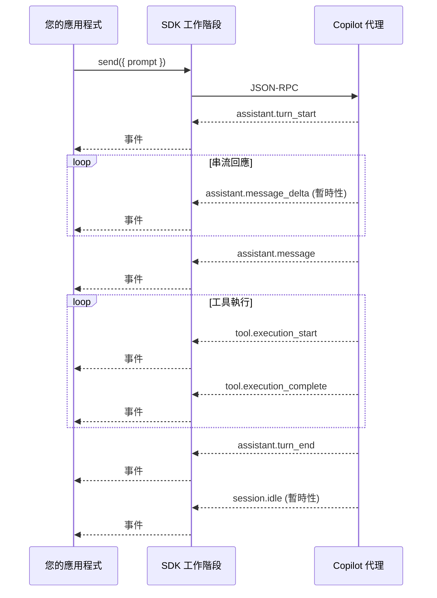

# 串流工作階段事件 (Streaming Session Events)

Copilot 代理採取的每項行動 — 思考、撰寫程式碼、執行工具 — 都會作為您可以訂閱的 **工作階段事件 (session event)** 發出。本指南是每個事件類型的欄位級別參考，因此您可以確切地知道預期會有什麼資料，而無需閱讀 SDK 原始碼。

## 概覽

在工作階段上設定 `streaming: true` 時，SDK 會在 **持久化 (persisted)** 事件（完整的訊息、工具結果）之外，即時發出 **暫時性 (ephemeral)** 事件（差異、進度更新）。所有事件都共享一個通用的外殼 (envelope)，並攜帶一個 `data` 負載，其形狀取決於事件的 `type`。



| 概念 | 說明 |
|---------|-------------|
| **暫時性事件 (Ephemeral event)** | 暫時的；即時串流，但 **不會** 持久化到工作階段日誌中。在恢復工作階段時不會重放。 |
| **持久化事件 (Persisted event)** | 儲存到磁碟上的工作階段事件日誌中。在恢復工作階段時會重放。 |
| **差異事件 (Delta event)** | 暫時性的串流區塊（文字或推理）。累積差異以建構完整的內容。 |
| **`parentId` 鏈** | 每個事件的 `parentId` 指向上一個事件，形成一個可以遍歷的連結列表。 |

## 事件外殼 (Event Envelope)

每個工作階段事件，不論類型為何，都包含以下欄位：

| 欄位 | 類型 | 說明 |
|-------|------|-------------|
| `id` | `string` (UUID v4) | 唯一事件識別碼 |
| `timestamp` | `string` (ISO 8601) | 事件建立時間 |
| `parentId` | `string \| null` | 鏈中上一個事件的 ID；第一個事件為 `null` |
| `ephemeral` | `boolean?` | 對於暫時性事件為 `true`；對於持久化事件為不存在或 `false` |
| `type` | `string` | 事件類型鑑別器（請參見下表） |
| `data` | `object` | 事件特定的負載 |

## 訂閱事件

<details open>
<summary><strong>Node.js / TypeScript</strong></summary>

```typescript
// 所有事件
session.on((event) => {
    console.log(event.type, event.data);
});

// 特定事件類型 — 資料會自動縮窄範圍 (narrowed)
session.on("assistant.message_delta", (event) => {
    process.stdout.write(event.data.deltaContent);
});
```

</details>

<details>
<summary><strong>Python</strong></summary>

<!-- docs-validate: hidden -->
```python
from copilot import CopilotClient
from copilot.generated.session_events import SessionEventType

client = CopilotClient()

session = None  # 假設工作階段是在其他地方建立的

def handle(event):
    if event.type == SessionEventType.ASSISTANT_MESSAGE_DELTA:
        print(event.data.delta_content, end="", flush=True)

# session.on(handle)
```
<!-- /docs-validate: hidden -->

```python
from copilot.generated.session_events import SessionEventType

def handle(event):
    if event.type == SessionEventType.ASSISTANT_MESSAGE_DELTA:
        print(event.data.delta_content, end="", flush=True)

session.on(handle)
```

</details>

<details>
<summary><strong>Go</strong></summary>

<!-- docs-validate: hidden -->
```go
package main

import (
	"context"
	"fmt"
	copilot "github.com/github/copilot-sdk/go"
)

func main() {
	ctx := context.Background()
	client := copilot.NewClient(nil)

	session, _ := client.CreateSession(ctx, &copilot.SessionConfig{
		Model:     "gpt-4.1",
		Streaming: true,
		OnPermissionRequest: func(req copilot.PermissionRequest, inv copilot.PermissionInvocation) (copilot.PermissionRequestResult, error) {
			return copilot.PermissionRequestResult{Kind: copilot.PermissionRequestResultKindApproved}, nil
		},
	})

	session.On(func(event copilot.SessionEvent) {
		if event.Type == "assistant.message_delta" {
			fmt.Print(*event.Data.DeltaContent)
		}
	})
	_ = session
}
```
<!-- /docs-validate: hidden -->

```go
session.On(func(event copilot.SessionEvent) {
    if event.Type == "assistant.message_delta" {
        fmt.Print(*event.Data.DeltaContent)
    }
})
```

</details>

<details>
<summary><strong>.NET</strong></summary>

<!-- docs-validate: hidden -->
```csharp
using GitHub.Copilot.SDK;

public static class StreamingEventsExample
{
    public static async Task Example(CopilotSession session)
    {
        session.On(evt =>
        {
            if (evt is AssistantMessageDeltaEvent delta)
            {
                Console.Write(delta.Data.DeltaContent);
            }
        });
    }
}
```
<!-- /docs-validate: hidden -->

```csharp
session.On(evt =>
{
    if (evt is AssistantMessageDeltaEvent delta)
    {
        Console.Write(delta.Data.DeltaContent);
    }
});
```

</details>

> **提示 (Python / Go)：** 這些 SDK 使用單一的 `Data` 類別/結構，其中所有可能的欄位都是選用的/可為 null 的。對於每種事件類型，只有下表中列出的欄位會被填充 — 其餘將為 `None` / `nil`。
>
> **提示 (.NET)：** .NET SDK 為每種事件使用獨立的強型別資料類別（例如 `AssistantMessageDeltaData`），因此每種類型上僅存在相關欄位。
>
> **提示 (TypeScript)：** TypeScript SDK 使用可辨識聯集 (discriminated union) — 當您對 `event.type` 進行匹配時，`data` 負載會自動縮窄為正確的形狀。

---

## 助理事件 (Assistant Events)

這些事件追蹤代理的回應生命週期 — 從輪次開始到串流區塊，再到最終訊息。

### `assistant.turn_start`

當代理開始處理輪次時發出。

| 資料欄位 | 類型 | 必填 | 說明 |
|------------|------|----------|-------------|
| `turnId` | `string` | ✅ | 輪次識別碼（通常是字串化的輪次編號） |
| `interactionId` | `string` | | 用於遙測關聯的 CAPI 互動 ID |

### `assistant.intent`

暫時性。代理目前正在做什麼的簡短說明，會隨著工作進展而更新。

| 資料欄位 | 類型 | 必填 | 說明 |
|------------|------|----------|-------------|
| `intent` | `string` | ✅ | 人類可讀的意圖（例如「正在探索程式碼庫」） |

### `assistant.reasoning`

來自模型的完整擴展思考塊。在推理完成後發出。

| 資料欄位 | 類型 | 必填 | 說明 |
|------------|------|----------|-------------|
| `reasoningId` | `string` | ✅ | 此推理塊的唯一識別碼 |
| `content` | `string` | ✅ | 完整的擴展思考文字 |

### `assistant.reasoning_delta`

暫時性。模型擴展思考的增量區塊，即時串流。

| 資料欄位 | 類型 | 必填 | 說明 |
|------------|------|----------|-------------|
| `reasoningId` | `string` | ✅ | 與對應的 `assistant.reasoning` 事件相符 |
| `deltaContent` | `string` | ✅ | 要附加到推理內容的文字區塊 |

### `assistant.message`

助理對此 LLM 呼叫的完整回應。可能包含工具叫用請求。

| 資料欄位 | 類型 | 必填 | 說明 |
|------------|------|----------|-------------|
| `messageId` | `string` | ✅ | 此訊息的唯一識別碼 |
| `content` | `string` | ✅ | 助理的文字回應 |
| `toolRequests` | `ToolRequest[]` | | 助理想要進行的工具呼叫（見下文） |
| `reasoningOpaque` | `string` | | 加密的擴展思考（Anthropic 模型）；工作階段綁定 |
| `reasoningText` | `string` | | 來自擴展思考的可讀推理文字 |
| `encryptedContent` | `string` | | 加密的推理內容（OpenAI 模型）；工作階段綁定 |
| `phase` | `string` | | 產生階段（例如 `"thinking"` 與 `"response"`） |
| `outputTokens` | `number` | | 來自 API 回應的實際輸出 token 計數 |
| `interactionId` | `string` | | 用於遙測的 CAPI 互動 ID |
| `parentToolCallId` | `string` | | 當此訊息源自子代理時設定 |

**`ToolRequest` 欄位：**

| 欄位 | 類型 | 必填 | 說明 |
|-------|------|----------|-------------|
| `toolCallId` | `string` | ✅ | 此工具呼叫的唯一 ID |
| `name` | `string` | ✅ | 工具名稱（例如 `"bash"`, `"edit"`, `"grep"`） |
| `arguments` | `object` | | 解析後的工具參數 |
| `type` | `"function" \| "custom"` | | 呼叫類型；缺失時預設為 `"function"` |

### `assistant.message_delta`

暫時性。助理文字回應的增量區塊，即時串流。

| 資料欄位 | 類型 | 必填 | 說明 |
|------------|------|----------|-------------|
| `messageId` | `string` | ✅ | 與對應的 `assistant.message` 事件相符 |
| `deltaContent` | `string` | ✅ | 要附加到訊息的文字區塊 |
| `parentToolCallId` | `string` | | 當源自子代理時設定 |

### `assistant.turn_end`

當代理完成輪次（所有工具執行完成，最終回應已交付）時發出。

| 資料欄位 | 類型 | 必填 | 說明 |
|------------|------|----------|-------------|
| `turnId` | `string` | ✅ | 與對應的 `assistant.turn_start` 事件相符 |

### `assistant.usage`

暫時性。個別 API 呼叫的 token 使用情況和成本資訊。

| 資料欄位 | 類型 | 必填 | 說明 |
|------------|------|----------|-------------|
| `model` | `string` | ✅ | 模型識別碼（例如 `"gpt-4.1"`） |
| `inputTokens` | `number` | | 消耗的輸入 token |
| `outputTokens` | `number` | | 產生的輸出 token |
| `cacheReadTokens` | `number` | | 從提示詞快取讀取的 token |
| `cacheWriteTokens` | `number` | | 寫入提示詞快取的 token |
| `cost` | `number` | | 用於計費的模型乘數成本 |
| `duration` | `number` | | API 呼叫持續時間（毫秒） |
| `initiator` | `string` | | 觸發此呼叫的原因（例如 `"sub-agent"`）；使用者起始時為不存在 |
| `apiCallId` | `string` | | 來自提供者的完成 ID（例如 `chatcmpl-abc123`） |
| `providerCallId` | `string` | | GitHub 要求追蹤 ID (`x-github-request-id`) |
| `parentToolCallId` | `string` | | 當使用量源自子代理時設定 |
| `quotaSnapshots` | `Record<string, QuotaSnapshot>` | | 每個配額的資源使用情況，以配額識別碼為鍵 |
| `copilotUsage` | `CopilotUsage` | | 來自 API 的項目化 token 成本明細 |

### `assistant.streaming_delta`

暫時性。低階網路進度指示器 — 從串流 API 回應接收到的總位元組數。

| 資料欄位 | 類型 | 必填 | 說明 |
|------------|------|----------|-------------|
| `totalResponseSizeBytes` | `number` | ✅ | 到目前為止接收到的累計位元組數 |

---

## 工具執行事件 (Tool Execution Events)

這些事件追蹤每個工具叫用的完整生命週期 — 從模型請求工具呼叫到執行再到完成。

### `tool.execution_start`

當工具開始執行時發出。

| 資料欄位 | 類型 | 必填 | 說明 |
|------------|------|----------|-------------|
| `toolCallId` | `string` | ✅ | 此工具呼叫的唯一識別碼 |
| `toolName` | `string` | ✅ | 工具名稱（例如 `"bash"`, `"edit"`, `"grep"`） |
| `arguments` | `object` | | 傳遞給工具的解析後的參數 |
| `mcpServerName` | `string` | | 當工具由 MCP 伺服器提供時的 MCP 伺服器名稱 |
| `mcpToolName` | `string` | | MCP 伺服器上的原始工具名稱 |
| `parentToolCallId` | `string` | | 當由子代理叫用時設定 |

### `tool.execution_partial_result`

暫時性。執行中工具的增量輸出（例如串流 bash 輸出）。

| 資料欄位 | 類型 | 必填 | 說明 |
|------------|------|----------|-------------|
| `toolCallId` | `string` | ✅ | 與對應的 `tool.execution_start` 相符 |
| `partialOutput` | `string` | ✅ | 增量輸出區塊 |

### `tool.execution_progress`

暫時性。執行中工具的人類可讀進度狀態（例如 MCP 伺服器進度通知）。

| 資料欄位 | 類型 | 必填 | 說明 |
|------------|------|----------|-------------|
| `toolCallId` | `string` | ✅ | 與對應的 `tool.execution_start` 相符 |
| `progressMessage` | `string` | ✅ | 進度狀態訊息 |

### `tool.execution_complete`

當工具執行完成時（成功或發生錯誤）發出。

| 資料欄位 | 類型 | 必填 | 說明 |
|------------|------|----------|-------------|
| `toolCallId` | `string` | ✅ | 與對應的 `tool.execution_start` 相符 |
| `success` | `boolean` | ✅ | 執行是否成功 |
| `model` | `string` | | 產生此工具呼叫的模型 |
| `interactionId` | `string` | | CAPI 互動 ID |
| `isUserRequested` | `boolean` | | 當使用者明確要求此工具呼叫時為 `true` |
| `result` | `Result` | | 成功時存在（見下文） |
| `error` | `{ message, code? }` | | 失敗時存在 |
| `toolTelemetry` | `object` | | 工具特定的遙測資料（例如 CodeQL 檢查計數） |
| `parentToolCallId` | `string` | | 當由子代理叫用時設定 |

**`Result` 欄位：**

| 欄位 | 類型 | 必填 | 說明 |
|-------|------|----------|-------------|
| `content` | `string` | ✅ | 傳送給 LLM 的簡明結果（可能為了 token 效率而截斷） |
| `detailedContent` | `string` | | 用於顯示的詳細結果，保留 diffs 等完整內容 |
| `contents` | `ContentBlock[]` | | 結構化內容塊（文字、終端機、圖片、音訊、資源） |

### `tool.user_requested`

當使用者明確要求工具叫用時（而不是由模型選擇呼叫）發出。

| 資料欄位 | 類型 | 必填 | 說明 |
|------------|------|----------|-------------|
| `toolCallId` | `string` | ✅ | 此工具呼叫的唯一識別碼 |
| `toolName` | `string` | ✅ | 使用者想要叫用的工具名稱 |
| `arguments` | `object` | | 叫用的參數 |

---

## 工作階段生命週期事件 (Session Lifecycle Events)

### `session.idle`

暫時性。代理已完成所有處理，並準備好接收下一條訊息。這是輪次完全完成的信號。

| 資料欄位 | 類型 | 必填 | 說明 |
|------------|------|----------|-------------|
| `backgroundTasks` | `BackgroundTasks` | | 當代理進入閒置狀態時仍在執行的背景代理/shell |

### `session.error`

在工作階段處理期間發生錯誤。

| 資料欄位 | 類型 | 必填 | 說明 |
|------------|------|----------|-------------|
| `errorType` | `string` | ✅ | 錯誤類別（例如 `"authentication"`, `"quota"`, `"rate_limit"`） |
| `message` | `string` | ✅ | 人類可讀的錯誤訊息 |
| `stack` | `string` | | 錯誤堆疊追蹤 |
| `statusCode` | `number` | | 來自上游請求的 HTTP 狀態碼 |
| `providerCallId` | `string` | | 用於伺服器端日誌關聯的 GitHub 要求追蹤 ID |

### `session.compaction_start`

內容視窗壓縮已開始。**資料負載為空 (`{}`)**。

### `session.compaction_complete`

內容視窗壓縮已完成。

| 資料欄位 | 類型 | 必填 | 說明 |
|------------|------|----------|-------------|
| `success` | `boolean` | ✅ | 壓縮是否成功 |
| `error` | `string` | | 如果壓縮失敗的錯誤訊息 |
| `preCompactionTokens` | `number` | | 壓縮前的 token 數 |
| `postCompactionTokens` | `number` | | 壓縮後的 token 數 |
| `preCompactionMessagesLength` | `number` | | 壓縮前的訊息計數 |
| `messagesRemoved` | `number` | | 移除的訊息數 |
| `tokensRemoved` | `number` | | 移除的 token 數 |
| `summaryContent` | `string` | | 由 LLM 產生的壓縮歷史記錄摘要 |
| `checkpointNumber` | `number` | | 為恢復而建立的檢查點快照編號 |
| `checkpointPath` | `string` | | 檢查點儲存的檔案路徑 |
| `compactionTokensUsed` | `{ input, output, cachedInput }` | | 壓縮 LLM 呼叫的 token 使用量 |
| `requestId` | `string` | | 壓縮呼叫的 GitHub 要求追蹤 ID |

### `session.title_changed`

暫時性。工作階段的自動產生標題已更新。

| 資料欄位 | 類型 | 必填 | 說明 |
|------------|------|----------|-------------|
| `title` | `string` | ✅ | 新的工作階段標題 |

### `session.context_changed`

工作階段的工作目錄或儲存庫內容已變更。

| 資料欄位 | 類型 | 必填 | 說明 |
|------------|------|----------|-------------|
| `cwd` | `string` | ✅ | 目前工作目錄 |
| `gitRoot` | `string` | | Git 儲存庫根目錄 |
| `repository` | `string` | | `"擁有者/名稱"` 格式的儲存庫 |
| `branch` | `string` | | 目前 git 分支 |

### `session.usage_info`

暫時性。內容視窗利用率快照。

| 資料欄位 | 類型 | 必填 | 說明 |
|------------|------|----------|-------------|
| `tokenLimit` | `number` | ✅ | 模型內容視窗的最大 token 數 |
| `currentTokens` | `number` | ✅ | 內容視窗中目前的 token 數 |
| `messagesLength` | `number` | ✅ | 對話中目前的訊息計數 |

### `session.task_complete`

代理已完成分配的任務。

| 資料欄位 | 類型 | 必填 | 說明 |
|------------|------|----------|-------------|
| `summary` | `string` | | 已完成任務的摘要 |

### `session.shutdown`

工作階段已結束。

| 資料欄位 | 類型 | 必填 | 說明 |
|------------|------|----------|-------------|
| `shutdownType` | `"routine" \| "error"` | ✅ | 正常關閉或崩潰 |
| `errorReason` | `string` | | 當 `shutdownType` 為 `"error"` 時的錯誤說明 |
| `totalPremiumRequests` | `number` | ✅ | 使用的付費 API 請求總數 |
| `totalApiDurationMs` | `number` | ✅ | 累積的 API 呼叫時間（毫秒） |
| `sessionStartTime` | `number` | ✅ | 工作階段開始時的 Unix 時間戳記 (ms) |
| `codeChanges` | `{ linesAdded, linesRemoved, filesModified }` | ✅ | 彙整的程式碼變更指標 |
| `modelMetrics` | `Record<string, ModelMetric>` | ✅ | 各個模型的用量明細 |
| `currentModel` | `string` | | 關閉時選擇的模型 |

---

## 權限與使用者輸入事件 (Permission & User Input Events)

這些事件在代理在繼續之前需要使用者的批准或輸入時發出。

### `permission.requested`

暫時性。代理需要權限來執行操作（執行命令、寫入檔案等）。

| 資料欄位 | 類型 | 必填 | 說明 |
|------------|------|----------|-------------|
| `requestId` | `string` | ✅ | 用於透過 `session.respondToPermission()` 進行回應 |
| `permissionRequest` | `PermissionRequest` | ✅ | 正在請求的權限詳情 |

`permissionRequest` 是一個基於 `kind` 的可辨識聯集：

| `kind` | 關鍵欄位 | 說明 |
|--------|------------|-------------|
| `"shell"` | `fullCommandText`, `intention`, `commands[]`, `possiblePaths[]` | 執行 shell 命令 |
| `"write"` | `fileName`, `diff`, `intention`, `newFileContents?` | 寫入/修改檔案 |
| `"read"` | `path`, `intention` | 讀取檔案或目錄 |
| `"mcp"` | `serverName`, `toolName`, `toolTitle`, `args?`, `readOnly` | 叫用 MCP 工具 |
| `"url"` | `url`, `intention` | 擷取 URL |
| `"memory"` | `subject`, `fact`, `citations` | 儲存記憶 |
| `"custom-tool"` | `toolName`, `toolDescription`, `args?` | 叫用自訂工具 |

所有的 `kind` 變體還包含一個選用的 `toolCallId`，連結回觸發該請求的工具呼叫。

### `permission.completed`

暫時性。權限請求已解決。

| 資料欄位 | 類型 | 必填 | 說明 |
|------------|------|----------|-------------|
| `requestId` | `string` | ✅ | 與對應的 `permission.requested` 相符 |
| `result.kind` | `string` | ✅ | 下列之一：`"approved"`, `"denied-by-rules"`, `"denied-interactively-by-user"`, `"denied-no-approval-rule-and-could-not-request-from-user"`, `"denied-by-content-exclusion-policy"` |

### `user_input.requested`

暫時性。代理正在向使用者提問。

| 資料欄位 | 類型 | 必填 | 說明 |
|------------|------|----------|-------------|
| `requestId` | `string` | ✅ | 用於透過 `session.respondToUserInput()` 進行回應 |
| `question` | `string` | ✅ | 要呈現給使用者的問題 |
| `choices` | `string[]` | | 預定義的使用者選項 |
| `allowFreeform` | `boolean` | | 是否允許自由格式的文字輸入 |

### `user_input.completed`

暫時性。使用者輸入請求已解決。

| 資料欄位 | 類型 | 必填 | 說明 |
|------------|------|----------|-------------|
| `requestId` | `string` | ✅ | 與對應的 `user_input.requested` 相符 |

### `elicitation.requested`

暫時性。代理需要來自使用者的結構化表單輸入（MCP 誘導協定）。

| 資料欄位 | 類型 | 必填 | 說明 |
|------------|------|----------|-------------|
| `requestId` | `string` | ✅ | 用於透過 `session.respondToElicitation()` 進行回應 |
| `message` | `string` | ✅ | 需要什麼資訊的說明 |
| `mode` | `"form"` | | 誘導模式（目前僅有 `"form"`） |
| `requestedSchema` | `{ type: "object", properties, required? }` | ✅ | 描述表單欄位的 JSON Schema |

### `elicitation.completed`

暫時性。誘導請求已解決。

| 資料欄位 | 類型 | 必填 | 說明 |
|------------|------|----------|-------------|
| `requestId` | `string` | ✅ | 與對應的 `elicitation.requested` 相符 |

---

## 子代理與技能事件 (Sub-Agent & Skill Events)

### `subagent.started`

一個自訂代理作為子代理被叫用。

| 資料欄位 | 類型 | 必填 | 說明 |
|------------|------|----------|-------------|
| `toolCallId` | `string` | ✅ | 產生此子代理的父工具呼叫 |
| `agentName` | `string` | ✅ | 子代理的內部名稱 |
| `agentDisplayName` | `string` | ✅ | 人類可讀的顯示名稱 |
| `agentDescription` | `string` | ✅ | 子代理作用的說明 |

### `subagent.completed`

子代理成功完成。

| 資料欄位 | 類型 | 必填 | 說明 |
|------------|------|----------|-------------|
| `toolCallId` | `string` | ✅ | 與對應的 `subagent.started` 相符 |
| `agentName` | `string` | ✅ | 內部名稱 |
| `agentDisplayName` | `string` | ✅ | 顯示名稱 |

### `subagent.failed`

子代理遇到錯誤。

| 資料欄位 | 類型 | 必填 | 說明 |
|------------|------|----------|-------------|
| `toolCallId` | `string` | ✅ | 與對應的 `subagent.started` 相符 |
| `agentName` | `string` | ✅ | 內部名稱 |
| `agentDisplayName` | `string` | ✅ | 顯示名稱 |
| `error` | `string` | ✅ | 錯誤訊息 |

### `subagent.selected`

一個自訂代理被選擇（推論出）來處理目前的請求。

| 資料欄位 | 類型 | 必填 | 說明 |
|------------|------|----------|-------------|
| `agentName` | `string` | ✅ | 所選代理的內部名稱 |
| `agentDisplayName` | `string` | ✅ | 顯示名稱 |
| `tools` | `string[] \| null` | ✅ | 此代理可用的工具名稱；`null` 表示所有工具 |

### `subagent.deselected`

一個自訂代理被取消選擇，返回預設代理。**資料負載為空 (`{}`)**。

### `skill.invoked`

為目前對話啟動了一項技能。

| 資料欄位 | 類型 | 必填 | 說明 |
|------------|------|----------|-------------|
| `name` | `string` | ✅ | 技能名稱 |
| `path` | `string` | ✅ | SKILL.md 定義的檔案路徑 |
| `content` | `string` | ✅ | 注入到對話中的完整技能內容 |
| `allowedTools` | `string[]` | | 此技能作用期間自動核准的工具 |
| `pluginName` | `string` | | 技能來源的插件 |
| `pluginVersion` | `string` | | 插件版本 |

---

## 其他事件

### `abort`

目前的輪次已中止。

| 資料欄位 | 類型 | 必填 | 說明 |
|------------|------|----------|-------------|
| `reason` | `string` | ✅ | 輪次中止的原因（例如 `"user initiated"`） |

### `user.message`

使用者傳送了一條訊息。記錄用於工作階段時間軸。

| 資料欄位 | 類型 | 必填 | 說明 |
|------------|------|----------|-------------|
| `content` | `string` | ✅ | 使用者的訊息文字 |
| `transformedContent` | `string` | | 預處理後的轉換版本 |
| `attachments` | `Attachment[]` | | 檔案、目錄、選擇或 GitHub 參考附件 |
| `source` | `string` | | 訊息來源識別碼 |
| `agentMode` | `string` | | 代理模式：`"interactive"`, `"plan"`, `"autopilot"`, 或 `"shell"` |
| `interactionId` | `string` | | CAPI 互動 ID |

### `system.message`

一條系統或開發者提示詞被注入到對話中。

| 資料欄位 | 類型 | 必填 | 說明 |
|------------|------|----------|-------------|
| `content` | `string` | ✅ | 提示詞文字 |
| `role` | `"system" \| "developer"` | ✅ | 訊息角色 |
| `name` | `string` | | 來源識別碼 |
| `metadata` | `{ promptVersion?, variables? }` | | 提示詞範本中繼資料 |

### `external_tool.requested`

暫時性。代理想要叫用一個外部工具（由 SDK 使用者提供的工具）。

| 資料欄位 | 類型 | 必填 | 說明 |
|------------|------|----------|-------------|
| `requestId` | `string` | ✅ | 用於透過 `session.respondToExternalTool()` 進行回應 |
| `sessionId` | `string` | ✅ | 此請求所屬的工作階段 |
| `toolCallId` | `string` | ✅ | 此叫用的工具呼叫 ID |
| `toolName` | `string` | ✅ | 外部工具名稱 |
| `arguments` | `object` | | 工具參數 |

### `external_tool.completed`

暫時性。外部工具請求已解決。

| 資料欄位 | 類型 | 必填 | 說明 |
|------------|------|----------|-------------|
| `requestId` | `string` | ✅ | 與對應的 `external_tool.requested` 相符 |

### `exit_plan_mode.requested`

暫時性。代理已建立計劃並想要退出計劃模式。

| 資料欄位 | 類型 | 必填 | 說明 |
|------------|------|----------|-------------|
| `requestId` | `string` | ✅ | 用於透過 `session.respondToExitPlanMode()` 進行回應 |
| `summary` | `string` | ✅ | 計劃摘要 |
| `planContent` | `string` | ✅ | 完整的計劃檔案內容 |
| `actions` | `string[]` | ✅ | 可用的使用者操作（例如：核准、編輯、拒絕） |
| `recommendedAction` | `string` | ✅ | 建議的操作 |

### `exit_plan_mode.completed`

暫時性。退出計劃模式請求已解決。

| 資料欄位 | 類型 | 必填 | 說明 |
|------------|------|----------|-------------|
| `requestId` | `string` | ✅ | 與對應的 `exit_plan_mode.requested` 相符 |

### `command.queued`

暫時性。一個斜線指令已排隊等待執行。

| 資料欄位 | 類型 | 必填 | 說明 |
|------------|------|----------|-------------|
| `requestId` | `string` | ✅ | 用於透過 `session.respondToQueuedCommand()` 進行回應 |
| `command` | `string` | ✅ | 斜線指令文字（例如 `/help`, `/clear`） |

### `command.completed`

暫時性。排隊的指令已解決。

| 資料欄位 | 類型 | 必填 | 說明 |
|------------|------|----------|-------------|
| `requestId` | `string` | ✅ | 與對應的 `command.queued` 相符 |

---

## 快速參考：代理輪次流程 (Agentic Turn Flow)

典型的代理輪次會依此順序發出事件：

```
assistant.turn_start          → 輪次開始
├── assistant.intent          → 代理計劃做什麼（暫時性）
├── assistant.reasoning_delta → 串流思考區塊（暫時性，重複）
├── assistant.reasoning       → 完整的思考塊
├── assistant.message_delta   → 串流回應區塊（暫時性，重複）
├── assistant.message         → 完整的回應（可能包含 toolRequests）
├── assistant.usage           → 此 API 呼叫的 token 使用量（暫時性）
│
├── [如果請求了工具：]
│   ├── permission.requested  → 需要使用者核准（暫時性）
│   ├── permission.completed  → 核准結果（暫時性）
│   ├── tool.execution_start  → 工具開始
│   ├── tool.execution_partial_result  → 串流工具輸出（暫時性，重複）
│   ├── tool.execution_progress        → 進度更新（暫時性，重複）
│   ├── tool.execution_complete        → 工具完成
│   │
│   └── [代理循環：更多推理 → 訊息 → 工具呼叫...]
│
assistant.turn_end            → 輪次完成
session.idle                  → 準備好接收下一條訊息（暫時性）
```

## 所有事件類型一覽

| 事件類型 | 暫時性 | 類別 | 關鍵資料欄位 |
|------------|-----------|----------|-----------------|
| `assistant.turn_start` | | 助理 | `turnId`, `interactionId?` |
| `assistant.intent` | ✅ | 助理 | `intent` |
| `assistant.reasoning` | | 助理 | `reasoningId`, `content` |
| `assistant.reasoning_delta` | ✅ | 助理 | `reasoningId`, `deltaContent` |
| `assistant.streaming_delta` | ✅ | 助理 | `totalResponseSizeBytes` |
| `assistant.message` | | 助理 | `messageId`, `content`, `toolRequests?`, `outputTokens?`, `phase?` |
| `assistant.message_delta` | ✅ | 助理 | `messageId`, `deltaContent`, `parentToolCallId?` |
| `assistant.turn_end` | | 助理 | `turnId` |
| `assistant.usage` | ✅ | 助理 | `model`, `inputTokens?`, `outputTokens?`, `cost?`, `duration?` |
| `tool.user_requested` | | 工具 | `toolCallId`, `toolName`, `arguments?` |
| `tool.execution_start` | | 工具 | `toolCallId`, `toolName`, `arguments?`, `mcpServerName?` |
| `tool.execution_partial_result` | ✅ | 工具 | `toolCallId`, `partialOutput` |
| `tool.execution_progress` | ✅ | 工具 | `toolCallId`, `progressMessage` |
| `tool.execution_complete` | | 工具 | `toolCallId`, `success`, `result?`, `error?` |
| `session.idle` | ✅ | 工作階段 | `backgroundTasks?` |
| `session.error` | | 工作階段 | `errorType`, `message`, `statusCode?` |
| `session.compaction_start` | | 工作階段 | *(空)* |
| `session.compaction_complete` | | 工作階段 | `success`, `preCompactionTokens?`, `summaryContent?` |
| `session.title_changed` | ✅ | 工作階段 | `title` |
| `session.context_changed` | | 工作階段 | `cwd`, `gitRoot?`, `repository?`, `branch?` |
| `session.usage_info` | ✅ | 工作階段 | `tokenLimit`, `currentTokens`, `messagesLength` |
| `session.task_complete` | | 工作階段 | `summary?` |
| `session.shutdown` | | 工作階段 | `shutdownType`, `codeChanges`, `modelMetrics` |
| `permission.requested` | ✅ | 權限 | `requestId`, `permissionRequest` |
| `permission.completed` | ✅ | 權限 | `requestId`, `result.kind` |
| `user_input.requested` | ✅ | 使用者輸入 | `requestId`, `question`, `choices?` |
| `user_input.completed` | ✅ | 使用者輸入 | `requestId` |
| `elicitation.requested` | ✅ | 使用者輸入 | `requestId`, `message`, `requestedSchema` |
| `elicitation.completed` | ✅ | 使用者輸入 | `requestId` |
| `subagent.started` | | 子代理 | `toolCallId`, `agentName`, `agentDisplayName` |
| `subagent.completed` | | 子代理 | `toolCallId`, `agentName`, `agentDisplayName` |
| `subagent.failed` | | 子代理 | `toolCallId`, `agentName`, `error` |
| `subagent.selected` | | 子代理 | `agentName`, `agentDisplayName`, `tools` |
| `subagent.deselected` | | 子代理 | *(空)* |
| `skill.invoked` | | 技能 | `name`, `path`, `content`, `allowedTools?` |
| `abort` | | 控制 | `reason` |
| `user.message` | | 使用者 | `content`, `attachments?`, `agentMode?` |
| `system.message` | | 系統 | `content`, `role` |
| `external_tool.requested` | ✅ | 外部工具 | `requestId`, `toolName`, `arguments?` |
| `external_tool.completed` | ✅ | 外部工具 | `requestId` |
| `command.queued` | ✅ | 指令 | `requestId`, `command` |
| `command.completed` | ✅ | 指令 | `requestId` |
| `exit_plan_mode.requested` | ✅ | 計劃模式 | `requestId`, `summary`, `planContent`, `actions` |
| `exit_plan_mode.completed` | ✅ | 計劃模式 | `requestId` |
