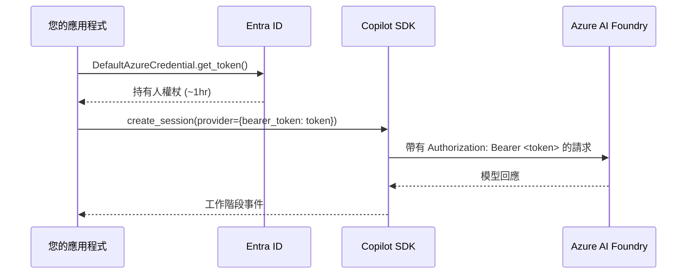

# 具備 BYOK 的 Azure 受控識別 (Managed Identity)

Copilot SDK 的 [BYOK 模式](../auth/byok_zh_TW.md) 接受靜態 API 金鑰，但 Azure 部署通常使用 **受控識別 (Managed Identity)** (Entra ID) 而非長效金鑰。由於 SDK 未原生支援 Entra ID 驗證，您可以使用 `bearer_token` 提供者配置欄位來傳遞短效持有人權杖 (bearer token)。

本指南說明如何使用 [Azure Identity](https://learn.microsoft.com/python/api/azure-identity/azure.identity.defaultazurecredential) 程式庫中的 `DefaultAzureCredential` 透過 Copilot SDK 向 Azure AI Foundry 模型進行驗證。

## 運作原理

Azure AI Foundry 的 OpenAI 相容端點接受來自 Entra ID 的持有人權杖來代替靜態 API 金鑰。其模式如下：

1. 使用 `DefaultAzureCredential` 獲取 `https://cognitiveservices.azure.com/.default` 範圍的權杖
2. 將該權杖作為 BYOK 提供者配置中的 `bearer_token` 傳遞
3. 在權杖過期前進行重新整理 (權杖通常有效期約為 1 小時)



## Python 範例

### 必要條件

```bash
pip install github-copilot-sdk azure-identity
```

### 基本用法

```python
import asyncio
import os

from azure.identity import DefaultAzureCredential
from copilot import CopilotClient, ProviderConfig, SessionConfig

COGNITIVE_SERVICES_SCOPE = "https://cognitiveservices.azure.com/.default"


async def main():
    # 使用受控識別、Azure CLI 或其他認證鏈獲取權杖
    credential = DefaultAzureCredential()
    token = credential.get_token(COGNITIVE_SERVICES_SCOPE).token

    foundry_url = os.environ["AZURE_AI_FOUNDRY_RESOURCE_URL"]

    client = CopilotClient()
    await client.start()

    session = await client.create_session(
        SessionConfig(
            model="gpt-4.1",
            provider=ProviderConfig(
                type="openai",
                base_url=f"{foundry_url.rstrip('/')}/openai/v1/",
                bearer_token=token,  # 短效持有人權杖
                wire_api="responses",
            ),
        )
    )

    response = await session.send_and_wait({"prompt": "Hello from Managed Identity!"})
    print(response.data.content)

    await client.stop()


asyncio.run(main())
```

### 長時間運行應用程式的權杖重新整理

持有人權杖會過期 (通常在約 1 小時後)。對於伺服器或長時間運行的代理程式，請在建立每個工作階段前重新整理權杖：

```python
from azure.identity import DefaultAzureCredential
from copilot import CopilotClient, ProviderConfig, SessionConfig

COGNITIVE_SERVICES_SCOPE = "https://cognitiveservices.azure.com/.default"


class ManagedIdentityCopilotAgent:
    """為 Azure AI Foundry 重新整理 Entra ID 權杖的 Copilot 代理程式。"""

    def __init__(self, foundry_url: str, model: str = "gpt-4.1"):
        self.foundry_url = foundry_url.rstrip("/")
        self.model = model
        self.credential = DefaultAzureCredential()
        self.client = CopilotClient()

    def _get_session_config(self) -> SessionConfig:
        """使用新的持有人權杖建立 SessionConfig。"""
        token = self.credential.get_token(COGNITIVE_SERVICES_SCOPE).token
        return SessionConfig(
            model=self.model,
            provider=ProviderConfig(
                type="openai",
                base_url=f"{self.foundry_url}/openai/v1/",
                bearer_token=token,
                wire_api="responses",
            ),
        )

    async def chat(self, prompt: str) -> str:
        """發送提示詞並回傳回應文字。"""
        # 每個工作階段都使用新權杖
        config = self._get_session_config()
        session = await self.client.create_session(config)

        response = await session.send_and_wait({"prompt": prompt})
        await session.disconnect()

        return response.data.content if response else ""
```

## Node.js / TypeScript 範例

<!-- docs-validate: skip -->
```typescript
import { DefaultAzureCredential } from "@azure/identity";
import { CopilotClient } from "@github/copilot-sdk";

const credential = new DefaultAzureCredential();
const tokenResponse = await credential.getToken(
  "https://cognitiveservices.azure.com/.default"
);

const client = new CopilotClient();

const session = await client.createSession({
  model: "gpt-4.1",
  provider: {
    type: "openai",
    baseUrl: `${process.env.AZURE_AI_FOUNDRY_RESOURCE_URL}/openai/v1/`,
    bearerToken: tokenResponse.token,
    wireApi: "responses",
  },
});

const response = await session.sendAndWait({ prompt: "Hello!" });
console.log(response?.data.content);

await client.stop();
```

## .NET 範例

<!-- docs-validate: skip -->
```csharp
using Azure.Identity;
using GitHub.Copilot;

var credential = new DefaultAzureCredential();
var token = await credential.GetTokenAsync(
    new Azure.Core.TokenRequestContext(
        new[] { "https://cognitiveservices.azure.com/.default" }));

await using var client = new CopilotClient();
var foundryUrl = Environment.GetEnvironmentVariable("AZURE_AI_FOUNDRY_RESOURCE_URL");

await using var session = await client.CreateSessionAsync(new SessionConfig
{
    Model = "gpt-4.1",
    Provider = new ProviderConfig
    {
        Type = "openai",
        BaseUrl = $"{foundryUrl!.TrimEnd('/')}/openai/v1/",
        BearerToken = token.Token,
        WireApi = "responses",
    },
});

var response = await session.SendAndWaitAsync(
    new MessageOptions { Prompt = "Hello from Managed Identity!" });
Console.WriteLine(response?.Data.Content);
```

## 環境配置

| 變數 | 描述 | 範例 |
|----------|-------------|---------|
| `AZURE_AI_FOUNDRY_RESOURCE_URL` | 您的 Azure AI Foundry 資源 URL | `https://myresource.openai.azure.com` |

不需要 API 金鑰環境變數 — 身分驗證由 `DefaultAzureCredential` 處理，它自動支援：

- **受控識別 (Managed Identity)** (系統指派或使用者指派) — 用於 Azure 託管的應用程式
- **Azure CLI** (`az login`) — 用於本地開發
- **環境變數** (`AZURE_CLIENT_ID`, `AZURE_TENANT_ID`, `AZURE_CLIENT_SECRET`) — 用於服務主體 (service principals)
- **工作負載識別 (Workload Identity)** — 用於 Kubernetes

請參閱 [DefaultAzureCredential 說明文件](https://learn.microsoft.com/python/api/azure-identity/azure.identity.defaultazurecredential) 以了解完整的認證鏈。

## 何時使用此模式

| 場景 | 建議 |
|----------|----------------|
| 使用受控識別的 Azure 託管應用程式 | ✅ 使用此模式 |
| 具有現有 Azure AD 服務主體的應用程式 | ✅ 使用此模式 |
| 使用 `az login` 的本地開發 | ✅ 使用此模式 |
| 帶有靜態 API 金鑰的非 Azure 環境 | 使用 [標準 BYOK](../auth/byok_zh_TW.md) |
| 具備 GitHub Copilot 訂閱 | 使用 [GitHub OAuth](./github-oauth_zh_TW.md) |

## 延伸閱讀

- [BYOK 設定指南](../auth/byok_zh_TW.md) — 靜態 API 金鑰配置
- [後端服務](./backend-services_zh_TW.md) — 伺服器端部署
- [Azure Identity 說明文件](https://learn.microsoft.com/python/api/overview/azure/identity-readme)
