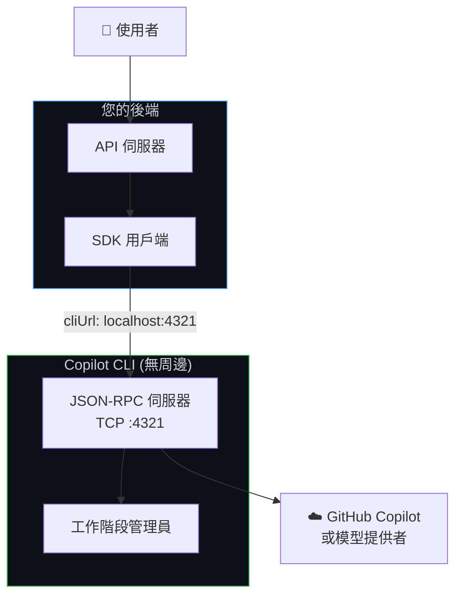
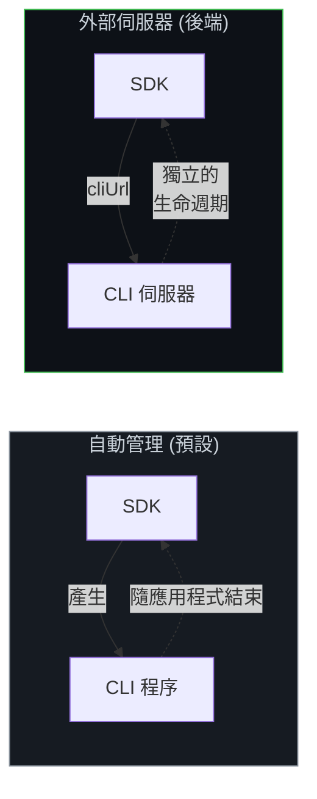
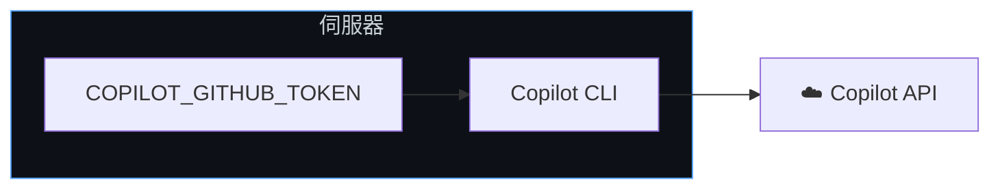
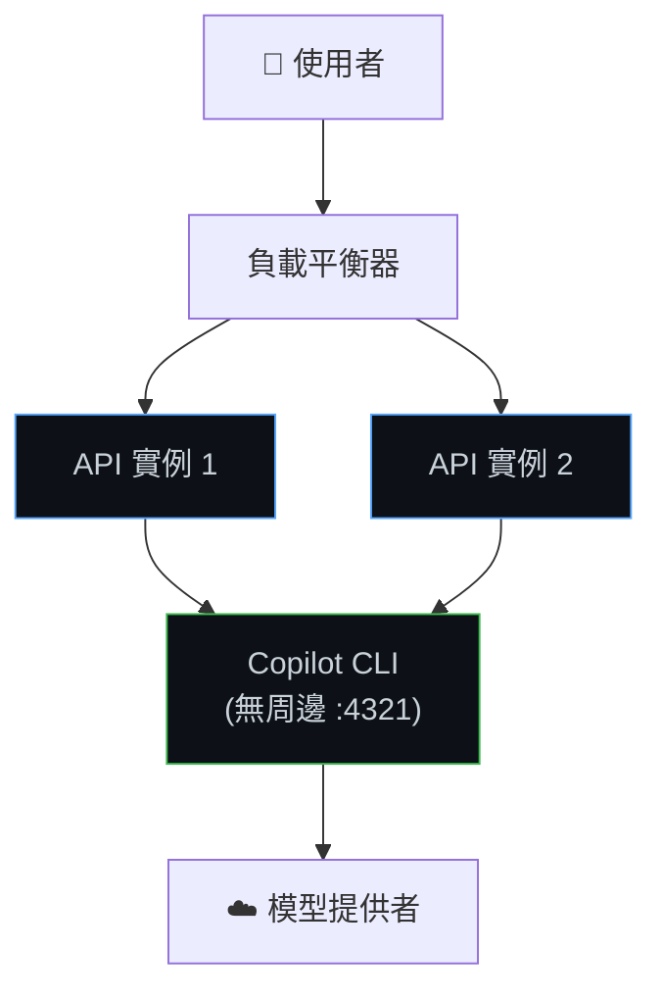
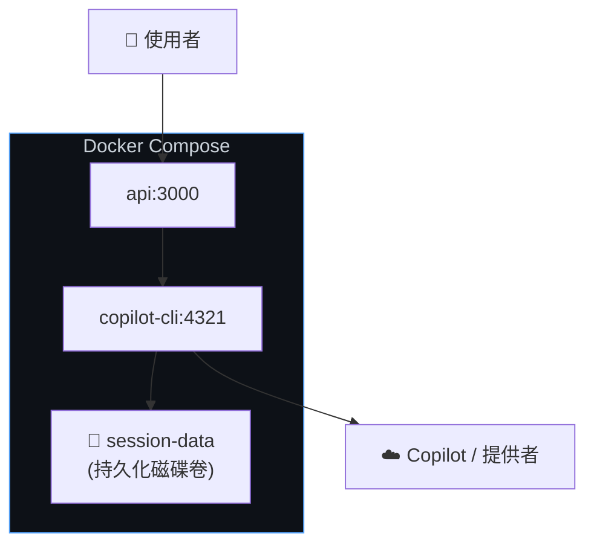

# 後端服務設定 (Backend Services Setup)

在伺服器端應用程式中執行 Copilot SDK — 包括 API、網頁後端、微服務和背景工作程式。CLI 以無周邊 (headless) 伺服器模式執行，您的後端程式碼透過網路與其連接。

**最適合：** 網頁應用程式後端、API 服務、內部工具、CI/CD 整合以及任何伺服器端工作負載。

## 運作原理

SDK 不會產生 CLI 子程序，而是讓 CLI 以獨立的 **無周邊伺服器模式** 執行。您的後端使用 `cliUrl` 選項透過 TCP 與其連接。



**主要特徵：**
- CLI 作為持久的伺服器程序執行 (不是每個請求產生一次)
- SDK 透過 TCP 連接 — CLI 和應用程式可以在不同的容器中執行
- 多個 SDK 用戶端可以共用一個 CLI 伺服器
- 支援任何身分驗證方法 (GitHub 權杖、環境變數、BYOK)

## 架構：自動管理 vs. 外部 CLI



## 第一步：以無周邊模式啟動 CLI

將 CLI 作為背景伺服器執行：

```bash
# 使用特定連接埠啟動
copilot --headless --port 4321

# 或讓它隨機挑選連接埠 (會印出 URL)
copilot --headless
# 輸出：Listening on http://localhost:52431
```

對於生產環境，將其作為系統服務或在容器中執行：

```bash
# Docker
docker run -d --name copilot-cli \
    -p 4321:4321 \
    -e COPILOT_GITHUB_TOKEN="$TOKEN" \
    ghcr.io/github/copilot-cli:latest \
    --headless --port 4321

# systemd
[Service]
ExecStart=/usr/local/bin/copilot --headless --port 4321
Environment=COPILOT_GITHUB_TOKEN=your-token
Restart=always
```

## 第二步：連接 SDK

<details open>
<summary><strong>Node.js / TypeScript</strong></summary>

```typescript
import { CopilotClient } from "@github/copilot-sdk";

const client = new CopilotClient({
    cliUrl: "localhost:4321",
});

const session = await client.createSession({
    sessionId: `user-${userId}-${Date.now()}`,
    model: "gpt-4.1",
});

const response = await session.sendAndWait({ prompt: req.body.message });
res.json({ content: response?.data.content });
```

</details>

<details>
<summary><strong>Python</strong></summary>

```python
from copilot import CopilotClient

client = CopilotClient({
    "cli_url": "localhost:4321",
})
await client.start()

session = await client.create_session({
    "session_id": f"user-{user_id}-{int(time.time())}",
    "model": "gpt-4.1",
})

response = await session.send_and_wait({"prompt": message})
```

</details>

<details>
<summary><strong>Go</strong></summary>

<!-- docs-validate: hidden -->
```go
package main

import (
	"context"
	"fmt"
	"time"
	copilot "github.com/github/copilot-sdk/go"
)

func main() {
	ctx := context.Background()
	userID := "user1"
	message := "你好"

	client := copilot.NewClient(&copilot.ClientOptions{
		CLIUrl: "localhost:4321",
	})
	client.Start(ctx)
	defer client.Stop()

	session, _ := client.CreateSession(ctx, &copilot.SessionConfig{
		SessionID: fmt.Sprintf("user-%s-%d", userID, time.Now().Unix()),
		Model:     "gpt-4.1",
	})

	response, _ := session.SendAndWait(ctx, copilot.MessageOptions{Prompt: message})
	_ = response
}
```
<!-- /docs-validate: hidden -->

```go
client := copilot.NewClient(&copilot.ClientOptions{
    CLIUrl:"localhost:4321",
})
client.Start(ctx)
defer client.Stop()

session, _ := client.CreateSession(ctx, &copilot.SessionConfig{
    SessionID: fmt.Sprintf("user-%s-%d", userID, time.Now().Unix()),
    Model:     "gpt-4.1",
})

response, _ := session.SendAndWait(ctx, copilot.MessageOptions{Prompt: message})
```

</details>

<details>
<summary><strong>.NET</strong></summary>

<!-- docs-validate: hidden -->
```csharp
using GitHub.Copilot.SDK;

var userId = "user1";
var message = "你好";

var client = new CopilotClient(new CopilotClientOptions
{
    CliUrl = "localhost:4321",
    UseStdio = false,
});

await using var session = await client.CreateSessionAsync(new SessionConfig
{
    SessionId = $"user-{userId}-{DateTimeOffset.UtcNow.ToUnixTimeSeconds()}",
    Model = "gpt-4.1",
});

var response = await session.SendAndWaitAsync(
    new MessageOptions { Prompt = message });
```
<!-- /docs-validate: hidden -->

```csharp
var client = new CopilotClient(new CopilotClientOptions
{
    CliUrl = "localhost:4321",
    UseStdio = false,
});

await using var session = await client.CreateSessionAsync(new SessionConfig
{
    SessionId = $"user-{userId}-{DateTimeOffset.UtcNow.ToUnixTimeSeconds()}",
    Model = "gpt-4.1",
});

var response = await session.SendAndWaitAsync(
    new MessageOptions { Prompt = message });
```

</details>

## 後端服務的身分驗證

### 環境變數權杖 (Environment Variable Tokens)

最簡單的方法 — 在 CLI 伺服器上設定一個權杖：



```bash
# 所有請求都使用此權杖
export COPILOT_GITHUB_TOKEN="gho_service_account_token"
copilot --headless --port 4321
```

### 每個使用者的權杖 (OAuth)

建立工作階段時傳入個別使用者的權杖。請參閱 [GitHub OAuth](./github-oauth_zh_TW.md) 以了解完整流程。

```typescript
// 您的 API 從驗證層接收使用者權杖
app.post("/chat", authMiddleware, async (req, res) => {
    const client = new CopilotClient({
        cliUrl: "localhost:4321",
        githubToken: req.user.githubToken,
        useLoggedInUser: false,
    });

    const session = await client.createSession({
        sessionId: `user-${req.user.id}-chat`,
        model: "gpt-4.1",
    });

    const response = await session.sendAndWait({
        prompt: req.body.message,
    });

    res.json({ content: response?.data.content });
});
```

### BYOK (不需要 GitHub 驗證)

使用您自己的模型提供者 API 金鑰。請參閱 [BYOK](../auth/byok_zh_TW.md) 以了解詳細資訊。

```typescript
const client = new CopilotClient({
    cliUrl: "localhost:4321",
});

const session = await client.createSession({
    model: "gpt-4.1",
    provider: {
        type: "openai",
        baseUrl: "https://api.openai.com/v1",
        apiKey: process.env.OPENAI_API_KEY,
    },
});
```

## 常見後端模式

### 使用 Express 的網頁 API



```typescript
import express from "express";
import { CopilotClient } from "@github/copilot-sdk";

const app = express();
app.use(express.json());

// 單一共享的 CLI 連接
const client = new CopilotClient({
    cliUrl: process.env.CLI_URL || "localhost:4321",
});

app.post("/api/chat", async (req, res) => {
    const { sessionId, message } = req.body;

    // 建立或恢復工作階段
    let session;
    try {
        session = await client.resumeSession(sessionId);
    } catch {
        session = await client.createSession({
            sessionId,
            model: "gpt-4.1",
        });
    }

    const response = await session.sendAndWait({ prompt: message });
    res.json({
        sessionId,
        content: response?.data.content,
    });
});

app.listen(3000);
```

### 背景工作程式 (Background Worker)

```typescript
import { CopilotClient } from "@github/copilot-sdk";

const client = new CopilotClient({
    cliUrl: process.env.CLI_URL || "localhost:4321",
});

// 從佇列處理工作
async function processJob(job: Job) {
    const session = await client.createSession({
        sessionId: `job-${job.id}`,
        model: "gpt-4.1",
    });

    const response = await session.sendAndWait({
        prompt: job.prompt,
    });

    await saveResult(job.id, response?.data.content);
    await session.disconnect();  // 工作完成後進行清理
}
```

### Docker Compose 部署

```yaml
version: "3.8"

services:
  copilot-cli:
    image: ghcr.io/github/copilot-cli:latest
    command: ["--headless", "--port", "4321"]
    environment:
      - COPILOT_GITHUB_TOKEN=${COPILOT_GITHUB_TOKEN}
    ports:
      - "4321:4321"
    restart: always
    volumes:
      - session-data:/root/.copilot/session-state

  api:
    build: .
    environment:
      - CLI_URL=copilot-cli:4321
    depends_on:
      - copilot-cli
    ports:
      - "3000:3000"

volumes:
  session-data:
```



## 健康檢查

監控 CLI 伺服器的健康狀態：

```typescript
// 定期健康檢查
async function checkCLIHealth(): Promise<boolean> {
    try {
        const status = await client.getStatus();
        return status !== undefined;
    } catch {
        return false;
    }
}
```

## 工作階段清理

後端服務應主動清理工作階段以避免資源洩漏：

```typescript
// 定期清理過期的工作階段
async function cleanupSessions(maxAgeMs: number) {
    const sessions = await client.listSessions();
    const now = Date.now();

    for (const session of sessions) {
        const age = now - new Date(session.createdAt).getTime();
        if (age > maxAgeMs) {
            await client.deleteSession(session.sessionId);
        }
    }
}

// 每小時執行一次
setInterval(() => cleanupSessions(24 * 60 * 60 * 1000), 60 * 60 * 1000);
```

## 限制

| 限制 | 詳情 |
|------------|---------|
| **單一 CLI 伺服器 = 單點故障** | 參見 [擴展指南](./scaling_zh_TW.md) 以了解高可用性模式 |
| **SDK 與 CLI 之間無內建驗證** | 請確保網路路徑安全 (相同主機、VPC 等) |
| **工作階段狀態存於本地磁碟** | 針對容器重新啟動，請掛載持久化儲存 |
| **30 分鐘閒置逾時** | 無活動的工作階段將自動清理 |

## 接下來要做什麼？

| 需求 | 下一個指南 |
|------|-----------|
| 多個 CLI 伺服器 / 高可用性 | [擴展與多租戶](./scaling_zh_TW.md) |
| 使用者的 GitHub 帳戶驗證 | [GitHub OAuth](./github-oauth_zh_TW.md) |
| 您自己的模型金鑰 | [BYOK](../auth/byok_zh_TW.md) |

## 後續步驟

- **[擴展與多租戶](./scaling_zh_TW.md)** — 處理更多使用者，增加備援
- **[工作階段持久性](../features/session-persistence_zh_TW.md)** — 跨重啟恢復工作階段
- **[GitHub OAuth](./github-oauth_zh_TW.md)** — 新增使用者身分驗證
