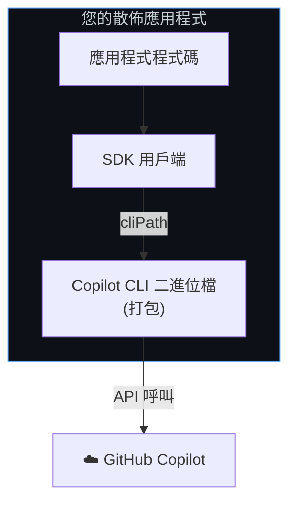
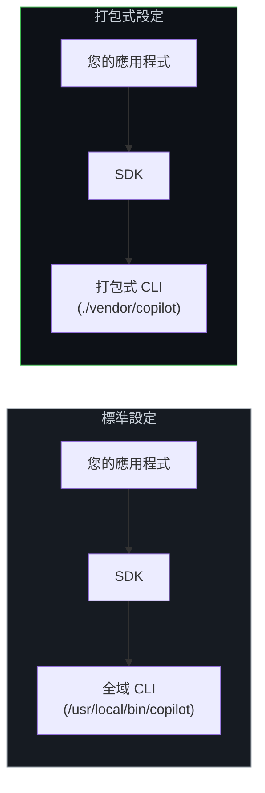
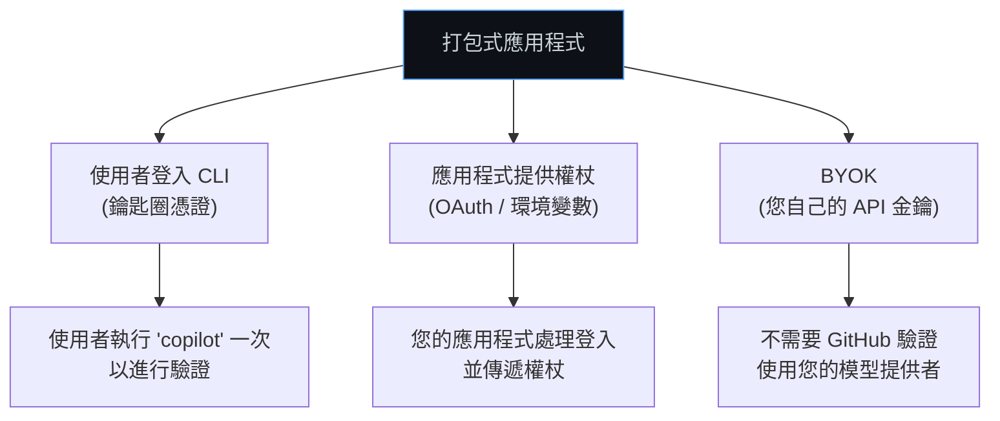
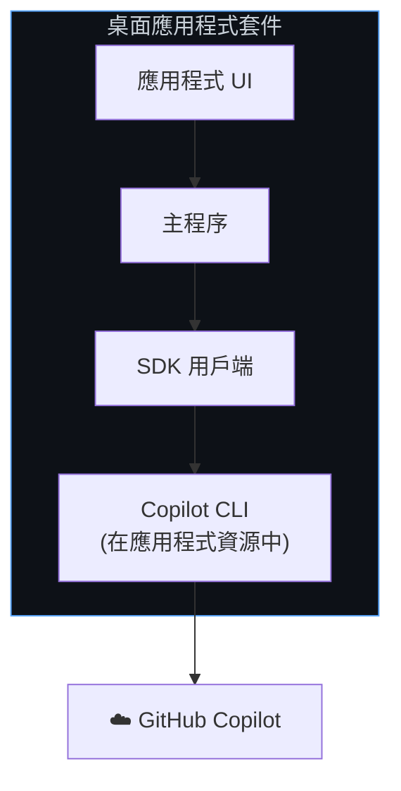

# 打包式 CLI 設定 (Bundled CLI Setup)

將 Copilot CLI 與您的應用程式打包在一起，讓使用者無需另外安裝或配置任何內容。您的應用程式隨附所需的一切。

**最適合：** 桌面應用程式、獨立工具、Electron 應用程式、可散佈的 CLI 公用程式。

## 運作原理

與其依賴全域安裝的 CLI，您可以將 CLI 二進位檔包含在您的應用程式套件中。SDK 透過 `cliPath` 選項指向您打包的副本。



**主要特徵：**
- CLI 二進位檔隨應用程式交付 — 無需個別安裝
- 您可以控制應用程式所使用的確切 CLI 版本
- 使用者透過您的應用程式進行驗證 (或使用環境變數 / BYOK)
- 工作階段 (sessions) 在使用者的機器上按使用者管理

## 架構：打包式 vs. 已安裝



## 設定

### 1. 在您的專案中包含 CLI

CLI 是作為 `@github/copilot` npm 套件的一部分散佈的。您也可以為您的發佈管線獲取特定平台的二進位檔。

```bash
# 可從 @github/copilot 套件獲取 CLI
npm install @github/copilot
```

### 2. 將 SDK 指向您的打包式 CLI

<details open>
<summary><strong>Node.js / TypeScript</strong></summary>

```typescript
import { CopilotClient } from "@github/copilot-sdk";
import path from "path";

const client = new CopilotClient({
    // 指向您應用程式套件中的 CLI 二進位檔
    cliPath: path.join(__dirname, "vendor", "copilot"),
});

const session = await client.createSession({ model: "gpt-4.1" });
const response = await session.sendAndWait({ prompt: "你好！" });
console.log(response?.data.content);

await client.stop();
```

</details>

<details>
<summary><strong>Python</strong></summary>

```python
from copilot import CopilotClient
from pathlib import Path

client = CopilotClient({
    "cli_path": str(Path(__file__).parent / "vendor" / "copilot"),
})
await client.start()

session = await client.create_session({"model": "gpt-4.1"})
response = await session.send_and_wait({"prompt": "你好！"})
print(response.data.content)

await client.stop()
```

</details>

<details>
<summary><strong>Go</strong></summary>

<!-- docs-validate: hidden -->
```go
package main

import (
	"context"
	"fmt"
	"log"
	copilot "github.com/github/copilot-sdk/go"
)

func main() {
	ctx := context.Background()

	client := copilot.NewClient(&copilot.ClientOptions{
		CLIPath: "./vendor/copilot",
	})
	if err := client.Start(ctx); err != nil {
		log.Fatal(err)
	}
	defer client.Stop()

	session, _ := client.CreateSession(ctx, &copilot.SessionConfig{Model: "gpt-4.1"})
	response, _ := session.SendAndWait(ctx, copilot.MessageOptions{Prompt: "你好！"})
	fmt.Println(*response.Data.Content)
}
```
<!-- /docs-validate: hidden -->

```go
client := copilot.NewClient(&copilot.ClientOptions{
    CLIPath:"./vendor/copilot",
})
if err := client.Start(ctx); err != nil {
    log.Fatal(err)
}
defer client.Stop()

session, _ := client.CreateSession(ctx, &copilot.SessionConfig{Model: "gpt-4.1"})
response, _ := session.SendAndWait(ctx, copilot.MessageOptions{Prompt: "你好！"})
fmt.Println(*response.Data.Content)
```

</details>

<details>
<summary><strong>.NET</strong></summary>

```csharp
var client = new CopilotClient(new CopilotClientOptions
{
    CliPath = Path.Combine(AppContext.BaseDirectory, "vendor", "copilot"),
});

await using var session = await client.CreateSessionAsync(
    new SessionConfig { Model = "gpt-4.1" });

var response = await session.SendAndWaitAsync(
    new MessageOptions { Prompt = "你好！" });
Console.WriteLine(response?.Data.Content);
```

</details>

## 身分驗證策略

進行打包時，您需要決定使用者如何進行身分驗證。以下是常見模式：



### 選項 A：使用者的已登入憑證 (最簡單)

使用者登入 CLI 一次，您的打包應用程式即使用該憑證。無需額外程式碼 — 這是預設行為。

```typescript
const client = new CopilotClient({
    cliPath: path.join(__dirname, "vendor", "copilot"),
    // 預設：使用已登入的使用者憑證
});
```

### 選項 B：透過環境變數提供權杖

隨應用程式附上設定權杖的說明，或以程式化方式設定：

```typescript
const client = new CopilotClient({
    cliPath: path.join(__dirname, "vendor", "copilot"),
    env: {
        COPILOT_GITHUB_TOKEN: getUserToken(),  // 您的應用程式提供權杖
    },
});
```

### 選項 C：BYOK (不需要 GitHub 驗證)

如果您管理自己的模型提供者金鑰，使用者完全不需要 GitHub 帳戶：

```typescript
const client = new CopilotClient({
    cliPath: path.join(__dirname, "vendor", "copilot"),
});

const session = await client.createSession({
    model: "gpt-4.1",
    provider: {
        type: "openai",
        baseUrl: "https://api.openai.com/v1",
        apiKey: process.env.OPENAI_API_KEY,
    },
});
```

請參閱 **[BYOK 指南](../auth/byok_zh_TW.md)** 以了解詳細資訊。

## 工作階段管理

打包應用程式通常需要具名工作階段，以便使用者可以恢復對話：

```typescript
const client = new CopilotClient({
    cliPath: path.join(__dirname, "vendor", "copilot"),
});

// 建立連結至使用者專案的工作階段
const sessionId = `project-${projectName}`;
const session = await client.createSession({
    sessionId,
    model: "gpt-4.1",
});

// 使用者關閉應用程式...
// 稍後，從上次離開的地方恢復
const resumed = await client.resumeSession(sessionId);
```

工作階段狀態會持久化於 `~/.copilot/session-state/{sessionId}/`。

## 散佈模式

### 桌面應用程式 (Electron, Tauri)



將 CLI 二進位檔包含在您應用程式的資源目錄中：

```typescript
import { app } from "electron";
import path from "path";

const cliPath = path.join(
    app.isPackaged ? process.resourcesPath : __dirname,
    "copilot"
);

const client = new CopilotClient({ cliPath });
```

### CLI 工具

對於可散佈的 CLI 工具，相對於您的二進位檔解析路徑：

```typescript
import { fileURLToPath } from "url";
import path from "path";

const __dirname = path.dirname(fileURLToPath(import.meta.url));
const cliPath = path.join(__dirname, "..", "vendor", "copilot");

const client = new CopilotClient({ cliPath });
```

## 特定平台二進位檔

針對多個平台散佈時，請包含每個平台的正確二進位檔：

```
my-app/
├── vendor/
│   ├── copilot-darwin-arm64    # macOS Apple Silicon
│   ├── copilot-darwin-x64      # macOS Intel
│   ├── copilot-linux-x64       # Linux x64
│   └── copilot-win-x64.exe     # Windows x64
└── src/
    └── index.ts
```

```typescript
import os from "os";

function getCLIPath(): string {
    const platform = process.platform;   // "darwin", "linux", "win32"
    const arch = os.arch();              // "arm64", "x64"
    const ext = platform === "win32" ? ".exe" : "";
    const name = `copilot-${platform}-${arch}${ext}`;
    return path.join(__dirname, "vendor", name);
}

const client = new CopilotClient({
    cliPath: getCLIPath(),
});
```

## 限制

| 限制 | 詳情 |
|------------|---------|
| **套件大小** | CLI 二進位檔會增加您應用程式的散佈大小 |
| **更新** | 您需要在發佈週期中管理 CLI 版本更新 |
| **平台建置** | 每個作業系統/架構都需要個別的二進位檔 |
| **單一使用者** | 每個打包的 CLI 實例服務一名使用者 |

## 接下來要做什麼？

| 需求 | 下一個指南 |
|------|-----------|
| 使用 GitHub 帳戶登入的使用者 | [GitHub OAuth](./github-oauth_zh_TW.md) |
| 在伺服器上執行，而非使用者機器 | [後端服務](./backend-services_zh_TW.md) |
| 使用您自己的模型金鑰 | [BYOK](../auth/byok_zh_TW.md) |

## 後續步驟

- **[BYOK 指南](../auth/byok_zh_TW.md)** — 使用您自己的模型提供者金鑰
- **[工作階段持久性](../features/session-persistence_zh_TW.md)** — 進階工作階段管理
- **[入門教學](../getting-started_zh_TW.md)** — 建立一個完整的應用程式
