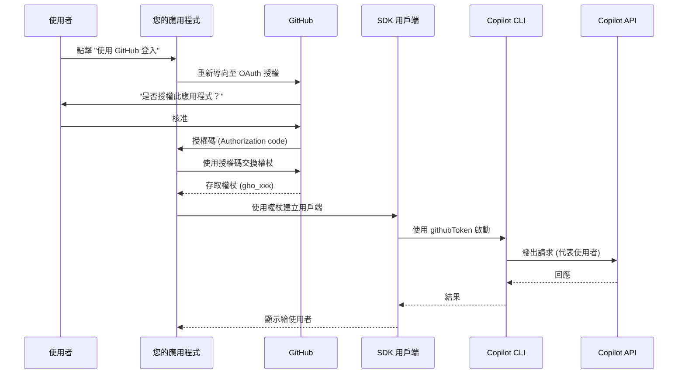
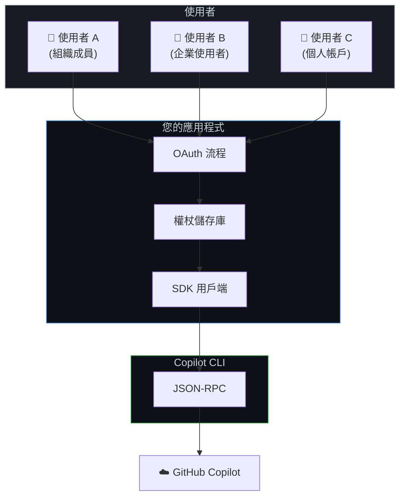
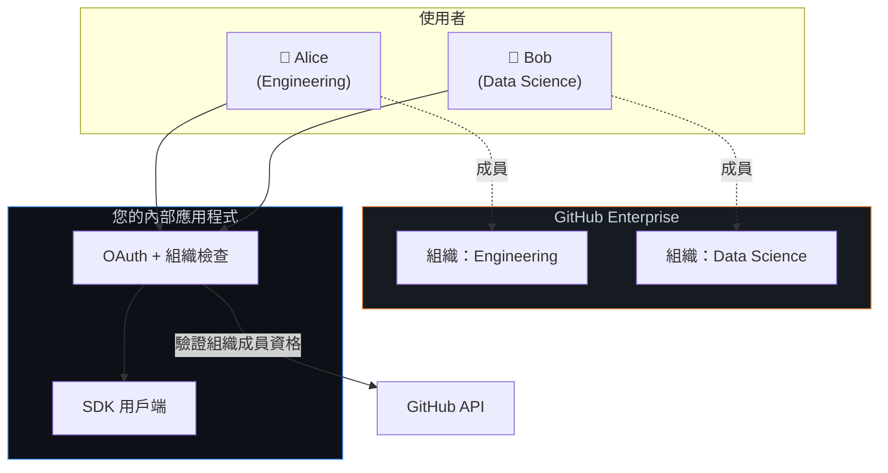
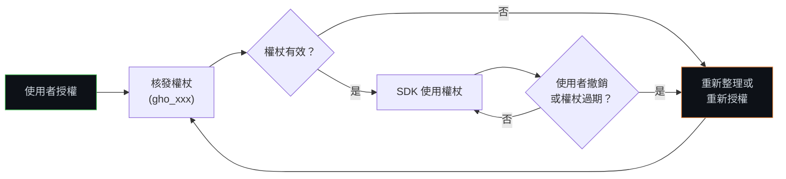

# GitHub OAuth 設定

讓使用者透過其 GitHub 帳戶進行驗證，以便在您的應用程式中使用 Copilot。這支援個人帳戶、組織成員資格以及企業身分。

**最適合：** 多使用者應用程式、具備組織存取控制的內部工具、SaaS 產品，以及使用者擁有 GitHub 帳戶的應用程式。

## 運作原理

您建立一個 GitHub OAuth 應用程式 (或 GitHub App)，使用者授權該程式，接著您將其存取權杖 (access token) 傳遞給 SDK。Copilot 請求將代表每個經過驗證的使用者發出，並使用其自身的 Copilot 訂閱。



**主要特徵：**
- 每個使用者都使用自己的 GitHub 帳戶進行驗證
- Copilot 使用量計費至每個使用者的訂閱
- 支援 GitHub 組織 (organizations) 和企業 (enterprise) 帳戶
- 您的應用程式永遠不會經手模型 API 金鑰 — GitHub 管理一切

## 架構



## 第一步：建立 GitHub OAuth 應用程式

1. 前往 **GitHub Settings → Developer Settings → OAuth Apps → New OAuth App**
   (或針對組織：**Organization Settings → Developer Settings**)

2. 填寫資訊：
   - **Application name**: 您的應用程式名稱
   - **Homepage URL**: 您的應用程式 URL
   - **Authorization callback URL**: 您的 OAuth 回呼端點 (例如：`https://yourapp.com/auth/callback`)

3. 記下您的 **Client ID** 並產生 **Client Secret**

> **GitHub App vs OAuth App:** 兩者皆可。GitHub Apps 提供更精細的權限，推薦用於新專案。OAuth Apps 設定較簡單。從 SDK 的角度來看，權杖流程是一樣的。

## 第二步：實作 OAuth 流程

您的應用程式處理標準的 GitHub OAuth 流程。以下是伺服器端的權杖交換範例：

```typescript
// 伺服器端：使用授權碼交換使用者權杖
async function handleOAuthCallback(code: string): Promise<string> {
    const response = await fetch("https://github.com/login/oauth/access_token", {
        method: "POST",
        headers: {
            "Content-Type": "application/json",
            Accept: "application/json",
        },
        body: JSON.stringify({
            client_id: process.env.GITHUB_CLIENT_ID,
            client_secret: process.env.GITHUB_CLIENT_SECRET,
            code,
        }),
    });

    const data = await response.json();
    return data.access_token; // gho_xxxx 或 ghu_xxxx
}
```

## 第三步：將權杖傳遞給 SDK

為每個經過驗證的使用者建立一個 SDK 用戶端，並傳入其權杖：

<details open>
<summary><strong>Node.js / TypeScript</strong></summary>

```typescript
import { CopilotClient } from "@github/copilot-sdk";

// 為已驗證使用者建立用戶端
function createClientForUser(userToken: string): CopilotClient {
    return new CopilotClient({
        githubToken: userToken,
        useLoggedInUser: false,  // 不要回退到 CLI 登入
    });
}

// 用法
const client = createClientForUser("gho_user_access_token");
const session = await client.createSession({
    sessionId: `user-${userId}-session`,
    model: "gpt-4.1",
});

const response = await session.sendAndWait({ prompt: "你好！" });
```

</details>

<details>
<summary><strong>Python</strong></summary>

```python
from copilot import CopilotClient

def create_client_for_user(user_token: str) -> CopilotClient:
    return CopilotClient({
        "github_token": user_token,
        "use_logged_in_user": False,
    })

# 用法
client = create_client_for_user("gho_user_access_token")
await client.start()

session = await client.create_session({
    "session_id": f"user-{user_id}-session",
    "model": "gpt-4.1",
})

response = await session.send_and_wait({"prompt": "你好！"})
```

</details>

<details>
<summary><strong>Go</strong></summary>

<!-- docs-validate: hidden -->
```go
package main

import (
	"context"
	"fmt"
	copilot "github.com/github/copilot-sdk/go"
)

func createClientForUser(userToken string) *copilot.Client {
	return copilot.NewClient(&copilot.ClientOptions{
		GitHubToken:     userToken,
		UseLoggedInUser: copilot.Bool(false),
	})
}

func main() {
	ctx := context.Background()
	userID := "user1"

	client := createClientForUser("gho_user_access_token")
	client.Start(ctx)
	defer client.Stop()

	session, _ := client.CreateSession(ctx, &copilot.SessionConfig{
		SessionID: fmt.Sprintf("user-%s-session", userID),
		Model:     "gpt-4.1",
	})
	response, _ := session.SendAndWait(ctx, copilot.MessageOptions{Prompt: "你好！"})
	_ = response
}
```
<!-- /docs-validate: hidden -->

```go
func createClientForUser(userToken string) *copilot.Client {
    return copilot.NewClient(&copilot.ClientOptions{
        GithubToken:     userToken,
        UseLoggedInUser: copilot.Bool(false),
    })
}

// 用法
client := createClientForUser("gho_user_access_token")
client.Start(ctx)
defer client.Stop()

session, _ := client.CreateSession(ctx, &copilot.SessionConfig{
    SessionID: fmt.Sprintf("user-%s-session", userID),
    Model:     "gpt-4.1",
})
response, _ := session.SendAndWait(ctx, copilot.MessageOptions{Prompt: "你好！"})
```

</details>

<details>
<summary><strong>.NET</strong></summary>

<!-- docs-validate: hidden -->
```csharp
using GitHub.Copilot.SDK;

CopilotClient CreateClientForUser(string userToken) =>
    new CopilotClient(new CopilotClientOptions
    {
        GithubToken = userToken,
        UseLoggedInUser = false,
    });

var userId = "user1";

await using var client = CreateClientForUser("gho_user_access_token");
await using var session = await client.CreateSessionAsync(new SessionConfig
{
    SessionId = $"user-{userId}-session",
    Model = "gpt-4.1",
});

var response = await session.SendAndWaitAsync(
    new MessageOptions { Prompt = "你好！" });
```
<!-- /docs-validate: hidden -->

```csharp
CopilotClient CreateClientForUser(string userToken) =>
    new CopilotClient(new CopilotClientOptions
    {
        GithubToken = userToken,
        UseLoggedInUser = false,
    });

// 用法
await using var client = CreateClientForUser("gho_user_access_token");
await using var session = await client.CreateSessionAsync(new SessionConfig
{
    SessionId = $"user-{userId}-session",
    Model = "gpt-4.1",
});

var response = await session.SendAndWaitAsync(
    new MessageOptions { Prompt = "你好！" });
```

</details>

## 企業與組織存取

GitHub OAuth 自然地支援企業場景。當使用者使用 GitHub 進行驗證時，其組織成員資格和企業關聯會隨之而來。



### 驗證組織成員資格

完成 OAuth 後，檢查使用者是否屬於您的組織：

```typescript
async function verifyOrgMembership(
    token: string,
    requiredOrg: string
): Promise<boolean> {
    const response = await fetch("https://api.github.com/user/orgs", {
        headers: { Authorization: `Bearer ${token}` },
    });
    const orgs = await response.json();
    return orgs.some((org: any) => org.login === requiredOrg);
}

// 在您的驗證流程中
const token = await handleOAuthCallback(code);
if (!await verifyOrgMembership(token, "my-company")) {
    throw new Error("使用者不屬於必要的組織");
}
const client = createClientForUser(token);
```

### 企業受管使用者 (EMU)

對於 GitHub 企業受管使用者 (Enterprise Managed Users)，流程完全相同 — EMU 使用者像其他使用者一樣透過 GitHub OAuth 進行驗證。他們的企業政策 (IP 限制、SAML SSO) 會由 GitHub 自動強制執行。

```typescript
// EMU 不需要特殊的 SDK 配置
// 企業政策由 GitHub 在伺服器端強制執行
const client = new CopilotClient({
    githubToken: emuUserToken,  // 運作方式與一般權杖相同
    useLoggedInUser: false,
});
```

## 支援的權杖類型

| 權杖前綴 | 來源 | 是否可用？ |
|-------------|--------|--------|
| `gho_` | OAuth 使用者存取權杖 | ✅ |
| `ghu_` | GitHub App 使用者存取權杖 | ✅ |
| `github_pat_` | 精細的個人存取權杖 (Fine-grained PAT) | ✅ |
| `ghp_` | 經典款個人存取權杖 (Classic PAT) | ❌ (已廢棄) |

## 權杖生命週期



**重要提示：** 您的應用程式負責權杖的儲存、重新整理和過期處理。SDK 使用您提供的任何權杖 — 它不管理 OAuth 生命週期。

### 權杖重新整理模式

```typescript
async function getOrRefreshToken(userId: string): Promise<string> {
    const stored = await tokenStore.get(userId);

    if (stored && !isExpired(stored)) {
        return stored.accessToken;
    }

    if (stored?.refreshToken) {
        const refreshed = await refreshGitHubToken(stored.refreshToken);
        await tokenStore.set(userId, refreshed);
        return refreshed.accessToken;
    }

    throw new Error("使用者必須重新驗證");
}
```

## 多使用者模式

### 每個使用者一個用戶端 (推薦)

每個使用者擁有自己的 SDK 用戶端和權杖。這提供了最強的隔離性。

```typescript
const clients = new Map<string, CopilotClient>();

function getClientForUser(userId: string, token: string): CopilotClient {
    if (!clients.has(userId)) {
        clients.set(userId, new CopilotClient({
            githubToken: token,
            useLoggedInUser: false,
        }));
    }
    return clients.get(userId)!;
}
```

### 每個請求使用權杖的共享 CLI

為了減少資源佔用，您可以運行單個外部 CLI 伺服器並在每個工作階段傳遞權杖。請參閱 [後端服務](./backend-services_zh_TW.md) 以了解此模式。

## 限制

| 限制 | 詳情 |
|------------|---------|
| **需要 Copilot 訂閱** | 每個使用者都需要有效的 Copilot 訂閱 |
| **權杖管理是您的責任** | 儲存、重新整理並處理過期 |
| **需要 GitHub 帳戶** | 使用者必須擁有 GitHub 帳戶 |
| **每個使用者的速率限制** | 受限於每個使用者的 Copilot 速率限制 |

## 接下來要做什麼？

| 需求 | 下一個指南 |
|------|-----------|
| 沒有 GitHub 帳戶的使用者 | [BYOK](../auth/byok_zh_TW.md) |
| 在伺服器上執行 SDK | [後端服務](./backend-services_zh_TW.md) |
| 處理大量並發使用者 | [擴展與多租戶](./scaling_zh_TW.md) |

## 後續步驟

- **[身分驗證文件](../auth/index_zh_TW.md)** — 完整身分驗證方法參考
- **[後端服務](./backend-services_zh_TW.md)** — 伺服器端部署
- **[擴展與多租戶](./scaling_zh_TW.md)** — 大規模處理多個使用者
