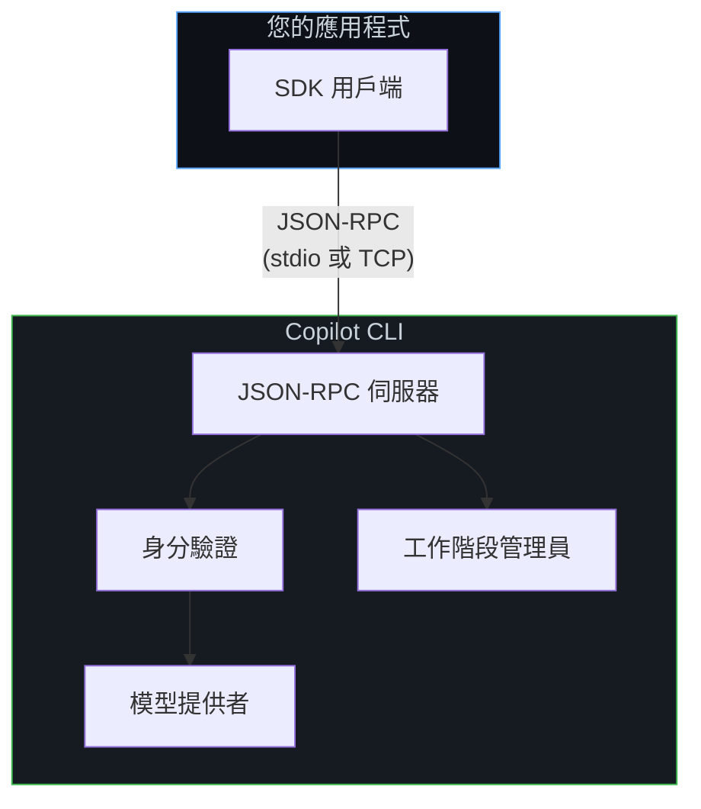
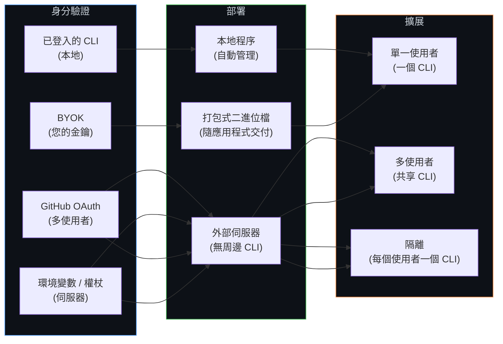

# 設定指南

這些指南將引導您根據具體使用場景配置 Copilot SDK — 從個人側邊專案到服務數千名使用者的生產平台。

## 架構一覽

每個 Copilot SDK 整合都遵循相同的核心模式：您的應用程式與 SDK 對話，而 SDK 透過 JSON-RPC 與 Copilot CLI 通訊。不同設定之間的變化在於 **CLI 運行的位置**、**使用者如何進行身分驗證**，以及 **工作階段 (session) 如何管理**。

下方的設定指南可協助您針對您的情境配置每一層。

## 您是哪類使用者？

### 🧑‍💻 愛好者 (Hobbyist)

您正在建立個人助理、側邊專案或實驗性應用程式。您希望以最簡單的方式在程式碼中使用 Copilot。

**從這裡開始：**
1. **[本地 CLI](./local-cli_zh_TW.md)** — 使用您機器上已登入的 CLI
2. **[打包式 CLI](./bundled-cli_zh_TW.md)** — 將所有內容封裝成獨立應用程式

### 🏢 內部應用程式開發者

您正在為您的團隊或公司建立工具。使用者是需要使用其企業 GitHub 帳戶或組織成員資格進行驗證的員工。

**從這裡開始：**
1. **[GitHub OAuth](./github-oauth_zh_TW.md)** — 讓員工使用其 GitHub 帳戶登入
2. **[後端服務](./backend-services_zh_TW.md)** — 在您的內部服務中執行 SDK

**如果擴展超出單一伺服器：**
3. **[擴展與多租戶](./scaling_zh_TW.md)** — 處理多個使用者和服務

### 🚀 應用程式開發者 (ISV)

您正在為客戶建立產品。您需要處理使用者的身分驗證 — 無論是透過 GitHub 還是自行管理身分。

**從這裡開始：**
1. **[GitHub OAuth](./github-oauth_zh_TW.md)** — 讓客戶使用 GitHub 登入
2. **[BYOK](../auth/byok_zh_TW.md)** — 使用您自己的模型金鑰自行管理身分
3. **[後端服務](./backend-services_zh_TW.md)** — 從伺服器端程式碼驅動您的產品

**用於生產環境：**
4. **[擴展與多租戶](./scaling_zh_TW.md)** — 可靠地服務眾多客戶

### 🏗️ 平台開發者

您正在將 Copilot 嵌入平台 — API、開發者工具或供其他開發者構建的基礎設施。您需要對工作階段、擴展和多租戶進行精細控制。

**從這裡開始：**
1. **[後端服務](./backend-services_zh_TW.md)** — 核心伺服器端整合
2. **[擴展與多租戶](./scaling_zh_TW.md)** — 工作階段隔離、水平擴展、持久性

**視您的驗證模型而定：**
3. **[GitHub OAuth](./github-oauth_zh_TW.md)** — 適用於經 GitHub 驗證的使用者
4. **[BYOK](../auth/byok_zh_TW.md)** — 適用於自行管理身分和模型存取

## 決策矩陣

使用此表格根據您的需求找到正確的指南：

| 您的需求 | 指南 |
|---------------|-------|
| 最簡單的設定 | [本地 CLI](./local-cli_zh_TW.md) |
| 交付帶有 Copilot 的獨立應用程式 | [打包式 CLI](./bundled-cli_zh_TW.md) |
| 使用者使用 GitHub 登入 | [GitHub OAuth](./github-oauth_zh_TW.md) |
| 使用您自己的模型金鑰 (OpenAI, Azure 等) | [BYOK](../auth/byok_zh_TW.md) |
| 具備受控識別的 Azure BYOK (無 API 金鑰) | [Azure 受控識別](./azure-managed-identity_zh_TW.md) |
| 在伺服器上執行 SDK | [後端服務](./backend-services_zh_TW.md) |
| 服務多個使用者 / 水平擴展 | [擴展與多租戶](./scaling_zh_TW.md) |

## 配置比較

## 必要條件

所有指南均假設您已具備：

- 已安裝 **Copilot CLI** ([安裝指南](https://docs.github.com/en/copilot/how-tos/set-up/install-copilot-cli))
- 已安裝 **其中一個 SDK**：
  - Node.js: `npm install @github/copilot-sdk`
  - Python: `pip install github-copilot-sdk`
  - Go: `go get github.com/github/copilot-sdk/go`
  - .NET: `dotnet add package GitHub.Copilot.SDK`

如果您是初學者，請先閱讀 **[入門教學](../getting-started_zh_TW.md)**，然後再回到此處進行生產配置。

## 後續步驟

從上方的[決策矩陣](#決策矩陣)中挑選符合您情況的指南，或從最接近您角色的角色描述開始。
