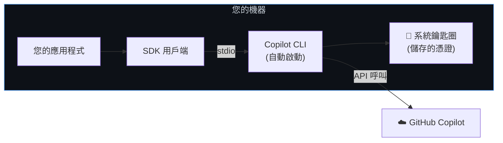
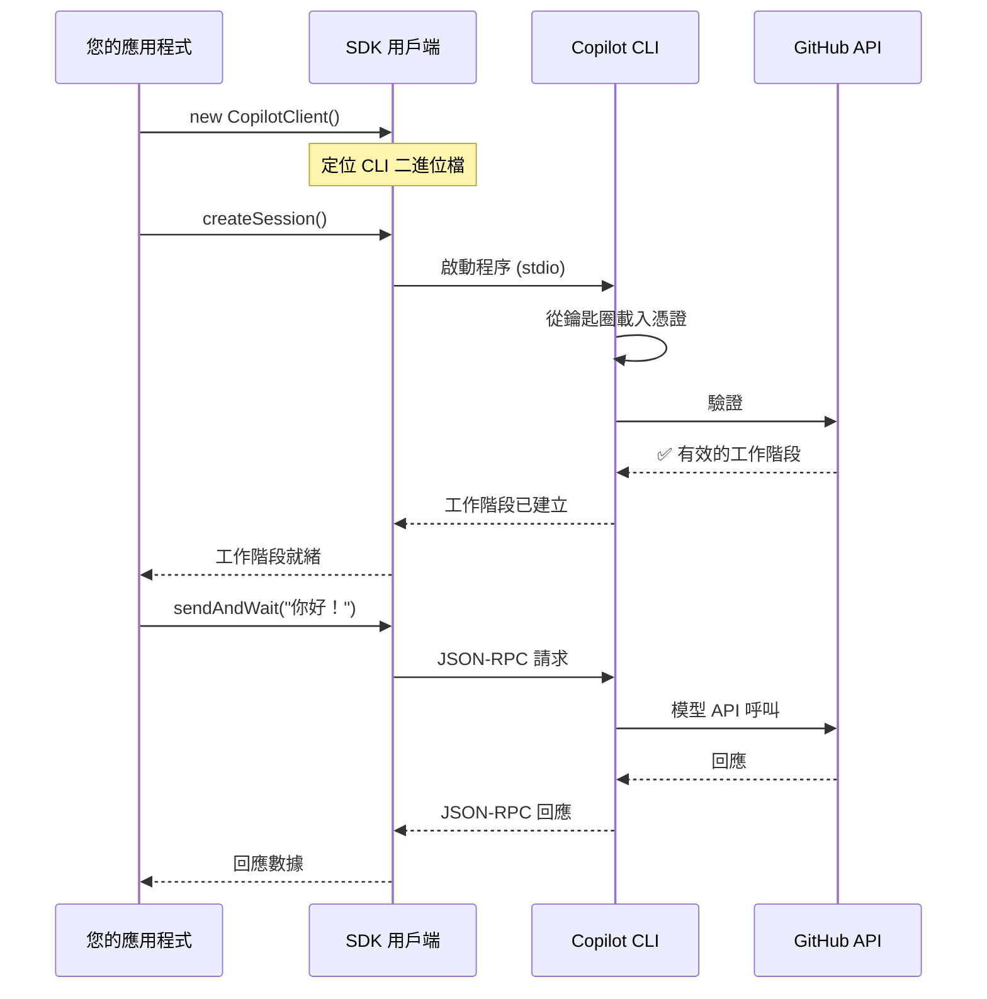

# 本地 CLI 設定

使用機器上已登入的 CLI 來配合 Copilot SDK。這是最簡單的設定方式 — 無需編寫驗證程式碼，也無需基礎架構。

**最佳適用場景：** 個人專案、原型製作、本地開發、學習 SDK。

## 運作方式

當您安裝 Copilot CLI 並登入時，您的憑證會儲存在系統鑰匙圈中。SDK 會自動將 CLI 作為子程序啟動，並使用那些儲存的憑證。



**關鍵特性：**
- CLI 由 SDK 自動產生 (無需設定)
- 驗證使用來自系統鑰匙圈的已登入使用者憑證
- 透過 stdio (stdin/stdout) 進行通訊 — 無需網路埠
- 工作階段僅限於您的本地機器

## 快速入門

預設設定完全不需要任何選項：

<details open>
<summary><strong>Node.js / TypeScript</strong></summary>

```typescript
import { CopilotClient } from "@github/copilot-sdk";

const client = new CopilotClient();
const session = await client.createSession({ model: "gpt-4.1" });

const response = await session.sendAndWait({ prompt: "你好！" });
console.log(response?.data.content);

await client.stop();
```

</details>

<details>
<summary><strong>Python</strong></summary>

```python
from copilot import CopilotClient

client = CopilotClient()
await client.start()

session = await client.create_session({"model": "gpt-4.1"})
response = await session.send_and_wait({"prompt": "你好！"})
print(response.data.content)

await client.stop()
```

</details>

<details>
<summary><strong>Go</strong></summary>

<!-- docs-validate: hidden -->
```go
package main

import (
	"context"
	"fmt"
	"log"
	copilot "github.com/github/copilot-sdk/go"
)

func main() {
	ctx := context.Background()

	client := copilot.NewClient(nil)
	if err := client.Start(ctx); err != nil {
		log.Fatal(err)
	}
	defer client.Stop()

	session, _ := client.CreateSession(ctx, &copilot.SessionConfig{Model: "gpt-4.1"})
	response, _ := session.SendAndWait(ctx, copilot.MessageOptions{Prompt: "你好！"})
	fmt.Println(*response.Data.Content)
}
```
<!-- /docs-validate: hidden -->

```go
client := copilot.NewClient(nil)
if err := client.Start(ctx); err != nil {
    log.Fatal(err)
}
defer client.Stop()

session, _ := client.CreateSession(ctx, &copilot.SessionConfig{Model: "gpt-4.1"})
response, _ := session.SendAndWait(ctx, copilot.MessageOptions{Prompt: "你好！"})
fmt.Println(*response.Data.Content)
```

</details>

<details>
<summary><strong>.NET</strong></summary>

```csharp
await using var client = new CopilotClient();
await using var session = await client.CreateSessionAsync(
    new SessionConfig { Model = "gpt-4.1" });

var response = await session.SendAndWaitAsync(
    new MessageOptions { Prompt = "你好！" });
Console.WriteLine(response?.Data.Content);
```

</details>

就這樣。SDK 處理所有事情：啟動 CLI、驗證以及管理工作階段。

## 背後的運作機制



## 設定選項

雖然預設設定運作良好，但您可以自定義本地設定：

```typescript
const client = new CopilotClient({
    // 覆蓋 CLI 位置 (預設：隨附於 @github/copilot)
    cliPath: "/usr/local/bin/copilot",

    // 設定用於偵錯的記錄層級
    logLevel: "debug",

    // 傳遞額外的 CLI 引數
    cliArgs: ["--disable-telemetry"],

    // 設定工作目錄
    cwd: "/path/to/project",

    // 如果 CLI 崩潰則自動重啟 (預設：true)
    autoRestart: true,
});
```

## 使用環境變數

除了鑰匙圈之外，您還可以透過環境變數進行驗證。這對於 CI 或當您不希望進行互動式登入時非常有用。

```bash
# 設定其中一個 (按優先順序)：
export COPILOT_GITHUB_TOKEN="gho_xxxx"   # 建議使用
export GH_TOKEN="gho_xxxx"               # 與 GitHub CLI 相容
export GITHUB_TOKEN="gho_xxxx"           # 與 GitHub Actions 相容
```

SDK 會自動擷取這些變數 — 無需更改程式碼。

## 管理工作階段

使用本地 CLI 時，工作階段預設為臨時性的。若要建立可恢復的工作階段，請提供您自己的工作階段識別碼：

```typescript
// 建立一個具名工作階段
const session = await client.createSession({
    sessionId: "my-project-analysis",
    model: "gpt-4.1",
});

// 稍後恢復它
const resumed = await client.resumeSession("my-project-analysis");
```

工作階段狀態儲存在本地的 `~/.copilot/session-state/{sessionId}/`。

## 限制

| 限制 | 詳情 |
|------------|---------|
| **單一使用者** | 憑證與登入 CLI 的使用者綁定 |
| **僅限本地** | CLI 在與您的應用程式相同的機器上執行 |
| **無多租戶** | 無法從一個 CLI 執行個體服務多個使用者 |
| **需要 CLI 登入** | 使用者必須先執行 `copilot` 並進行驗證 |

## 何時需要切換方案

如果您需要以下任何一項，就該選擇更進階的設定了：

| 需求 | 下一步指南 |
|------|-----------|
| 將您的應用程式交付給他人 | [隨附的 CLI (Bundled CLI)](./bundled-cli_zh_TW.md) |
| 多個使用者登入 | [GitHub OAuth](./github-oauth_zh_TW.md) |
| 在伺服器上執行 | [後端服務 (Backend Services)](./backend-services_zh_TW.md) |
| 使用您自己的模型金鑰 | [BYOK](../auth/byok_zh_TW.md) |

## 後續步驟

- **[入門教學](../getting-started_zh_TW.md)** — 建置一個完整的互動式應用程式
- **[身分驗證文件](../auth/index_zh_TW.md)** — 所有驗證方法的詳情
- **[工作階段持久化](../features/session-persistence_zh_TW.md)** — 進階工作階段管理
