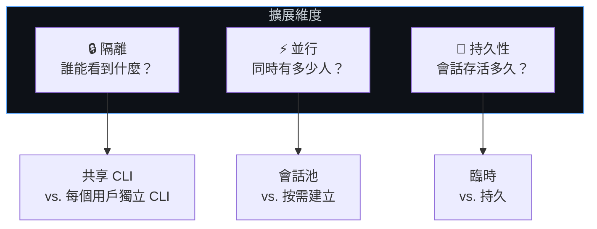
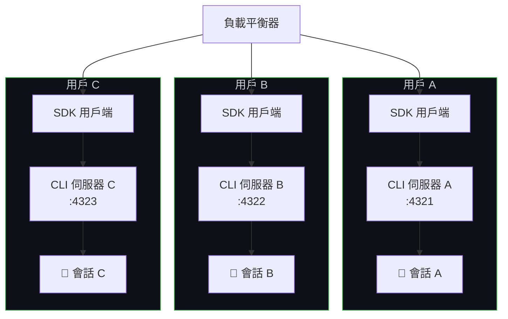
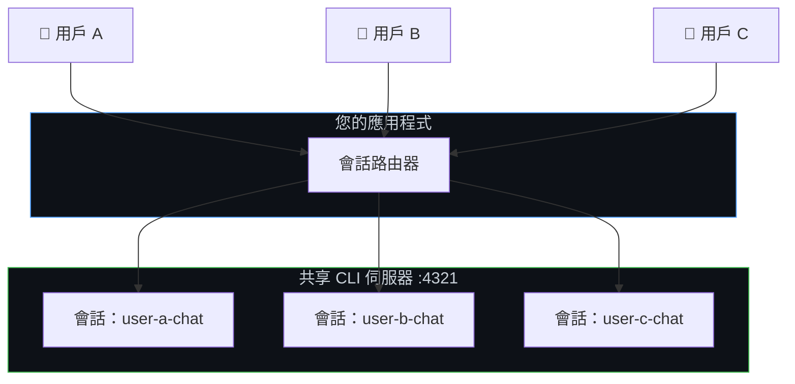
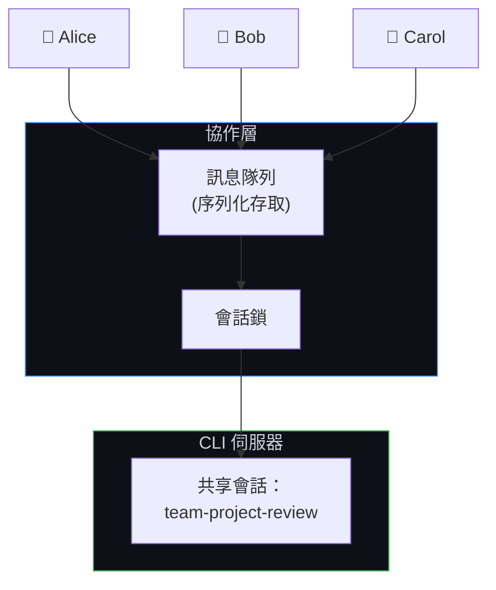
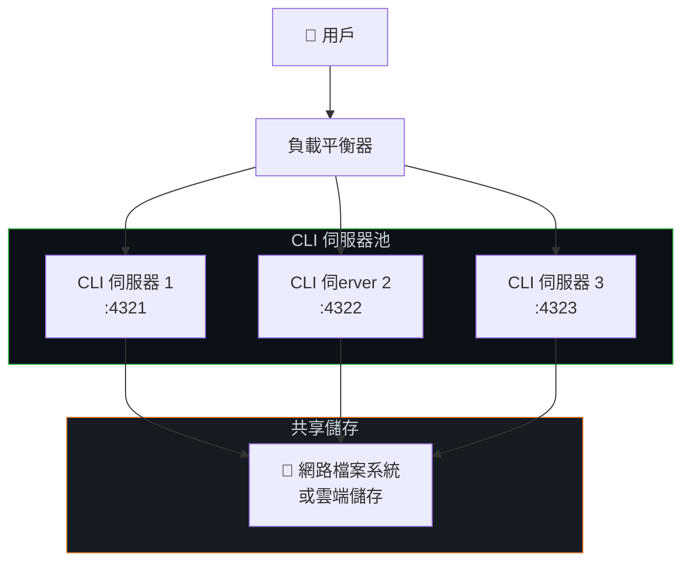
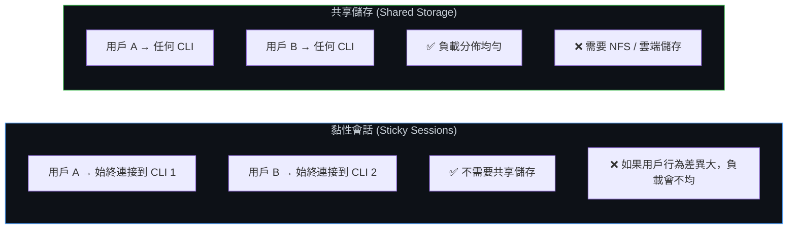
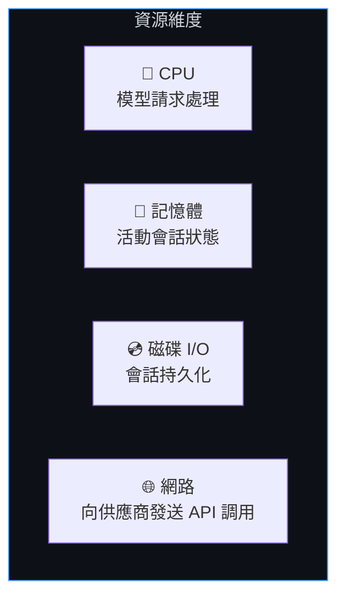
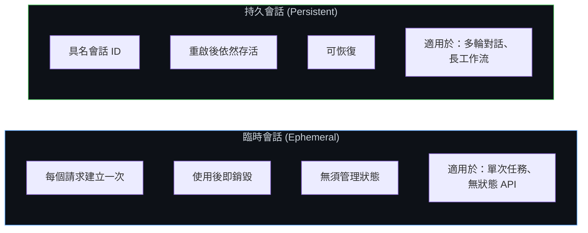
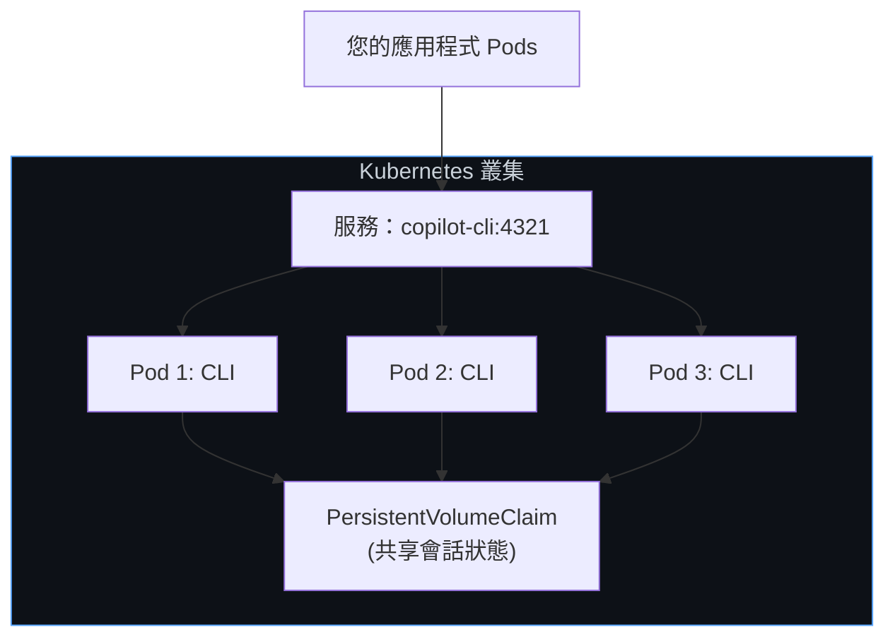
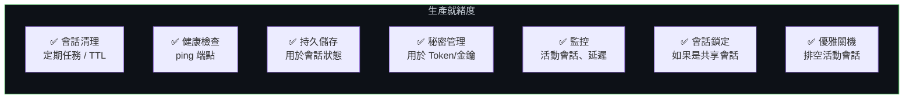

# 擴展與多租戶 (Scaling & Multi-Tenancy)

設計您的 Copilot SDK 部署以服務多個用戶、處理並行會話，並在基礎設施上進行水平擴展。本指南涵蓋了會話隔離模式、擴展拓撲以及生產環境的最佳實踐。

**適用於：** 平台開發者、SaaS 構建者，以及任何需要服務多個並行用戶的部署。

## 核心概念

在選擇模式之前，請先了解擴展的三個維度：



## 會話隔離模式

### 模式 1：每個用戶獨立的 CLI (Isolated CLI Per User)

每個用戶都有自己的 CLI 伺服器執行個體。最強的隔離性 —— 用戶的會話、記憶體和進程完全分離。



**適用場景：**
- 數據隔離至關重要的多租戶 SaaS
- 具有不同身份驗證憑據的用戶
- 合規性要求（SOC 2, HIPAA）

```typescript
// CLI 池管理器 — 每個用戶一個 CLI
class CLIPool {
    private instances = new Map<string, { client: CopilotClient; port: number }>();
    private nextPort = 5000;

    async getClientForUser(userId: string, token?: string): Promise<CopilotClient> {
        if (this.instances.has(userId)) {
            return this.instances.get(userId)!.client;
        }

        const port = this.nextPort++;

        // 為此用戶啟動專用 CLI
        await spawnCLI(port, token);

        const client = new CopilotClient({
            cliUrl: `localhost:${port}`,
        });

        this.instances.set(userId, { client, port });
        return client;
    }

    async releaseUser(userId: string): Promise<void> {
        const instance = this.instances.get(userId);
        if (instance) {
            await instance.client.stop();
            this.instances.delete(userId);
        }
    }
}
```

### 模式 2：共享 CLI 與會話隔離 (Shared CLI with Session Isolation)

多個用戶共享一個 CLI 伺服器，但透過唯一的會話 ID 實現會話隔離。資源消耗較少，但隔離性較弱。



**適用場景：**
- 具有受信任用戶的內部工具
- 資源受限的環境
- 隔離要求較低

```typescript
const sharedClient = new CopilotClient({
    cliUrl: "localhost:4321",
});

// 透過命名慣例強制執行會話隔離
function getSessionId(userId: string, purpose: string): string {
    return `${userId}-${purpose}-${Date.now()}`;
}

// 存取控制：確保用戶只能存取自己的會話
async function resumeSessionWithAuth(
    sessionId: string,
    currentUserId: string
): Promise<Session> {
    const [sessionUserId] = sessionId.split("-");
    if (sessionUserId !== currentUserId) {
        throw new Error("拒絕存取：會話屬於另一個用戶");
    }
    return sharedClient.resumeSession(sessionId);
}
```

### 模式 3：共享會話（協作式） (Shared Sessions - Collaborative)

多個用戶與同一個會話互動 — 就像一個共享的 Copilot 聊天室。



**適用場景：**
- 團隊協作工具
- 共享代碼審查會話
- 結對編程助手

> ⚠️ **重要提示：** SDK 不提供內置的會話鎖定功能。您 **必須** 序列化存取，以防止對同一個會話進行並行寫入。

```typescript
import Redis from "ioredis";

const redis = new Redis();

async function withSessionLock<T>(
    sessionId: string,
    fn: () => Promise<T>,
    timeoutSec = 300
): Promise<T> {
    const lockKey = `session-lock:${sessionId}`;
    const lockId = crypto.randomUUID();

    // 獲取鎖
    const acquired = await redis.set(lockKey, lockId, "NX", "EX", timeoutSec);
    if (!acquired) {
        throw new Error("會話正被另一個用戶使用");
    }

    try {
        return await fn();
    } finally {
        // 釋放鎖（僅當我們仍然擁有它時）
        const currentLock = await redis.get(lockKey);
        if (currentLock === lockId) {
            await redis.del(lockKey);
        }
    }
}

// 用法：序列化對共享會話的存取
app.post("/team-chat", authMiddleware, async (req, res) => {
    const result = await withSessionLock("team-project-review", async () => {
        const session = await client.resumeSession("team-project-review");
        return session.sendAndWait({ prompt: req.body.message });
    });

    res.json({ content: result?.data.content });
});
```

## 隔離模式比較

| | 每個用戶獨立 CLI | 共享 CLI + 會話隔離 | 共享會話 |
|---|---|---|---|
| **隔離性** | ✅ 完全隔離 | ⚠️ 邏輯隔離 | ❌ 共享 |
| **資源消耗** | 高 (每個用戶一個 CLI) | 低 (一個 CLI) | 低 (一個 CLI + 會話) |
| **複雜度** | 中 | 低 | 高 (需要鎖定機制) |
| **認證靈活性** | ✅ 每個用戶獨立 Token | ⚠️ 服務端 Token | ⚠️ 服務端 Token |
| **最佳用途** | 多租戶 SaaS | 內部工具 | 協同作業 |

## 水平擴展 (Horizontal Scaling)

### 負載平衡器後的多個 CLI 伺服器



**關鍵要求：** 會話狀態必須位於 **共享儲存** 上，以便任何 CLI 伺服器都可以恢復任何會話。

```typescript
// 將會話路由到 CLI 伺服器
class CLILoadBalancer {
    private servers: string[];
    private currentIndex = 0;

    constructor(servers: string[]) {
        this.servers = servers;
    }

    // 輪詢選擇 (Round-robin)
    getNextServer(): string {
        const server = this.servers[this.currentIndex];
        this.currentIndex = (this.currentIndex + 1) % this.servers.length;
        return server;
    }

    // 黏性會話 (Sticky sessions)：同一個用戶始終連接到同一個伺服器
    getServerForUser(userId: string): string {
        const hash = this.hashCode(userId);
        return this.servers[hash % this.servers.length];
    }

    private hashCode(str: string): number {
        let hash = 0;
        for (let i = 0; i < str.length; i++) {
            hash = (hash << 5) - hash + str.charCodeAt(i);
            hash |= 0;
        }
        return Math.abs(hash);
    }
}

const lb = new CLILoadBalancer([
    "cli-1:4321",
    "cli-2:4321",
    "cli-3:4321",
]);

app.post("/chat", async (req, res) => {
    const server = lb.getServerForUser(req.user.id);
    const client = new CopilotClient({ cliUrl: server });

    const session = await client.createSession({
        sessionId: `user-${req.user.id}-chat`,
        model: "gpt-4.1",
    });

    const response = await session.sendAndWait({ prompt: req.body.message });
    res.json({ content: response?.data.content });
});
```

### 黏性會話 vs. 共享儲存



**黏性會話** 較為簡單 — 將用戶固定到特定的 CLI 伺服器。不需要共享儲存，但負載分佈不均。

**共享儲存** 允許任何 CLI 處理任何會話。負載分佈更好，但需要為 `~/.copilot/session-state/` 提供網路儲存。

## 垂直擴展 (Vertical Scaling)

### 調優單一 CLI 伺服器

單個 CLI 伺服器可以處理多個並行會話。關鍵考量因素：



**會話生命週期管理** 是垂直擴展的關鍵：

```typescript
// 限制並行活動會話的數量
class SessionManager {
    private activeSessions = new Map<string, Session>();
    private maxConcurrent: number;

    constructor(maxConcurrent = 50) {
        this.maxConcurrent = maxConcurrent;
    }

    async getSession(sessionId: string): Promise<Session> {
        // 返回現有的活動會話
        if (this.activeSessions.has(sessionId)) {
            return this.activeSessions.get(sessionId)!;
        }

        // 強制執行並行限制
        if (this.activeSessions.size >= this.maxConcurrent) {
            await this.evictOldestSession();
        }

        // 建立或恢復
        const session = await client.createSession({
            sessionId,
            model: "gpt-4.1",
        });

        this.activeSessions.set(sessionId, session);
        return session;
    }

    private async evictOldestSession(): Promise<void> {
        const [oldestId] = this.activeSessions.keys();
        const session = this.activeSessions.get(oldestId)!;
        // 會話狀態會自動持久化 — 可以安全斷開連接
        await session.disconnect();
        this.activeSessions.delete(oldestId);
    }
}
```

## 臨時會話 vs. 持久會話



### 臨時會話 (Ephemeral Sessions)

適用於每個請求都相互獨立的無狀態 API 端點：

```typescript
app.post("/api/analyze", async (req, res) => {
    const session = await client.createSession({
        model: "gpt-4.1",
    });

    try {
        const response = await session.sendAndWait({
            prompt: req.body.prompt,
        });
        res.json({ result: response?.data.content });
    } finally {
        await session.disconnect();  // 立即清理
    }
});
```

### 持久會話 (Persistent Sessions)

適用於對話介面或運行時間較長的工作流：

```typescript
// 建立一個可恢復的會話
app.post("/api/chat/start", async (req, res) => {
    const sessionId = `user-${req.user.id}-${Date.now()}`;

    const session = await client.createSession({
        sessionId,
        model: "gpt-4.1",
        infiniteSessions: {
            enabled: true,
            backgroundCompactionThreshold: 0.80,
        },
    });

    res.json({ sessionId });
});

// 繼續對話
app.post("/api/chat/message", async (req, res) => {
    const session = await client.resumeSession(req.body.sessionId);
    const response = await session.sendAndWait({ prompt: req.body.message });

    res.json({ content: response?.data.content });
});

// 完成後清理
app.post("/api/chat/end", async (req, res) => {
    await client.deleteSession(req.body.sessionId);
    res.json({ success: true });
});
```

## 容器部署 (Container Deployments)

### 具備持久儲存的 Kubernetes

```yaml
apiVersion: apps/v1
kind: Deployment
metadata:
  name: copilot-cli
spec:
  replicas: 3
  selector:
    matchLabels:
      app: copilot-cli
  template:
    metadata:
      labels:
        app: copilot-cli
    spec:
      containers:
        - name: copilot-cli
          image: ghcr.io/github/copilot-cli:latest
          args: ["--headless", "--port", "4321"]
          env:
            - name: COPILOT_GITHUB_TOKEN
              valueFrom:
                secretKeyRef:
                  name: copilot-secrets
                  key: github-token
          ports:
            - containerPort: 4321
          volumeMounts:
            - name: session-state
              mountPath: /root/.copilot/session-state
      volumes:
        - name: session-state
          persistentVolumeClaim:
            claimName: copilot-sessions-pvc
---
apiVersion: v1
kind: Service
metadata:
  name: copilot-cli
spec:
  selector:
    app: copilot-cli
  ports:
    - port: 4321
      targetPort: 4321
```



### Azure 容器執行個體 (Azure Container Instances)

```yaml
containers:
  - name: copilot-cli
    image: ghcr.io/github/copilot-cli:latest
    command: ["copilot", "--headless", "--port", "4321"]
    volumeMounts:
      - name: session-storage
        mountPath: /root/.copilot/session-state

volumes:
  - name: session-storage
    azureFile:
      shareName: copilot-sessions
      storageAccountName: myaccount
```

## 生產環境檢查清單 (Production Checklist)



| 關注點 | 建議 |
|---------|---------------|
| **會話清理** | 運行定期清理任務，刪除超過 TTL 的會話 |
| **健康檢查** | 定期 Ping CLI 伺服器；如果無響應則重啟 |
| **儲存** | 為 `~/.copilot/session-state/` 掛載持久磁碟卷 |
| **秘密** | 使用您平台的秘密管理器 (Vault, K8s Secrets 等) |
| **監控** | 追蹤活動會話數量、響應延遲、錯誤率 |
| **鎖定** | 對於共享會話存取，使用 Redis 或類似工具 |
| **關機** | 在停止 CLI 伺服器之前，先排空活動會話 |

## 限制 (Limitations)

| 限制 | 詳情 |
|------------|---------|
| **無內置會話鎖定** | 需在應用程式層級實現並行存取鎖定 |
| **無內置負載平衡** | 需使用外部負載平衡器 (LB) 或服務網格 (Service Mesh) |
| **會話狀態基於檔案** | 多伺服器設置需要共享檔案系統 |
| **30 分鐘閒置逾時** | 無活動的會話會被 CLI 自動清理 |
| **CLI 是單進程的** | 透過增加更多 CLI 伺服器執行個體來擴展，而非透過線程 |

## 下一步

- **[會話持久化 (Session Persistence)](../features/session-persistence_zh_TW.md)** — 深入了解可恢復的會話
- **[後端服務 (Backend Services)](./backend-services_zh_TW.md)** — 核心伺服器端設置
- **[GitHub OAuth](./github-oauth_zh_TW.md)** — 多用戶身份驗證
- **[BYOK](../auth/byok_zh_TW.md)** — 使用您自己的模型供應商
